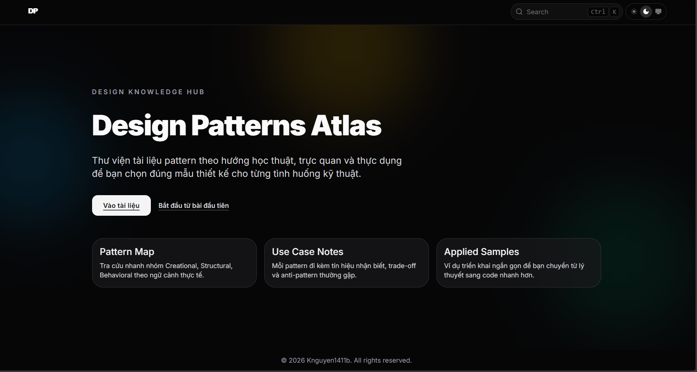
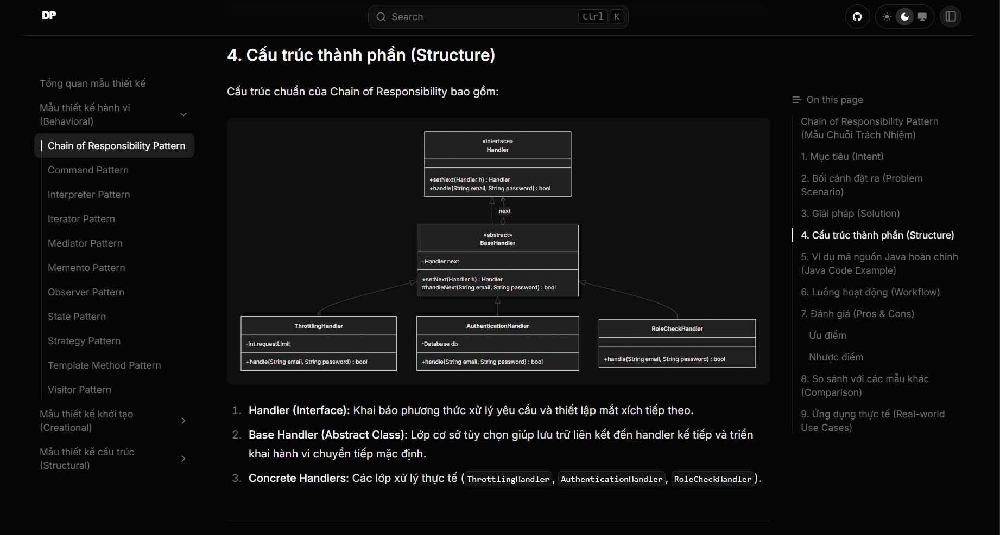
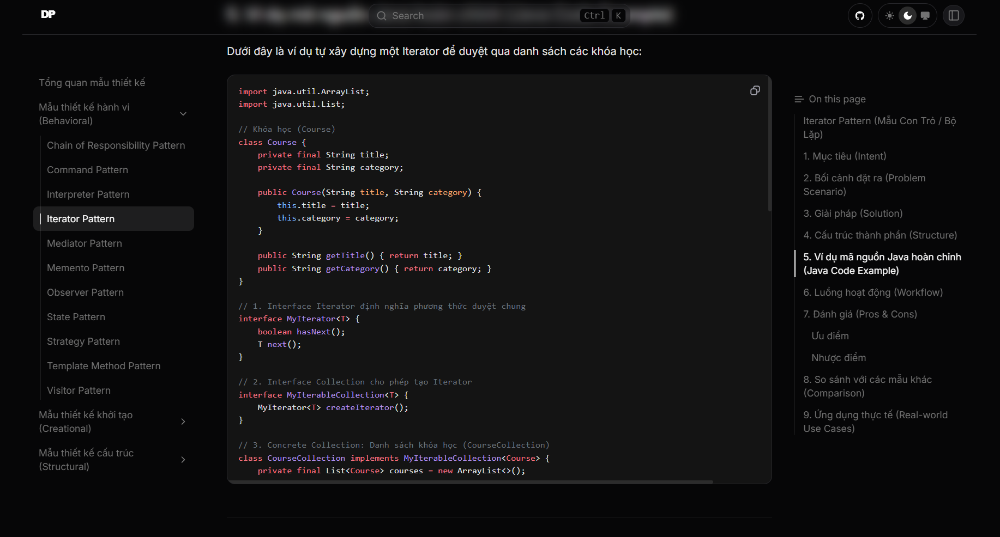

# Design Patterns Atlas 🗺️

[](https://opensource.org/licenses/MIT)
[](https://nodejs.org/)
[](https://nextjs.org/)
[](https://www.oracle.com/java/)

Tài liệu học tập và tra cứu **23 Design Patterns kinh điển (Gang of Four)** bằng tiếng Việt trực quan, sinh động. Dự án được phát triển dưới dạng trang tài liệu kỹ thuật (docs) chuyên nghiệp sử dụng công nghệ **Next.js + Fumadocs + MDX**.

Tất cả các bài học đều được trang bị mã nguồn ví dụ hoàn chỉnh bằng ngôn ngữ **Java** (với chú thích tiếng Việt từng bước), sơ đồ lớp **Mermaid UML**, phân tích quy trình runtime, so sánh chuyên sâu và ví dụ ứng dụng thực tế trong JDK/Spring Boot.

---

## 📸 Giao diện ứng dụng

<p align="center">
  
</p>
<p align="center">
  
</p>
<p align="center">
  
</p>

---

## ✨ Tính năng nổi bật

- 📚 **Đầy đủ 23/23 GoF Design Patterns**: Chia thành 3 nhóm lớn (Creational, Structural, Behavioral).
- ☕ **Java-centric**: Các ví dụ lập trình mẫu được viết bằng Java chuẩn chỉnh, cấu trúc rõ ràng kèm hàm `main` độc lập.
- 📊 **Sơ đồ lớp Mermaid trực quan**: Trực quan hóa cấu trúc và mối quan hệ giữa các lớp.
- 🔍 **Tìm kiếm thông minh**: Tìm kiếm tài liệu tức thời (Instant Search) tích hợp qua API route (`/api/search`).
- 🎨 **Thiết kế hiện đại & Tối ưu đọc**: Hỗ trợ Dark Mode/Light Mode, tô màu mã nguồn dễ nhìn, sidebar điều hướng linh hoạt.
- ⚡ **Siêu nhanh**: Xây dựng trên nền tảng Next.js static generation giúp tải trang ngay lập tức.

---

## 🛠️ Tech Stack

- **Framework**: [Next.js 16 (App Router)](https://nextjs.org/)
- **Động cơ tài liệu**: [Fumadocs](https://fumadocs.vercel.app/) (`fumadocs-ui`, `fumadocs-core`, `fumadocs-mdx`)
- **Giao diện**: [HeroUI v3](https://heroui.com/) + [Tailwind CSS v4](https://tailwindcss.com/)
- **Ngôn ngữ**: TypeScript (cho Front-end) & Java (cho các bài học mẫu thiết kế)
- **Công cụ định dạng**: Prettier & ESLint

---

## 📂 Cấu trúc thư mục

```text
├── content/                     # Nội dung tài liệu (.mdx)
│   ├── creational/              # Nhóm mẫu thiết kế Khởi tạo (5 mẫu)
│   ├── structural/              # Nhóm mẫu thiết kế Cấu trúc (7 mẫu)
│   ├── behavioral/              # Nhóm mẫu thiết kế Hành vi (11 mẫu)
│   └── index.mdx                # Trang chủ tài liệu học tập
├── src/
│   ├── app/                     # Next.js App Router (Layout & Routing)
│   │   ├── docs/                # Trang hiển thị tài liệu
│   │   └── api/search/          # API tìm kiếm bài viết
│   ├── components/              # Các UI Component tùy chỉnh (kebab-case)
│   ├── hooks/                   # Custom React Hooks
│   └── lib/                     # Cấu hình Fumadocs và helper
├── source.config.ts             # Định nghĩa schema metadata cho MDX
└── package.json                 # Cấu hình kịch bản và gói phụ thuộc
```

---

## 🚀 Cài đặt và Chạy cục bộ

### Yêu cầu hệ thống:

- **Node.js**: Phiên bản 20 trở lên
- Trình quản lý gói **pnpm** (khuyên dùng) hoặc **npm**

### Các bước thực hiện:

1. **Cài đặt các gói phụ thuộc:**

    ```bash
    pnpm install
    # hoặc
    npm install
    ```

2. **Chạy máy chủ phát triển cục bộ (Development Server):**

    ```bash
    pnpm dev
    # hoặc
    npm run dev
    ```

3. **Truy cập ứng dụng:**
    - Mở trình duyệt và truy cập: [http://localhost:3001](http://localhost:3001)

4. **Biên dịch sản phẩm tĩnh (Production Build):**
    ```bash
    pnpm build && pnpm start
    # hoặc
    npm run build && npm run start
    ```

---

## 📝 Quy trình thêm một mẫu thiết kế mới

1. Chọn thư mục nhóm tương ứng trong `content/` (`creational`, `structural`, `behavioral`).
2. Tạo tệp `.mdx` mới (ví dụ: `content/behavioral/mediator.mdx`).
3. Định nghĩa phần Metadata (Frontmatter) ở đầu tệp:
    ```yaml
    ---
    title: Tên Mẫu Thiết Kế Pattern
    summary: Mô tả ngắn gọn ý nghĩa của mẫu bằng tiếng Việt.
    category: creational | structural | behavioral
    level: beginner | intermediate | advanced
    tags:
        - creational
    related:
        - Factory Method Pattern
    date: 2026-05-22
    ---
    ```
4. Viết nội dung bài học tuân thủ chính xác **cấu trúc chuẩn 9 phần** (Intent, Problem, Solution, UML/Structure, Java Code, Workflow, Pros & Cons, Comparison, Real-world).
5. Định dạng lại mã nguồn bằng cách chạy:
    ```bash
    pnpm format
    ```

---

## 📜 Giấy phép & Quy tắc ứng xử

- **Giấy phép**: Dự án được phân phối dưới giấy phép mã nguồn mở [MIT License](LICENSE).
- **Đóng góp ý kiến**: Vui lòng tham khảo [Hướng dẫn đóng góp](CONTRIBUTING.md) trước khi gửi Pull Request.
- **Quy tắc ứng xử**: Chúng tôi tuân thủ nghiêm ngặt [Quy tắc ứng xử cho cộng tác viên](CODE_OF_CONDUCT.md).
