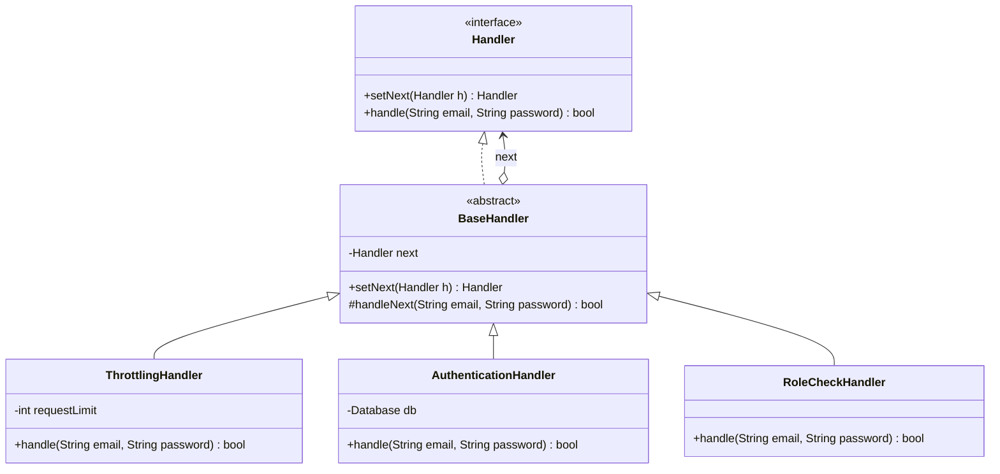

# Chain of Responsibility Pattern (Mẫu Chuỗi Trách Nhiệm)

## 1. Mục tiêu (Intent)

**Chain of Responsibility** (Chuỗi Trách Nhiệm) là một mẫu thiết kế behavioral (hành vi) cho phép bạn truyền các yêu cầu (requests) đi qua một chuỗi các bộ xử lý (handlers). Khi nhận được một yêu cầu, mỗi bộ xử lý sẽ tự quyết định xem có tự mình xử lý yêu cầu đó hay chuyển tiếp yêu cầu đó cho bộ xử lý tiếp theo trong chuỗi.

Mục tiêu chính:

- Tránh sự liên kết chặt chẽ (tight coupling) giữa đối tượng gửi yêu cầu (sender) và đối tượng nhận yêu cầu (receiver).
- Cho phép nhiều đối tượng có cơ hội xử lý yêu cầu mà người gửi không cần biết chính xác đối tượng nào sẽ giải quyết yêu cầu đó.
- Tuân thủ nguyên tắc Single Responsibility bằng cách tách các khâu kiểm tra/xử lý phức tạp thành các lớp riêng biệt, và Open/Closed Principle bằng cách cho phép thêm/bớt các mắt xích xử lý dễ dàng tại runtime.

---

## 2. Bối cảnh đặt ra (Problem Scenario)

Hãy tưởng tượng bạn đang xây dựng một hệ thống API cho cổng thanh toán trực tuyến. Bạn cần xây dựng bộ lọc bảo mật để kiểm tra tất cả các request gửi đến trước khi xử lý giao dịch.

Hệ thống yêu cầu các bước kiểm tra sau:

1. **Throttling (Giới hạn lưu lượng)**: Chặn request nếu Client gửi quá nhiều yêu cầu trong 1 giây (tránh tấn công DDoS).
2. **Authentication (Xác thực)**: Kiểm tra tài khoản đăng nhập và mật khẩu (hoặc API Key) có hợp lệ không.
3. **Authorization (Phân quyền)**: Kiểm tra xem tài khoản đó có quyền thực hiện giao dịch thanh toán này không (ví dụ: chỉ tài khoản VIP hoặc Admin).
4. **Validation (Xác thực dữ liệu)**: Kiểm tra xem định dạng số tiền thanh toán có hợp lệ không.

Nếu bạn viết tất cả các logic này trong một phương thức xử lý request:

```java
public void handleRequest(Request request) {
    if (checkThrottling(request)) {
        if (authenticate(request)) {
            if (authorize(request)) {
                if (validateData(request)) {
                    // Tiến hành giao dịch thanh toán
                } else {
                    throw new Exception("Dữ liệu không hợp lệ");
                }
            } else {
                throw new Exception("Không có quyền truy cập");
            }
        } else {
            throw new Exception("Xác thực thất bại");
        }
    } else {
        throw new Exception("Quá tải hệ thống");
    }
}
```

Vấn đề nảy sinh:

1. **Lớp phình to (Fat Class)**: Mã nguồn nhanh chóng trở nên khổng lồ, rối rắm và cực kỳ khó đọc với các khối lệnh `if-else` lồng nhau.
2. **Khó tái sử dụng**: Nếu một chức năng khác của hệ thống cũng cần xác thực (nhưng không cần giới hạn lưu lượng), bạn buộc phải sao chép lại mã nguồn hoặc viết lại một hàm khác.
3. **Khó bảo trì và mở rộng**: Khi cần thêm một bước lọc mới (ví dụ: Ghi log hoặc Quét mã độc), bạn phải sửa đổi trực tiếp vào phương thức lớn này, dễ gây lỗi hệ thống.

---

## 3. Giải pháp (Solution)

Mẫu thiết kế **Chain of Responsibility** khuyên bạn nên tách biệt từng bước kiểm tra thành một lớp xử lý độc lập gọi là **Handler**.

Mỗi Handler sẽ giữ một thuộc tính tham chiếu đến Handler tiếp theo trong chuỗi.

- Khi nhận yêu cầu, Handler tiến hành xử lý/kiểm tra logic của riêng mình.
- Nếu kiểm tra thất bại, Handler có thể quyết định **ngắt chuỗi** ngay lập tức và trả về thông báo lỗi.
- Nếu kiểm tra thành công, Handler chuyển tiếp yêu cầu sang Handler tiếp theo bằng cách gọi phương thức `handle()` của đối tượng liên kết đó.

---

## 4. Cấu trúc thành phần (Structure)

Cấu trúc chuẩn của Chain of Responsibility bao gồm:



1. **Handler (Interface)**: Khai báo phương thức xử lý yêu cầu và thiết lập mắt xích tiếp theo.
2. **Base Handler (Abstract Class)**: Lớp cơ sở tùy chọn giúp lưu trữ liên kết đến handler kế tiếp và triển khai hành vi chuyển tiếp mặc định.
3. **Concrete Handlers**: Các lớp xử lý thực tế (`ThrottlingHandler`, `AuthenticationHandler`, `RoleCheckHandler`).

---

## 5. Ví dụ mã nguồn Java hoàn chỉnh (Java Code Example)

Dưới đây là mã nguồn Java mô phỏng bộ lọc bảo mật đăng nhập hệ thống:

```java
// 1. Interface Handler chung cho các bước lọc
interface Handler {
    Handler setNext(Handler nextHandler);
    boolean handle(String email, String password);
}

// 2. Lớp Abstract Handler cơ sở quản lý liên kết
abstract class BaseHandler implements Handler {
    private Handler next;

    @Override
    public Handler setNext(Handler nextHandler) {
        this.next = nextHandler;
        return nextHandler; // Trả về handler tiếp theo để hỗ trợ viết chuỗi liên hoàn (Method Chaining)
    }

    // Phương thức trợ giúp chuyển tiếp yêu cầu
    protected boolean handleNext(String email, String password) {
        if (next == null) {
            return true; // Đã đi tới cuối chuỗi và tất cả các bước đều thành công
        }
        return next.handle(email, password);
    }
}

// 3. Concrete Handler 1: Giới hạn lưu lượng (Throttling)
class ThrottlingHandler extends BaseHandler {
    private final int requestPerMinute;
    private int requestCount = 0;

    public ThrottlingHandler(int requestPerMinute) {
        this.requestPerMinute = requestPerMinute;
    }

    @Override
    public boolean handle(String email, String password) {
        requestCount++;
        if (requestCount > requestPerMinute) {
            System.out.println("[WARNING] Throttling: Phát hiện gửi quá nhiều yêu cầu! Ngắt kết nối.");
            return false; // Ngắt chuỗi xử lý
        }
        System.out.println("[CHECK 1] Throttling OK.");
        return handleNext(email, password); // Chuyển sang bước tiếp theo
    }
}

// 4. Concrete Handler 2: Xác thực tài khoản (Authentication)
class AuthenticationHandler extends BaseHandler {
    @Override
    public boolean handle(String email, String password) {
        // Giả lập kiểm tra tài khoản trong database
        if (!"admin@domain.com".equals(email) || !"123456".equals(password)) {
            System.out.println("[ERROR] Auth: Email hoặc mật khẩu không chính xác!");
            return false; // Ngắt chuỗi xử lý
        }
        System.out.println("[CHECK 2] Xác thực tài khoản thành công.");
        return handleNext(email, password);
    }
}

// 5. Concrete Handler 3: Phân quyền tài khoản (Authorization)
class RoleCheckHandler extends BaseHandler {
    @Override
    public boolean handle(String email, String password) {
        if ("admin@domain.com".equals(email)) {
            System.out.println("[CHECK 3] Quyền ADMIN được xác nhận. Cho phép truy cập Dashboard.");
            return handleNext(email, password);
        }
        System.out.println("[ERROR] Role: Bạn không có quyền truy cập trang này!");
        return false;
    }
}

// Lớp Client chạy ứng dụng
class Main {
    public static void main(String[] args) {
        System.out.println("--- Khởi tạo chuỗi bảo mật hệ thống ---");

        Handler throttling = new ThrottlingHandler(2);
        Handler auth = new AuthenticationHandler();
        Handler role = new RoleCheckHandler();

        // Liên kết các handler thành một chuỗi bảo mật tuần tự
        throttling.setNext(auth).setNext(role);

        System.out.println("\n--- THỬ NGHIỆM 1: Đăng nhập sai thông tin ---");
        boolean result1 = throttling.handle("admin@domain.com", "sai-pass");
        System.out.println("Kết quả truy cập: " + (result1 ? "THÀNH CÔNG" : "THẤT BẠI"));

        System.out.println("\n--- THỬ NGHIỆM 2: Đăng nhập đúng thông tin ---");
        boolean result2 = throttling.handle("admin@domain.com", "123456");
        System.out.println("Kết quả truy cập: " + (result2 ? "THÀNH CÔNG" : "THẤT BẠI"));

        System.out.println("\n--- THỬ NGHIỆM 3: Gửi request liên tục để kích hoạt Throttling ---");
        // Gọi lại lần 2 trong chuỗi giới hạn request = 2
        throttling.handle("admin@domain.com", "123456");
        // Gọi lần 3 (Sẽ bị chặn ngay tại bước Throttling mà không cần kiểm tra pass hay role)
        boolean result3 = throttling.handle("admin@domain.com", "123456");
        System.out.println("Kết quả truy cập: " + (result3 ? "THÀNH CÔNG" : "THẤT BẠI"));
    }
}
```

---

## 6. Luồng hoạt động (Workflow)

1. Client khởi dựng chuỗi mắt xích bằng cách kết nối các handler với nhau (ví dụ: `throttling -> auth -> role`).
2. Client gửi yêu cầu cần kiểm tra đến handler đầu tiên của chuỗi (`throttling`).
3. Lớp `ThrottlingHandler` kiểm tra tần suất request:
    - Nếu vượt quá giới hạn, nó trả về `false`, chuỗi dừng lại tại đây.
    - Nếu hợp lệ, nó gọi `handleNext()` chuyển yêu cầu sang `AuthenticationHandler`.
4. Lớp `AuthenticationHandler` xác thực thông tin:
    - Nếu thông tin sai, trả về `false`, dừng chuỗi.
    - Nếu đúng, chuyển tiếp sang `RoleCheckHandler`.
5. `RoleCheckHandler` thực thi kiểm tra quyền Admin. Do đây là mắt xích cuối cùng, nếu kiểm tra thành công, nó trả về `true` báo hiệu toàn bộ chuỗi đã duyệt qua thành công.

---

## 7. Đánh giá (Pros & Cons)

### Ưu điểm

- **Giảm liên kết chặt chẽ (Decoupling)**: Bạn có thể kiểm soát thứ tự xử lý request một cách độc lập mà không cần Client phải biết các khâu bảo mật trung gian.
- **Tuân thủ Single Responsibility**: Tách biệt rõ ràng các nhiệm vụ kiểm tra độc lập vào các lớp chuyên biệt.
- **Tuân thủ Open/Closed Principle**: Cho phép chèn thêm các bước kiểm tra mới (ví dụ: ghi log, mã hóa) vào bất kỳ vị trí nào trong chuỗi mà không làm ảnh hưởng tới các Handler hiện có hay Client.

### Nhược điểm

- **Không đảm bảo xử lý**: Có thể xảy ra trường hợp một yêu cầu đi qua toàn bộ chuỗi mà không có bất kỳ bộ xử lý nào xử lý nó (nếu cuối chuỗi không có bộ xử lý mặc định hoặc chuỗi được thiết lập sai cấu trúc).
- **Khó khăn khi gỡ lỗi (Debugging)**: Việc theo dõi luồng dữ liệu đi xuyên qua các lớp liên kết gián tiếp có thể gây khó khăn cho việc tìm kiếm vị trí lỗi phát sinh.

---

## 8. So sánh với các mẫu khác (Comparison)

- **Chain of Responsibility vs Decorator**: Về mặt cấu trúc, cả hai đều có cấu trúc dạng mắt xích đi sâu vào trong. Tuy nhiên:
    - **Decorator** bổ sung tính năng mới cho đối tượng mà không làm thay đổi giao diện ban đầu của đối tượng và luôn đi xuyên qua toàn bộ các lớp trang trí.
    - **Chain of Responsibility** có thể chủ động **ngắt chuỗi** (ngăn chặn hành động tiếp theo) bất kỳ lúc nào nếu điều kiện không thỏa mãn.

---

## 9. Ứng dụng thực tế (Real-world Use Cases)

- **Java EE Filters**: Lớp `FilterChain` trong lập trình Web Servlet cho phép tạo chuỗi các `Filter` để xử lý xác thực, mã hóa UTF-8, nén dữ liệu trước khi request đến Servlet chính.
- **Spring Security**: Hệ thống bảo mật của Spring Boot được xây dựng hoàn toàn dựa trên một chuỗi các bộ lọc bảo mật (`SecurityFilterChain`) để kiểm soát truy cập API.
- **Giao diện Sự kiện (GUI Event Bubbling)**: Khi bạn click chuột vào một Button nằm trong một Panel, Panel lại nằm trong Window. Sự kiện click chuột sẽ được truyền dọc từ Button lên Panel rồi lên Window cho đến khi có một component xử lý nó.
