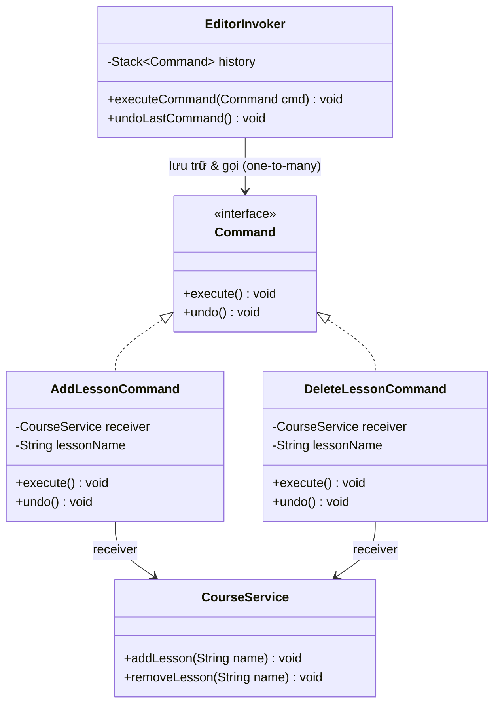

# Command Pattern (Mẫu Thiết Kế Lệnh)

## 1. Mục tiêu (Intent)

**Command** là một mẫu thiết kế thuộc nhóm behavioral (hành vi) chuyển đổi một yêu cầu thành một đối tượng độc lập chứa tất cả thông tin về yêu cầu đó. Sự chuyển đổi này cho phép bạn tham số hóa các phương thức gọi, trì hoãn hoặc xếp hàng thực thi yêu cầu, và hỗ trợ các thao tác không thể hoàn tác (undo/redo).

Mục tiêu chính:

- Tách biệt đối tượng gửi yêu cầu (Sender/Invoker) khỏi đối tượng thực sự hiểu và thực thi yêu cầu (Receiver).
- Đóng gói hành động thành các đối tượng có thể lưu trữ, chuyển giao, và xếp hàng thực thi.
- Hỗ trợ tính năng hoàn tác (Undo) và làm lại (Redo) một cách hệ thống.

---

## 2. Bối cảnh đặt ra (Problem Scenario)

Hãy tưởng tượng bạn đang xây dựng tính năng chỉnh sửa khóa học dành cho giảng viên trong hệ thống LMS. Trình chỉnh sửa cho phép giảng viên thực hiện các hành động:

1. Thêm một bài học mới (`AddLesson`).
2. Xóa một bài học (`DeleteLesson`).
3. Đổi tên bài học (`RenameLesson`).

Nếu bạn kết nối trực tiếp các nút bấm trên giao diện (UI Buttons) với logic chỉnh sửa cơ sở dữ liệu:

```java
class SaveButton {
    private CourseService courseService = new CourseService();

    public void onClick(String courseId, String lessonName) {
        // Gọi trực tiếp nghiệp vụ lưu bài học
        courseService.addLesson(courseId, lessonName);
    }
}
```

Vấn đề nảy sinh:

1. **Thiếu tính năng Undo/Redo**: Giảng viên vô tình xóa nhầm bài học và muốn bấm nút **Ctrl+Z (Undo)** để hoàn tác. Nếu gọi trực tiếp phương thức dịch vụ, bạn không có cách nào lưu lại lịch sử thay đổi để quay ngược trạng thái dữ liệu trước đó.
2. **Trùng lặp code**: Một hành động (ví dụ: Lưu bài học) có thể được kích hoạt bởi nhiều nút khác nhau (Nút Lưu trên thanh công cụ, phím tắt Ctrl+S, hoặc tính năng Tự động lưu - Autosave). Bạn sẽ phải viết lại logic gọi hàm ở nhiều nơi.
3. **Không thể xếp hàng tác vụ (Queueing)**: Không thể trì hoãn việc lưu bài học hoặc thực hiện nó bất đồng bộ khi mạng bị chập chờn.

---

## 3. Giải pháp (Solution)

Mẫu thiết kế **Command** đề xuất đóng gói toàn bộ thông tin của yêu cầu (bao gồm đối tượng nhận, phương thức được gọi và các tham số truyền vào) thành một lớp lệnh riêng biệt triển khai interface `Command` (chỉ có một phương thức duy nhất là `execute()`).

- **Invoker (Người gọi - ví dụ UI Button)**: Chỉ giữ tham chiếu đến interface `Command` và gọi `command.execute()` khi có sự kiện. Nó không cần biết dịch vụ bên dưới hoạt động ra sao.
- **Receiver (Người nhận - ví dụ `CourseService`)**: Chứa logic nghiệp vụ thực tế để xử lý yêu cầu.
- **Concrete Command (Lớp lệnh cụ thể)**: Kết nối Invoker và Receiver. Nó triển khai `execute()` bằng cách gọi phương thức tương ứng trên Receiver. Để hỗ trợ Undo, interface `Command` có thể bổ sung phương thức `undo()`.

---

## 4. Cấu trúc thành phần (Structure)

Cấu trúc chuẩn của Command Pattern:



1. **Command**: Interface định nghĩa phương thức `execute()` và `undo()`.
2. **Concrete Commands**: Triển khai các phương thức hành động cụ thể, lưu trữ tham số và gọi đến Receiver tương ứng (`AddLessonCommand`).
3. **Receiver**: Đối tượng chứa logic xử lý nghiệp vụ thực tế (`CourseService`).
4. **Invoker (Sender)**: Đối tượng kích hoạt lệnh và quản lý lịch sử lệnh để thực hiện Undo/Redo (`EditorInvoker`).

---

## 5. Ví dụ mã nguồn Java hoàn chỉnh (Java Code Example)

Dưới đây là cách triển khai Command Pattern hỗ trợ hoàn tác (Undo) bằng Java:

```java
import java.util.ArrayList;
import java.util.List;
import java.util.Stack;

// 1. Receiver (Đối tượng chứa logic nghiệp vụ thực tế)
class CourseEditor {
    private final List<String> lessons = new ArrayList<>();

    public void addLesson(String lessonName) {
        lessons.add(lessonName);
        System.out.println("[EDITOR] Đã thêm bài học: \"" + lessonName + "\"");
    }

    public void removeLesson(String lessonName) {
        if (lessons.remove(lessonName)) {
            System.out.println("[EDITOR] Đã xóa bài học: \"" + lessonName + "\"");
        }
    }

    public void printLessons() {
        System.out.println("[CURRENT STATE] Danh sách bài học hiện tại: " + lessons);
    }
}

// 2. Command Interface (Giao diện lệnh chung)
interface Command {
    void execute();
    void undo(); // Hỗ trợ hoàn tác
}

// 3. Concrete Commands (Các lệnh cụ thể)
class AddLessonCommand implements Command {
    private final CourseEditor editor; // Tham chiếu đến Receiver
    private final String lessonName;    // Tham số lưu trạng thái

    public AddLessonCommand(CourseEditor editor, String lessonName) {
        this.editor = editor;
        this.lessonName = lessonName;
    }

    @Override
    public void execute() {
        editor.addLesson(lessonName);
    }

    @Override
    public void undo() {
        editor.removeLesson(lessonName); // Hoàn tác bằng cách xóa đi
    }
}

class DeleteLessonCommand implements Command {
    private final CourseEditor editor;
    private final String lessonName;

    public DeleteLessonCommand(CourseEditor editor, String lessonName) {
        this.editor = editor;
        this.lessonName = lessonName;
    }

    @Override
    public void execute() {
        editor.removeLesson(lessonName);
    }

    @Override
    public void undo() {
        editor.addLesson(lessonName); // Hoàn tác bằng cách thêm lại
    }
}

// 4. Invoker (Người điều phối gọi lệnh và lưu lịch sử)
class CommandHistoryInvoker {
    private final Stack<Command> historyStack = new Stack<>();

    public void executeCommand(Command command) {
        command.execute();
        historyStack.push(command); // Lưu vào stack lịch sử
    }

    public void undo() {
        if (!historyStack.isEmpty()) {
            Command lastCommand = historyStack.pop();
            System.out.print("[UNDOING] -> ");
            lastCommand.undo();
        } else {
            System.out.println("[UNDO] Lỗi: Không có lịch sử thao tác để hoàn tác!");
        }
    }
}

// Lớp Client chạy ứng dụng
class Main {
    public static void main(String[] args) {
        // Khởi tạo Receiver
        CourseEditor editor = new CourseEditor();
        editor.printLessons();

        // Khởi tạo Invoker
        CommandHistoryInvoker invoker = new CommandHistoryInvoker();

        System.out.println("--- 1. THỰC HIỆN CÁC THAO TÁC THÊM BÀI HỌC ---");
        // Giảng viên thêm bài 1
        Command add1 = new AddLessonCommand(editor, "Bài 1: Giới thiệu Design Patterns");
        invoker.executeCommand(add1);

        // Giảng viên thêm bài 2
        Command add2 = new AddLessonCommand(editor, "Bài 2: Hướng dẫn cài đặt JDK");
        invoker.executeCommand(add2);

        editor.printLessons();

        System.out.println("\n--- 2. THỰC HIỆN XÓA BÀI HỌC ---");
        // Giảng viên xóa bài 2
        Command delete2 = new DeleteLessonCommand(editor, "Bài 2: Hướng dẫn cài đặt JDK");
        invoker.executeCommand(delete2);

        editor.printLessons();

        System.out.println("\n--- 3. THỰC HIỆN HOÀN TÁC (CTRL + Z) ---");
        // Bấm hoàn tác lần 1 (Sẽ thêm lại bài 2 vừa xóa)
        invoker.undo();
        editor.printLessons();

        // Bấm hoàn tác lần 2 (Sẽ xóa đi bài 2 vừa được thêm lại)
        invoker.undo();
        editor.printLessons();

        // Bấm hoàn tác lần 3 (Sẽ xóa đi bài 1)
        invoker.undo();
        editor.printLessons();
    }
}
```

---

## 6. Luồng hoạt động (Workflow)

1. Client tạo ra đối tượng Receiver (`CourseEditor`).
2. Client tạo ra một đối tượng lệnh cụ thể (ví dụ `AddLessonCommand`), truyền vào Receiver và các tham số tương ứng.
3. Client chuyển giao đối tượng lệnh này cho đối tượng Invoker (`CommandHistoryInvoker`).
4. Invoker chạy phương thức `execute()` của lệnh, đồng thời lưu trữ đối tượng lệnh đó vào một Stack lịch sử (`historyStack`).
5. Khi người dùng yêu cầu hoàn tác, Invoker pop lệnh cuối cùng ra khỏi Stack và gọi hàm `undo()`. Lệnh tự ý thức cách đảo ngược trạng thái trên Receiver.

---

## 7. Đánh giá (Pros & Cons)

### Ưu điểm

- **Loose Coupling**: Tách biệt hoàn toàn đối tượng kích hoạt hành động và đối tượng thực hiện hành động.
- **Hỗ trợ Undo/Redo**: Dễ dàng triển khai tính năng hoàn tác/làm lại bằng cách lưu trữ lịch sử các đối tượng lệnh đã chạy.
- **Xếp hàng tác vụ**: Hỗ trợ thiết lập hàng đợi (Queue), trì hoãn hoặc lập lịch thực thi tác vụ (như gửi email hàng loạt vào ban đêm).
- **Kết hợp các lệnh (Macro Command)**: Cho phép gom nhiều lệnh nhỏ lại thành một lệnh phức hợp lớn hơn (Composite Pattern) để chạy hàng loạt.

### Nhược điểm

- **Lớp phụ trợ gia tăng**: Phải viết thêm rất nhiều lớp lệnh cụ thể cho từng hành động nhỏ lẻ trong hệ thống, làm phình to mã nguồn.

---

## 8. So sánh với các mẫu khác (Comparison)

- **Command vs Strategy**: Cả hai đều đóng gói hành vi vào đối tượng. Nhưng **Strategy** tập trung vào việc **thay thế thuật toán** thực thi nghiệp vụ (các thuật toán giải quyết cùng một bài toán theo các cách khác nhau). **Command** tập trung vào việc **biến yêu cầu thành đối tượng** để có thể lưu trữ, truyền đi, xếp hàng hoặc hoàn tác (các lệnh có thể giải quyết các bài toán hoàn toàn khác nhau).
- **Command vs Memento**: Khi thực hiện Undo, Command sử dụng cơ chế lưu trữ hành vi nghịch đảo (hàm `undo()`). Memento thực hiện Undo bằng cách lưu trữ bản sao trạng thái nội bộ của đối tượng gốc trước khi bị thay đổi.

---

## 9. Ứng dụng thực tế (Real-world Use Cases)

- **Java Core**: Giao diện `java.lang.Runnable` là một ví dụ kinh điển của Command Pattern. Phương thức `run()` đóng gói một đoạn mã để truyền đi thực thi trên một luồng (Thread) khác.
- **Thread Pool**: Lớp `ThreadPoolExecutor` nhận các đối tượng `Runnable` (Command) và xếp chúng vào một `BlockingQueue` để đợi các Worker Threads lấy ra xử lý bất đồng bộ.
- **Spring Transaction**: Quản lý các lệnh thao tác DB và tự động thực hiện rollback (undo) khi có ngoại lệ xảy ra.
