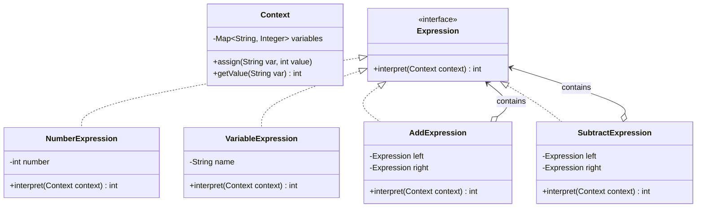

# Interpreter Pattern (Mẫu Trình Thông Dịch)

## 1. Mục tiêu (Intent)

**Interpreter** là một mẫu thiết kế behavioral (hành vi) định nghĩa cách biểu diễn ngữ pháp (grammar) của một ngôn ngữ đơn giản và cung cấp một trình thông dịch (interpreter) để đánh giá/thực thi các câu hoặc biểu thức trong ngôn ngữ đó.

Mục tiêu chính:

- Xây dựng một công cụ phân tích cú pháp và thực thi các câu lệnh thuộc một ngôn ngữ chuyên biệt (Domain-Specific Language - DSL).
- Biểu diễn các quy tắc ngữ pháp dưới dạng cây cấu trúc lớp phân cấp, dễ dàng mở rộng và bổ sung các quy tắc mới.
- Chuyển đổi một chuỗi văn bản ký tự (như biểu thức toán học hoặc logic) thành một cây cú pháp và tính toán ra kết quả cuối cùng.

---

## 2. Bối cảnh đặt ra (Problem Scenario)

Hãy tưởng tượng bạn đang xây dựng một công cụ tính toán tài chính. Công cụ này cho phép người dùng nhập vào các biểu thức toán học dạng chuỗi ký tự chứa các biến số, ví dụ: `"x + y - 2"`.

Hệ thống cần:

- Nhận diện các biến `x` và `y` từ ngữ cảnh (Context) đang lưu giữ (ví dụ: `x = 10`, `y = 5`).
- Tính toán ra kết quả cuối cùng của biểu thức (`10 + 5 - 2 = 13`).

Nếu bạn tự viết mã phân tích cú pháp bằng cách duyệt chuỗi ký tự thủ công (`String parsing` dùng vòng lặp, cắt chuỗi và `if-else`):

```java
public int evaluate(String expression, Map<String, Integer> variables) {
    // Duyệt qua từng ký tự, phân tích dấu cộng, trừ, số, tên biến...
    // Rất khó để xử lý độ ưu tiên toán tử (như nhân chia trước cộng trừ sau) hoặc các dấu ngoặc đơn.
}
```

Vấn đề nảy sinh:

1. **Quá phức tạp**: Việc tự viết mã phân tích cú pháp (Parser) cho các biểu thức toán học phức tạp cực kỳ khó khăn, dễ phát sinh lỗi và khó kiểm thử.
2. **Khó mở rộng**: Nếu sau này bạn muốn bổ sung thêm toán tử mới (như phép nhân `*`, phép chia `/` hoặc lũy thừa `^`), bạn sẽ phải đập đi xây lại toàn bộ thuật toán duyệt chuỗi ký tự của mình.

---

## 3. Giải pháp (Solution)

Mẫu thiết kế **Interpreter** khuyên bạn hãy chuyển đổi các quy tắc ngữ pháp của ngôn ngữ thành một phân cấp lớp các biểu thức (**Expressions**).

Chúng ta phân loại biểu thức thành hai loại chính:

1. **Biểu thức Terminal (Terminal Expression)**: Các biểu thức lá, biểu diễn các giá trị cơ sở không thể phân rã nhỏ hơn. Ví dụ: Số số học cụ thể (`NumberExpression`) hoặc Tên biến số (`VariableExpression`).
2. **Biểu thức Non-terminal (Non-terminal Expression)**: Các biểu thức phức hợp biểu diễn các quy tắc ngữ pháp kết hợp nhiều biểu thức con. Ví dụ: Phép cộng (`AddExpression`), Phép trừ (`SubtractExpression`).

Chúng ta xây dựng một Cây cú pháp trừu tượng (Abstract Syntax Tree - AST) biểu diễn biểu thức toán học. Sau đó, gọi phương thức `interpret(context)` trên nút gốc của cây để kích hoạt tính toán đệ quy trên toàn bộ cây.

---

## 4. Cấu trúc thành phần (Structure)

Cấu trúc chuẩn của Interpreter bao gồm:



1. **Context**: Lưu giữ các thông tin toàn cục hoặc trạng thái chạy chương trình (ví dụ: giá trị các biến số).
2. **Abstract Expression (Expression)**: Interface chung định nghĩa phương thức `interpret(context)`.
3. **Terminal Expression (NumberExpression, VariableExpression)**: Triển khai trực tiếp việc đánh giá giá trị cơ sở.
4. **Non-terminal Expression (AddExpression, SubtractExpression)**: Chứa các tham chiếu tới các biểu thức con và kết hợp kết quả của chúng.

---

## 5. Ví dụ mã nguồn Java hoàn chỉnh (Java Code Example)

Dưới đây là mã nguồn Java triển khai trình thông dịch biểu thức toán học `"x + y - 2"`:

```java
import java.util.HashMap;
import java.util.Map;

// 1. Lớp Context lưu trữ giá trị các biến số
class Context {
    private final Map<String, Integer> variables = new HashMap<>();

    public void assign(String variable, int value) {
        variables.put(variable, value);
    }

    public int getValue(String variable) {
        if (!variables.containsKey(variable)) {
            throw new IllegalArgumentException("Biến số chưa được định nghĩa: " + variable);
        }
        return variables.get(variable);
    }
}

// 2. Interface Expression chung cho cây cú pháp
interface Expression {
    int interpret(Context context);
}

// 3. Terminal Expression: Đại diện cho một số nguyên cụ thể
class NumberExpression implements Expression {
    private final int number;

    public NumberExpression(int number) {
        this.number = number;
    }

    @Override
    public int interpret(Context context) {
        return number;
    }
}

// 4. Terminal Expression: Đại diện cho một biến số (x, y, z...)
class VariableExpression implements Expression {
    private final String name;

    public VariableExpression(String name) {
        this.name = name;
    }

    @Override
    public int interpret(Context context) {
        // Tra cứu giá trị của biến từ ngữ cảnh Context
        return context.getValue(name);
    }
}

// 5. Non-terminal Expression: Phép cộng (+)
class AddExpression implements Expression {
    private final Expression leftExpression;
    private final Expression rightExpression;

    public AddExpression(Expression left, Expression right) {
        this.leftExpression = left;
        this.rightExpression = right;
    }

    @Override
    public int interpret(Context context) {
        // Thực hiện tính toán đệ quy
        return leftExpression.interpret(context) + rightExpression.interpret(context);
    }
}

// 6. Non-terminal Expression: Phép trừ (-)
class SubtractExpression implements Expression {
    private final Expression leftExpression;
    private final Expression rightExpression;

    public SubtractExpression(Expression left, Expression right) {
        this.leftExpression = left;
        this.rightExpression = right;
    }

    @Override
    public int interpret(Context context) {
        return leftExpression.interpret(context) - rightExpression.interpret(context);
    }
}

// Lớp Client chạy ứng dụng
class Main {
    public static void main(String[] args) {
        System.out.println("--- Khởi tạo ngữ cảnh dữ liệu ---");
        Context context = new Context();
        context.assign("x", 10);
        context.assign("y", 5);

        System.out.println("Giá trị gán: x = 10, y = 5");

        System.out.println("\n--- Xây dựng cây cú pháp cho biểu thức: (x + y) - 2 ---");
        // Biểu diễn cây cú pháp cho biểu thức: (x + y) - 2
        //             Subtract (-)
        //            /            \
        //        Add (+)        Number (2)
        //       /       \
        // Var (x)      Var (y)

        Expression x = new VariableExpression("x");
        Expression y = new VariableExpression("y");
        Expression add = new AddExpression(x, y); // (x + y)
        Expression two = new NumberExpression(2);
        Expression expression = new SubtractExpression(add, two); // (x + y) - 2

        System.out.println("\n--- Tiến hành thông dịch và tính toán kết quả ---");
        int result = expression.interpret(context);
        System.out.println("Kết quả tính toán: " + result);

        if (result == 13) {
            System.out.println("[SUCCESS] Trình thông dịch hoạt động chính xác! (10 + 5 - 2 = 13)");
        }
    }
}
```

---

## 6. Luồng hoạt động (Workflow)

1. Client khởi tạo đối tượng `Context` và gán giá trị cho các biến số (`x = 10`, `y = 5`).
2. Client xây dựng cấu trúc Cây cú pháp trừu tượng (AST) bằng cách kết hợp các Expression:
    - Các biến và số là lá (`x`, `y`, `two`).
    - Các phép tính là cành (`add`, `expression`).
3. Client gọi phương thức `interpret(context)` trên đối tượng gốc là `SubtractExpression` (`expression`).
4. `SubtractExpression` gọi đệ quy phương thức `interpret()` của hai nhánh con:
    - Nhánh bên phải là `NumberExpression` trả về ngay giá trị `2`.
    - Nhánh bên trái là `AddExpression` tiếp tục gọi đệ quy các nhánh con của nó.
5. `AddExpression` gọi `interpret()` của `VariableExpression("x")` (trả về `10` từ context) và `VariableExpression("y")` (trả về `5` từ context), tiến hành cộng lại được `15`.
6. Kết quả `15` được trả ngược lên cho `SubtractExpression` trừ đi `2`, cho ra kết quả cuối cùng là `13` và trả về cho Client.

---

## 7. Đánh giá (Pros & Cons)

### Ưu điểm

- **Dễ dàng mở rộng ngữ pháp**: Để thêm một quy tắc toán học mới (ví dụ: phép nhân `MultiplyExpression`), bạn chỉ cần tạo một lớp mới triển khai interface `Expression` mà không làm thay đổi các lớp cũ.
- **Tuân thủ Single Responsibility**: Tách riêng logic biểu diễn ngữ pháp của từng toán tử vào các lớp độc lập, giúp code sạch và dễ quản lý.

### Nhược điểm

- **Khó áp dụng cho ngôn ngữ phức tạp**: Mẫu thiết kế này hoạt động cực tốt cho các ngôn ngữ cực kỳ đơn giản. Khi ngữ pháp trở nên phức tạp (như một ngôn ngữ lập trình thực sự Java, Python), số lượng lớp Expression sẽ bùng nổ khổng lồ, khiến cây cú pháp cực kỳ khó kiểm soát. Trong trường hợp đó, các thư viện tạo Parser chuyên nghiệp (như ANTLR hoặc Lex/Yacc) được khuyên dùng hơn.

---

## 8. So sánh với các mẫu khác (Comparison)

- **Interpreter vs Composite**: Về bản chất cấu trúc, Interpreter sử dụng mẫu thiết kế **Composite** để xây dựng cây cú pháp trừu tượng (AST). Các biểu thức Non-terminal đóng vai trò là Composite, còn các biểu thức Terminal đóng vai trò là Leaf.
- **Interpreter vs Visitor**: Bạn có thể kết hợp sử dụng **Visitor** để duyệt qua cây cú pháp của Interpreter nhằm thực hiện các thao tác phụ như: tối ưu hóa cây, kiểm tra kiểu dữ liệu, hoặc in đẹp biểu thức (pretty printing) mà không cần viết thêm phương thức trong các lớp Expression.

---

## 9. Ứng dụng thực tế (Real-world Use Cases)

- **SQL Parsers**: Các thư viện phân tích cú pháp câu lệnh truy vấn SQL (như `SELECT * FROM users WHERE age > 18`) thành một cây cú pháp trước khi chạy tối ưu hóa truy vấn và thực thi dưới Database.
- **Regular Expressions**: Công cụ biên dịch và thực thi các chuỗi regex (như `^[a-zA-Z0-9]+@[a-z]+\\.com$`) để xác thực định dạng email.
- **Quy tắc nghiệp vụ (Rule Engines)**: Phân tích cú pháp các quy tắc nghiệp vụ động được nhập vào bởi người dùng nghiệp vụ (ví dụ: _"Nếu tổng hóa đơn > 1000 và khách hàng là VIP thì giảm giá 10%"_) tại runtime.
