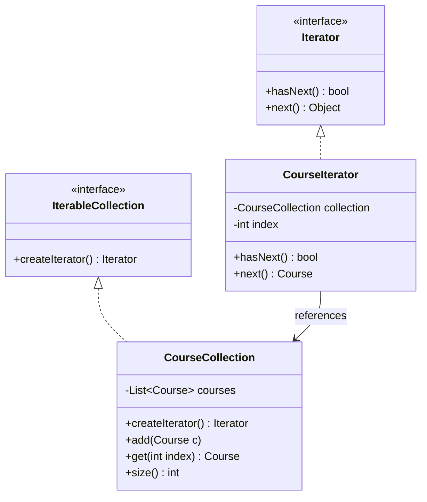

# Iterator Pattern (Mẫu Con Trỏ / Bộ Lặp)

## 1. Mục tiêu (Intent)

**Iterator** là một mẫu thiết kế behavioral (hành vi) cho phép bạn truy cập tuần tự (traverse) vào các phần tử của một tập hợp dữ liệu (Collection) mà không cần tiết lộ cấu trúc biểu diễn bên trong của nó (cho dù đó là danh sách liên kết, mảng, cây hay đồ thị).

Mục tiêu chính:

- Tách biệt logic duyệt phần tử ra khỏi lớp tập hợp dữ liệu, giữ cho các lớp tập hợp tập trung vào nhiệm vụ chính là lưu trữ dữ liệu.
- Cung cấp một giao diện (interface) chuẩn và đồng nhất để duyệt qua nhiều cấu trúc dữ liệu khác nhau mà không cần Client thay đổi logic code.
- Cho phép nhiều tiến trình duyệt (nhiều Iterator) cùng chạy song song trên một tập hợp dữ liệu mà không làm nhiễu loạn trạng thái của nhau.

---

## 2. Bối cảnh đặt ra (Problem Scenario)

Hãy tưởng tượng bạn đang xây dựng một nền tảng học tập trực tuyến. Hệ thống quản lý danh sách các khóa học (`Course`). Danh sách này hiện tại được lưu dưới dạng một danh sách liên kết (`LinkedList`) trong lớp `CourseCollection`.

Client muốn duyệt qua các khóa học để hiển thị lên màn hình:

```java
// Logic duyệt ở phía Client
LinkedList<Course> courses = courseCollection.getCourses();
for (int i = 0; i < courses.size(); i++) {
    Course c = courses.get(i);
    System.out.println(c.getTitle());
}
```

Vấn đề nảy sinh:

1. **Lộ chi tiết triển khai**: Client phải biết rằng `CourseCollection` sử dụng `LinkedList` bên dưới. Nếu sau này, để tối ưu hiệu năng tìm kiếm, bạn đổi kiểu lưu trữ từ `LinkedList` sang `HashMap` hoặc cấu trúc Cây (`Tree`), mã nguồn Client sẽ bị biên dịch lỗi và bắt buộc phải sửa đổi lại toàn bộ.
2. **Logic duyệt phức tạp**: Một cấu trúc dữ liệu phức tạp như Cây hoặc Đồ thị sẽ yêu cầu các thuật toán duyệt khác nhau (Duyệt theo chiều sâu - DFS, Duyệt theo chiều rộng - BFS). Việc viết các thuật toán này trực tiếp ở Client sẽ làm mã nguồn Client cực kỳ cồng kềnh.

---

## 3. Giải pháp (Solution)

Mẫu thiết kế **Iterator** giải quyết vấn đề bằng cách trích xuất hành vi duyệt tập hợp vào một đối tượng riêng biệt gọi là **Iterator**.

1. Đối tượng Iterator chịu trách nhiệm lưu trữ vị trí duyệt hiện tại (chỉ mục), kiểm tra xem còn phần tử tiếp theo hay không (`hasNext()`), và trả về phần tử kế tiếp (`next()`).
2. Lớp tập hợp (`CourseCollection`) sẽ triển khai một interface cho phép nó tự sinh ra một đối tượng Iterator tương thích với chính nó (`createIterator()`).
3. Client chỉ cần giao tiếp với Iterator thông qua interface chung. Cho dù tập hợp bên dưới đổi cấu trúc lưu trữ thế nào, Client vẫn duyệt phần tử theo một cách duy nhất.

---

## 4. Cấu trúc thành phần (Structure)

Cấu trúc chuẩn của Iterator bao gồm:



1. **Iterator (Interface)**: Định nghĩa các phép toán để duyệt qua tập hợp (thường là `hasNext()` và `next()`).
2. **Concrete Iterator (CourseIterator)**: Triển khai thuật toán duyệt cụ thể và lưu giữ vết trạng thái duyệt hiện tại.
3. **Iterable Collection (Interface)**: Khai báo phương thức để tạo ra đối tượng Iterator tương ứng.
4. **Concrete Collection (CourseCollection)**: Chứa cấu trúc dữ liệu thực tế và trả về thực thể của Concrete Iterator khi được yêu cầu.

---

## 5. Ví dụ mã nguồn Java hoàn chỉnh (Java Code Example)

Dưới đây là ví dụ tự xây dựng một Iterator để duyệt qua danh sách các khóa học:

```java
import java.util.ArrayList;
import java.util.List;

// Khóa học (Course)
class Course {
    private final String title;
    private final String category;

    public Course(String title, String category) {
        this.title = title;
        this.category = category;
    }

    public String getTitle() { return title; }
    public String getCategory() { return category; }
}

// 1. Interface Iterator định nghĩa phương thức duyệt chung
interface MyIterator<T> {
    boolean hasNext();
    T next();
}

// 2. Interface Collection cho phép tạo Iterator
interface MyIterableCollection<T> {
    MyIterator<T> createIterator();
}

// 3. Concrete Collection: Danh sách khóa học (CourseCollection)
class CourseCollection implements MyIterableCollection<Course> {
    private final List<Course> courses = new ArrayList<>();

    public void addCourse(Course course) {
        courses.add(course);
    }

    public int size() {
        return courses.size();
    }

    public Course get(int index) {
        return courses.get(index);
    }

    @Override
    public MyIterator<Course> createIterator() {
        return new CourseIterator(this); // Trả về bộ lặp tương ứng
    }
}

// 4. Concrete Iterator: Bộ lặp khóa học cụ thể
class CourseIterator implements MyIterator<Course> {
    private final CourseCollection collection;
    private int currentPosition = 0;

    public CourseIterator(CourseCollection collection) {
        this.collection = collection;
    }

    @Override
    public boolean hasNext() {
        return currentPosition < collection.size();
    }

    @Override
    public Course next() {
        if (!hasNext()) {
            return null;
        }
        Course course = collection.get(currentPosition);
        currentPosition++;
        return course;
    }
}

// Lớp Client chạy ứng dụng
class Main {
    public static void main(String[] args) {
        System.out.println("--- Tạo danh sách khóa học ---");
        CourseCollection courseCollection = new CourseCollection();
        courseCollection.addCourse(new Course("Java Core cho người mới", "Backend"));
        courseCollection.addCourse(new Course("Thiết kế UI/UX nâng cao", "Design"));
        courseCollection.addCourse(new Course("Xây dựng ứng dụng Next.js", "Frontend"));

        // Lấy bộ lặp Iterator (Client không hề biết danh sách lưu bằng ArrayList)
        MyIterator<Course> iterator = courseCollection.createIterator();

        System.out.println("\n--- Tiến hành duyệt danh sách qua Iterator ---");
        while (iterator.hasNext()) {
            Course course = iterator.next();
            System.out.println("- Khóa học: " + course.getTitle() + " (Chuyên ngành: " + course.getCategory() + ")");
        }
    }
}
```

---

## 6. Luồng hoạt động (Workflow)

1. Client khởi tạo tập hợp cụ thể `CourseCollection` và thêm các phần tử dữ liệu vào đó.
2. Khi cần duyệt, Client gọi `courseCollection.createIterator()`.
3. Lớp `CourseCollection` sinh ra một đối tượng `CourseIterator`, lưu tham chiếu tới chính `CourseCollection` (`this`) để truy cập dữ liệu và đặt chỉ mục duyệt ban đầu `currentPosition = 0`.
4. Client chạy vòng lặp `while (iterator.hasNext())`. Iterator kiểm tra xem chỉ mục hiện tại có vượt quá kích thước tập hợp không.
5. Nếu còn phần tử, Client gọi `iterator.next()`. Iterator lấy phần tử tại chỉ mục hiện tại, tăng chỉ mục lên 1 đơn vị, và trả về phần tử cho Client xử lý.

---

## 7. Đánh giá (Pros & Cons)

### Ưu điểm

- **Tách biệt mối quan tâm (Single Responsibility)**: Tách logic duyệt phần tử ra khỏi lớp chứa dữ liệu giúp cả hai lớp đơn giản và dễ đọc hơn.
- **Tính đóng gói dữ liệu (Encapsulation)**: Che giấu cấu trúc dữ liệu bên dưới của tập hợp khỏi tầm mắt của Client (an toàn bảo mật dữ liệu).
- **Tính đa hình**: Client có thể duyệt qua nhiều kiểu cấu trúc dữ liệu khác nhau bằng cùng một cú pháp mã nguồn chuẩn.

### Nhược điểm

- **Độ phức tạp tăng nhẹ**: Yêu cầu tạo thêm các interface và class Iterator tương ứng cho mỗi lớp tập hợp.
- **Có thể dư thừa**: Nếu ứng dụng của bạn chỉ làm việc với các mảng tĩnh đơn giản, việc áp dụng Iterator có thể làm quá tải cấu trúc hệ thống không cần thiết.

---

## 8. So sánh với các mẫu khác (Comparison)

- **Iterator vs Visitor**:
    - **Iterator** dùng để duyệt tuần tự qua các phần tử của một tập hợp mà không quan tâm đến nghiệp vụ xử lý cụ thể.
    - **Visitor** dùng để áp dụng một thuật toán nghiệp vụ lên toàn bộ các phần tử thuộc nhiều lớp khác nhau của một cấu trúc phức tạp.
- **Iterator vs Composite**: Iterator thường được dùng để duyệt qua các cấu trúc cây phức tạp được dựng bằng Composite.

---

## 9. Ứng dụng thực tế (Real-world Use Cases)

- **Java Core Collections**: Hầu hết mọi cấu trúc dữ liệu trong gói `java.util` (như `ArrayList`, `HashSet`, `LinkedList`) đều triển khai interface `java.lang.Iterable` và cung cấp phương thức `iterator()`.
- **Java For-Each Loop**: Vòng lặp `for (Type item : collection)` trong Java bản chất là cú pháp rút gọn (syntactic sugar) tự động biên dịch thành việc khởi tạo Iterator và chạy vòng lặp `while(iterator.hasNext())`.
- **Database Cursors**: Khi truy vấn cơ sở dữ liệu trả về hàng triệu dòng kết quả (ResultSet), driver sử dụng một con trỏ (Cursor) hoạt động như một Iterator để tải dữ liệu về client theo từng trang (Pagination) tránh quá tải RAM.
