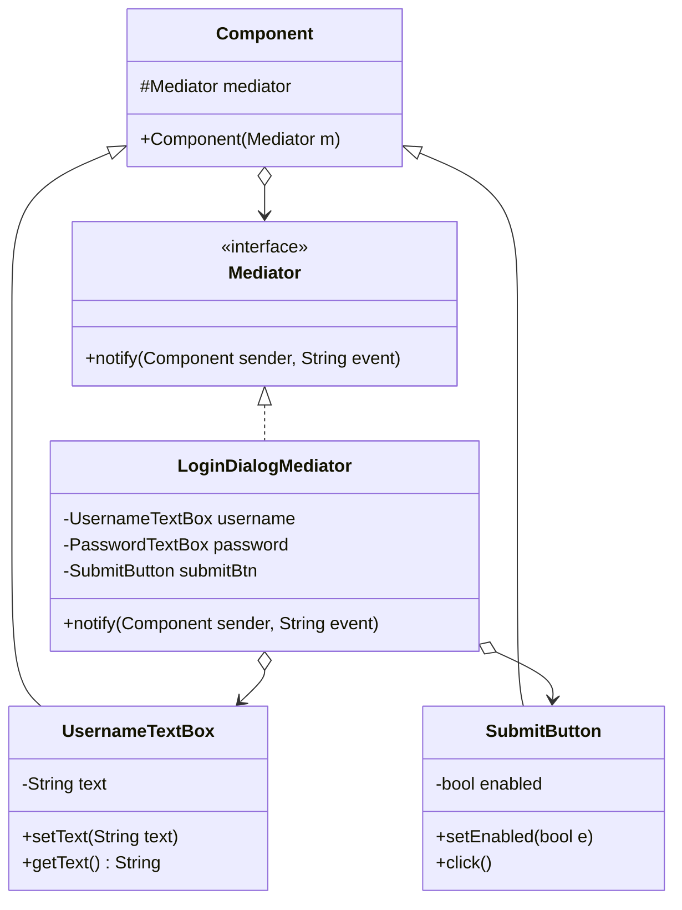

# Mediator Pattern (Mẫu Trung Gian)

## 1. Mục tiêu (Intent)

**Mediator** là một mẫu thiết kế behavioral (hành vi) giảm thiểu sự phụ thuộc lẫn nhau (coupling) giữa các đối tượng bằng cách ngăn không cho chúng giao tiếp trực tiếp với nhau. Thay vào đó, các đối tượng này chỉ giao tiếp gián tiếp thông qua một đối tượng **trung gian điều phối (Mediator)** duy nhất.

Mục tiêu chính:

- Loại bỏ mạng lưới liên kết chằng chịt ("spaghetti code") khi các lớp giữ tham chiếu chéo lẫn nhau.
- Tái sử dụng các thành phần (components) dễ dàng hơn vì chúng không còn phụ thuộc vào các lớp khác trong hệ thống.
- Tập trung hóa logic điều phối luồng hoạt động của một nhóm đối tượng vào một nơi duy nhất.

---

## 2. Bối cảnh đặt ra (Problem Scenario)

Hãy tưởng tượng bạn đang thiết kế một giao diện Form Đăng nhập phức tạp chứa nhiều thành phần:

- Một hộp văn bản nhập tên đăng nhập (`UsernameTextBox`).
- Một hộp văn bản nhập mật khẩu (`PasswordTextBox`).
- Một hộp kiểm nhớ mật khẩu (`RememberMeCheckBox`).
- Một nút bấm gửi form (`SubmitButton`).

Khi người dùng tương tác, các thành phần cần cập nhật trạng thái lẫn nhau:

1. Khi `UsernameTextBox` rỗng, `SubmitButton` phải bị vô hiệu hóa (disabled).
2. Khi tích chọn `RememberMeCheckBox`, hệ thống cần hiển thị một thông báo gợi ý bảo mật.
3. Khi nhấn `SubmitButton`, hệ thống cần lấy dữ liệu từ cả hai ô văn bản để xác thực.

Nếu các thành phần tự gọi trực tiếp lẫn nhau:

```java
public class UsernameTextBox {
    private SubmitButton submitButton; // Giữ tham chiếu để bật/tắt nút
    private CheckBox rememberMe;       // Giữ tham chiếu để kiểm tra

    public void onTextChanged() {
        if (text.isEmpty()) {
            submitButton.disable();
        } else {
            submitButton.enable();
        }
    }
}
```

Vấn đề nảy sinh:

1. **Liên kết quá chặt chẽ (Tight Coupling)**: Ô văn bản nhập tên phải biết đến sự tồn tại của nút bấm và hộp kiểm. Điều này khiến bạn không thể mang ô văn bản này sang dùng ở một Form khác (ví dụ: Form Tìm kiếm) vì nó bị dính chặt với các nút bấm của Form Đăng nhập.
2. **Khó bảo trì**: Khi số lượng thành phần giao diện tăng lên (ví dụ: thêm nút Reset, ô nhập Captcha), số lượng đường liên kết chéo giữa các lớp sẽ tăng theo cấp số nhân, khiến mã nguồn trở thành một mớ hỗn độn không thể kiểm soát.

---

## 3. Giải pháp (Solution)

Mẫu thiết kế **Mediator** khuyên bạn: Hãy bắt các thành phần giao diện ngừng giao tiếp trực tiếp với nhau.

Thay vào đó, bạn tạo ra một lớp điều phối trung gian (ví dụ: `LoginDialogMediator`).

- Tất cả các thành phần giao diện chỉ giữ duy nhất một tham chiếu đến đối tượng Mediator này.
- Khi có sự kiện xảy ra (ví dụ: người dùng gõ chữ vào `UsernameTextBox`), thành phần đó chỉ cần thông báo cho Mediator: _"Này Mediator, tao vừa bị thay đổi chữ nhé!"_.
- Mediator nhận thông báo, tự xử lý logic nghiệp vụ và ra lệnh cập nhật lại trạng thái cho các thành phần liên quan (`SubmitButton.enable()`, v.v.).

Các thành phần giao diện hoàn toàn "mù" thông tin về nhau, chúng chỉ làm việc với một đầu mối duy nhất là Mediator.

---

## 4. Cấu trúc thành phần (Structure)

Cấu trúc chuẩn của Mediator bao gồm:



1. **Mediator (Interface)**: Khai báo phương thức giao tiếp chung, thường là `notify(sender, event)`.
2. **Concrete Mediator (LoginDialogMediator)**: Triển khai logic điều phối bằng cách giữ tham chiếu đến các thành phần con và xử lý các sự kiện nhận được từ chúng.
3. **Component (Base Class)**: Lớp cơ sở chứa tham chiếu tới Mediator.
4. **Concrete Components (UsernameTextBox, SubmitButton)**: Các lớp nghiệp vụ độc lập. Khi có sự kiện, chúng gọi Mediator để thông báo.

---

## 5. Ví dụ mã nguồn Java hoàn chỉnh (Java Code Example)

Dưới đây là mã nguồn Java mô phỏng Form Đăng nhập sử dụng Mediator:

```java
// 1. Interface Mediator chung
interface Mediator {
    void notify(Component sender, String event);
}

// 2. Lớp Component cơ sở
abstract class Component {
    protected Mediator mediator;

    public Component(Mediator mediator) {
        this.mediator = mediator;
    }
}

// 3. Concrete Component: Hộp văn bản nhập liệu (TextBox)
class TextBox extends Component {
    private String text = "";

    public TextBox(Mediator mediator) {
        super(mediator);
    }

    public void setText(String text) {
        this.text = text;
        // Thông báo cho Mediator biết nội dung đã thay đổi
        mediator.notify(this, "textChanged");
    }

    public String getText() {
        return text;
    }
}

// 4. Concrete Component: Nút bấm (Button)
class Button extends Component {
    private boolean enabled = false;

    public Button(Mediator mediator) {
        super(mediator);
    }

    public void setEnabled(boolean enabled) {
        this.enabled = enabled;
    }

    public boolean isEnabled() {
        return enabled;
    }

    public void click() {
        if (enabled) {
            System.out.println("[BUTTON] Đang gửi dữ liệu đăng nhập...");
            mediator.notify(this, "submit");
        } else {
            System.out.println("[BUTTON] Click vô hiệu! Nút đang bị khóa.");
        }
    }
}

// 5. Concrete Mediator: Bộ điều phối Form đăng nhập (LoginDialog)
class LoginDialog implements Mediator {
    private TextBox usernameTextBox;
    private TextBox passwordTextBox;
    private Button submitButton;

    // Thiết lập các component cần điều phối
    public void setUsernameTextBox(TextBox usernameTextBox) {
        this.usernameTextBox = usernameTextBox;
    }

    public void setPasswordTextBox(TextBox passwordTextBox) {
        this.passwordTextBox = passwordTextBox;
    }

    public void setSubmitButton(Button submitButton) {
        this.submitButton = submitButton;
    }

    @Override
    public void notify(Component sender, String event) {
        // Logic điều phối tập trung
        if (sender instanceof TextBox && "textChanged".equals(event)) {
            System.out.println("[MEDIATOR] Nhận sự kiện thay đổi văn bản.");
            // Kiểm tra nếu cả username và password đều không rỗng thì mới bật nút Submit
            boolean isValid = !usernameTextBox.getText().isEmpty() && !passwordTextBox.getText().isEmpty();
            submitButton.setEnabled(isValid);
            System.out.println("-> Cập nhật Submit Button: " + (isValid ? "MỞ KHÓA" : "KHÓA"));
        }

        if (sender instanceof Button && "submit".equals(event)) {
            System.out.println("[MEDIATOR] Nhận sự kiện Submit form.");
            System.out.println("-> Tiến hành xác thực: User = " + usernameTextBox.getText()
                               + ", Pass = " + passwordTextBox.getText());
        }
    }
}

// Lớp Client chạy ứng dụng
class Main {
    public static void main(String[] args) {
        System.out.println("--- Khởi tạo giao diện Form ---");
        LoginDialog mediator = new LoginDialog();

        // Các component chỉ cần liên kết với duy nhất Mediator
        TextBox username = new TextBox(mediator);
        TextBox password = new TextBox(mediator);
        Button submit = new Button(mediator);

        // Đăng ký các component vào Mediator
        mediator.setUsernameTextBox(username);
        mediator.setPasswordTextBox(password);
        mediator.setSubmitButton(submit);

        System.out.println("\n--- THỬ NGHIỆM 1: Click nút submit khi chưa nhập gì ---");
        submit.click();

        System.out.println("\n--- THỬ NGHIỆM 2: Nhập Username ---");
        username.setText("knguyen1411");

        System.out.println("\n--- THỬ NGHIỆM 3: Nhập tiếp Password ---");
        password.setText("my-secret-pass");

        System.out.println("\n--- THỬ NGHIỆM 4: Click submit khi nút đã mở khóa ---");
        submit.click();
    }
}
```

---

## 6. Luồng hoạt động (Workflow)

1. Khởi tạo đối tượng trung gian `LoginDialog` (Mediator).
2. Khởi tạo các thành phần giao diện (`username`, `password`, `submit`), truyền `mediator` vào constructor của chúng.
3. Khi người dùng nhập tên đăng nhập thông qua `username.setText("knguyen1411")`:
    - Ô nhập tên cập nhật giá trị nội bộ, sau đó gọi `mediator.notify(this, "textChanged")`.
4. Đối tượng `mediator` nhận thông điệp, kiểm tra xem người gửi là ai và sự kiện gì.
5. `mediator` truy vấn dữ liệu từ `username` và `password`, nhận thấy thông tin chưa đủ (password vẫn rỗng), nên nó ra lệnh khóa nút bấm bằng cách gọi `submitButton.setEnabled(false)`.
6. Khi người dùng nhập tiếp password, quy trình lặp lại. Lúc này, cả hai ô đều có chữ, `mediator` gọi `submitButton.setEnabled(true)` để mở khóa nút bấm.

---

## 7. Đánh giá (Pros & Cons)

### Ưu điểm

- **Giảm khớp nối (Loose Coupling)**: Các thành phần nghiệp vụ hoạt động hoàn toàn độc lập, tăng khả năng tái sử dụng mã nguồn.
- **Tuân thủ Single Responsibility**: Gom toàn bộ logic điều phối phức tạp giữa các đối tượng vào một lớp duy nhất, giúp các lớp thành phần con cực kỳ gọn nhẹ.
- **Tuân thủ Open/Closed Principle**: Dễ dàng thay thế hoặc thêm mới một Mediator khác để thay đổi cách các component giao tiếp mà không cần sửa code của component.

### Nhược điểm

- **Lớp trung gian quá lớn (God Object)**: Theo thời gian, khi hệ thống lớn lên, lớp Mediator sẽ phình to khủng khiếp vì chứa logic giao tiếp của mọi thành phần, trở nên cực kỳ khó bảo trì.

---

## 8. So sánh với các mẫu khác (Comparison)

- **Mediator vs Facade**:
    - **Facade** cung cấp giao diện đơn giản hóa cho một hệ thống con (subsystem) phức tạp. Các yêu cầu đi **một chiều** từ client qua Facade vào subsystem. Bản thân subsystem không biết đến Facade.
    - **Mediator** tạo ra giao tiếp **hai chiều** giữa các đối tượng con. Các đối tượng con chủ động gửi thông báo cho Mediator và nhận lệnh ngược lại từ Mediator.
- **Mediator vs Observer**: Cả hai đều hỗ trợ giao tiếp giữa các đối tượng. Tuy nhiên:
    - **Observer** thiết lập mối quan hệ 1-nhiều động: Một đối tượng thay đổi tự động thông báo tới danh sách các Subscriber đăng ký.
    - **Mediator** thiết lập mối quan hệ nhiều-nhiều tĩnh: Tập trung hóa mọi tương tác của một nhóm đối tượng vào một điểm trung tâm duy nhất.

---

## 9. Ứng dụng thực tế (Real-world Use Cases)

- **Hệ thống điều khiển bay ở sân bay**: Các phi công lái máy bay (Components) không tự nói chuyện trực tiếp với nhau để tránh va chạm. Thay vào đó, tất cả đều phải liên lạc với Tháp kiểm soát không lưu (Mediator) để nhận lệnh cất cánh/hạ cánh.
- **Chat Rooms**: Trong một phòng chat nhóm, các thành viên không gửi tin nhắn trực tiếp đến IP của nhau. Tất cả tin nhắn được gửi lên Server Chat (Mediator), Server chịu trách nhiệm chuyển tiếp tin nhắn đến các thành viên còn lại trong phòng.
- **MVC Architecture**: Lớp Controller trong kiến trúc Model-View-Controller hoạt động như một Mediator, nhận sự kiện từ View, truy vấn dữ liệu từ Model và cập nhật lại View tương ứng.
