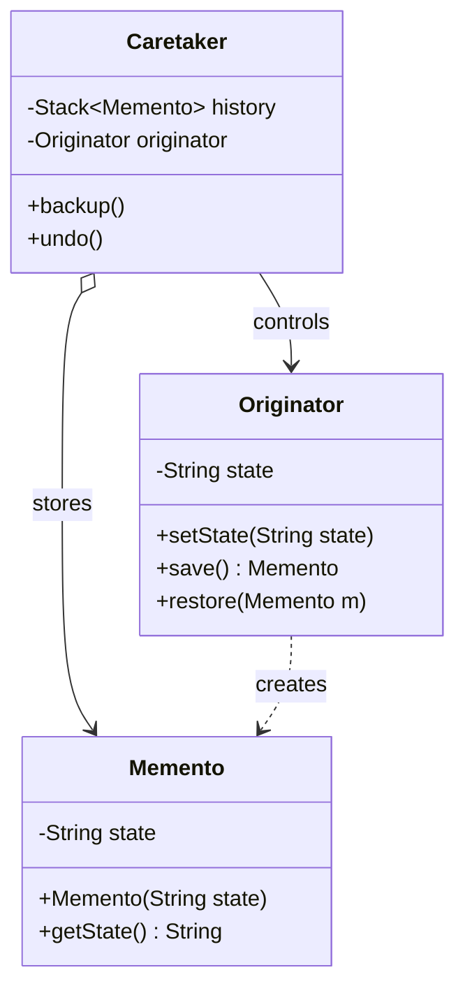

# Memento Pattern (Mẫu Vật Kỷ Niệm / Snapshot)

## 1. Mục tiêu (Intent)

**Memento** là một mẫu thiết kế behavioral (hành vi) cho phép bạn lưu lại ảnh chụp trạng thái (snapshot) hiện tại của một đối tượng mà không vi phạm nguyên tắc đóng gói (encapsulation), nhằm giúp đối tượng đó có thể quay trở lại trạng thái đã lưu bất cứ lúc nào (tính năng hoàn tác - Undo).

Mục tiêu chính:

- Lưu giữ các phiên bản trạng thái của đối tượng để khôi phục khi cần thiết.
- Tránh việc để lộ cấu trúc dữ liệu hoặc các thuộc tính nội bộ (`private`) của đối tượng ra bên ngoài trong quá trình lưu trữ.
- Đơn giản hóa vai trò của đối tượng chính bằng cách giao trách nhiệm lưu trữ lịch sử trạng thái cho một lớp quản lý khác (`Caretaker`).

---

## 2. Bối cảnh đặt ra (Problem Scenario)

Hãy tưởng tượng bạn đang viết một ứng dụng soạn thảo văn bản (`TextEditor`). Người dùng có thể gõ văn bản, thay đổi định dạng chữ, và di chuyển vị trí con trỏ. Bạn cần xây dựng tính năng **Undo (Hoàn tác)** giúp người dùng quay lại bước soạn thảo trước đó nếu gõ nhầm.

Để làm được điều này, trước khi thực hiện bất cứ hành động nào, ứng dụng cần sao chép toàn bộ thông số trạng thái của `TextEditor` (như nội dung văn bản `text`, tọa độ con trỏ `cursorX`, `cursorY`) và lưu vào một danh sách lịch sử.

Nếu bạn viết mã theo cách thông thường:

```java
public class EditorHistory {
    private List<TextEditorState> states = new ArrayList<>();
    private TextEditor editor;

    public void backup() {
        // Lỗi: Muốn lưu trạng thái, lớp History phải truy cập các thuộc tính private của Editor
        String txt = editor.text; // Sẽ báo lỗi compile nếu text là private
        int x = editor.cursorX;
        states.add(new TextEditorState(txt, x));
    }
}
```

Vấn đề nảy sinh:

1. **Vi phạm tính đóng gói**: Lớp `EditorHistory` cần quyền truy cập trực tiếp vào các thuộc tính bên trong của `TextEditor` để sao chép. Nếu bạn mở công khai (`public`) các thuộc tính này, bất kỳ lớp nào khác trong dự án cũng có thể chỉnh sửa chúng một cách tự do, làm tăng nguy cơ lỗi hệ thống.
2. **Liên kết chặt chẽ (Tight Coupling)**: Bất kỳ thay đổi nào về cấu trúc nội bộ của `TextEditor` (ví dụ: đổi kiểu dữ liệu tọa độ từ `int` sang lớp `Coordinate`) đều buộc bạn phải sửa đổi lại toàn bộ lớp lưu lịch sử `EditorHistory`.

---

## 3. Giải pháp (Solution)

Mẫu thiết kế **Memento** giải quyết vấn đề bằng cách giao trách nhiệm tự tạo ra ảnh chụp trạng thái cho chính đối tượng chủ sở hữu trạng thái đó - **Originator** (ở đây là `TextEditor`).

1. `TextEditor` sẽ tự tạo ra một đối tượng đặc biệt gọi là **Memento** chứa các thông tin trạng thái bất biến tại thời điểm hiện tại của chính nó.
2. Đối tượng **Memento** được thiết kế như một hộp đen (Black Box): Nó giới hạn quyền truy cập tối đa đối với các lớp bên ngoài, chỉ cho phép đối tượng tạo ra nó (`TextEditor`) đọc và nạp lại trạng thái từ nó.
3. Một đối tượng quản lý lịch sử gọi là **Caretaker** (ví dụ: `History`) sẽ lưu trữ danh sách các Memento dưới dạng một Stack. Caretaker không được phép đọc hay chỉnh sửa nội dung bên trong Memento.
4. Khi cần Undo, Caretaker lấy Memento cuối cùng ra khỏi Stack và truyền ngược lại cho `TextEditor` tự giải nén và khôi phục trạng thái.

---

## 4. Cấu trúc thành phần (Structure)

Cấu trúc chuẩn của Memento bao gồm:



1. **Originator (TextEditor)**: Đối tượng gốc có trạng thái cần được lưu trữ và khôi phục. Nó có phương thức tạo Memento (`save()`) và phục hồi từ Memento (`restore()`).
2. **Memento**: Đối tượng chứa trạng thái đã được chụp. Nó là bất biến (immutable) và chỉ có Originator mới có quyền truy cập dữ liệu bên trong.
3. **Caretaker (History)**: Quản lý danh sách các Memento. Nó biết thời điểm nào cần sao lưu (`backup()`) và thời điểm nào cần khôi phục (`undo()`).

---

## 5. Ví dụ mã nguồn Java hoàn chỉnh (Java Code Example)

Dưới đây là mã nguồn Java mô tả chức năng soạn thảo văn bản có hỗ trợ Undo:

```java
import java.util.Stack;

// 1. Đối tượng Memento chứa trạng thái chụp lại
class EditorMemento {
    // Thuộc tính là final để đảm bảo trạng thái đã lưu không bị sửa đổi ngoài ý muốn
    private final String content;

    public EditorMemento(String content) {
        this.content = content;
    }

    // Chỉ cho phép truy cập gói nội bộ hoặc lớp Originator đọc
    String getContent() {
        return content;
    }
}

// 2. Lớp Originator: Trình soạn thảo văn bản (TextEditor)
class TextEditor {
    private String content = "";

    public void write(String text) {
        this.content += text;
    }

    public String getContent() {
        return content;
    }

    // Tạo ảnh chụp trạng thái hiện tại
    public EditorMemento save() {
        System.out.println("[EDITOR] Đang tạo ảnh chụp trạng thái: \"" + content + "\"");
        return new EditorMemento(content);
    }

    // Khôi phục trạng thái từ ảnh chụp
    public void restore(EditorMemento memento) {
        if (memento != null) {
            this.content = memento.getContent();
            System.out.println("[EDITOR] Đã khôi phục văn bản về phiên bản trước.");
        }
    }
}

// 3. Lớp Caretaker: Quản lý lịch sử (History)
class History {
    private final Stack<EditorMemento> historyStack = new Stack<>();
    private final TextEditor editor;

    public History(TextEditor editor) {
        this.editor = editor;
    }

    // Sao lưu trạng thái hiện tại của editor
    public void backup() {
        historyStack.push(editor.save());
    }

    // Hoàn tác hành động gần nhất
    public void undo() {
        if (historyStack.isEmpty()) {
            System.out.println("[HISTORY] Không còn lịch sử để Undo!");
            return;
        }
        // Lấy memento ra và trả lại cho editor tự khôi phục
        EditorMemento memento = historyStack.pop();
        editor.restore(memento);
    }
}

// Lớp Client chạy ứng dụng
class Main {
    public static void main(String[] args) {
        TextEditor editor = new TextEditor();
        History history = new History(editor);

        System.out.println("--- Người dùng soạn thảo văn bản ---");
        editor.write("Chào mừng ");
        System.out.println("Nội dung: " + editor.getContent());

        // Lưu trạng thái lần 1
        history.backup();

        editor.write("đến với khóa học ");
        System.out.println("Nội dung: " + editor.getContent());

        // Lưu trạng thái lần 2
        history.backup();

        editor.write("Design Patterns!");
        System.out.println("Nội dung: " + editor.getContent());

        System.out.println("\n--- Thực hiện hoàn tác (Undo 1) ---");
        history.undo();
        System.out.println("Nội dung sau Undo 1: " + editor.getContent());

        System.out.println("\n--- Thực hiện hoàn tác (Undo 2) ---");
        history.undo();
        System.out.println("Nội dung sau Undo 2: " + editor.getContent());

        System.out.println("\n--- Thực hiện hoàn tác (Undo 3 - Hết lịch sử) ---");
        history.undo();
    }
}
```

---

## 6. Luồng hoạt động (Workflow)

1. Client khởi tạo `TextEditor` (Originator) và `History` (Caretaker).
2. Khi người dùng thực hiện một thao tác quan trọng, Client gọi `history.backup()`.
3. Lớp `History` gọi `editor.save()`. Lớp `TextEditor` tự đóng gói nội dung văn bản hiện tại vào một đối tượng `EditorMemento` mới tinh và trả về cho `History`.
4. `History` nhận đối tượng Memento này và đẩy vào `historyStack` để lưu trữ mà không hề đọc hay tác động gì tới thuộc tính bên trong nó.
5. Khi người dùng kích hoạt lệnh Undo, Client gọi `history.undo()`.
6. Lớp `History` lấy memento ở đỉnh Stack ra và gọi `editor.restore(memento)`. `TextEditor` nhận memento, tự giải nén lấy thuộc tính `content` và cập nhật lại biến nội bộ của mình.

---

## 7. Đánh giá (Pros & Cons)

### Ưu điểm

- **Đóng gói tuyệt đối**: Bảo vệ tính toàn vẹn dữ liệu của Originator. Không một lớp nào ngoài Originator được can thiệp vào cấu trúc snapshot.
- **Phân tách trách nhiệm (Separation of Concerns)**: Lớp Originator không cần tự quản lý danh sách lịch sử hay lo lắng việc chiếm dụng bộ nhớ Stack. Nhiệm vụ quản lý này được giao hoàn toàn cho Caretaker.

### Nhược điểm

- **Tốn bộ nhớ**: Nếu đối tượng Originator có dung lượng lớn (như hình ảnh độ phân giải cao hoặc dữ liệu âm thanh), việc liên tục tạo và lưu trữ Memento vào Stack sẽ nhanh chóng làm cạn kiệt bộ nhớ RAM.
- **Chi phí dọn dẹp**: Caretaker cần có cơ chế giới hạn kích thước Stack (ví dụ chỉ cho Undo tối đa 50 bước) và dọn dẹp các memento cũ để giải phóng tài nguyên.

---

## 8. So sánh với các mẫu khác (Comparison)

- **Memento vs Prototype**:
    - **Memento** lưu giữ trạng thái nội bộ tĩnh nhằm phục vụ cho mục đích khôi phục về sau (Undo), đối tượng Memento là bất biến và không dùng để hoạt động trực tiếp.
    - **Prototype** tạo ra một bản sao hoạt động độc lập, có thể thay đổi trạng thái và chạy song song với đối tượng gốc.
- **Memento vs Command**: Thường được kết hợp với nhau. Các đối tượng `Command` (như Copy, Paste, Delete) có thể lưu giữ một `Memento` đại diện cho trạng thái trước khi lệnh được chạy, để khi gọi phương thức `command.undo()`, nó sẽ khôi phục lại trạng thái cũ của hệ thống.

---

## 9. Ứng dụng thực tế (Real-world Use Cases)

- **Trình chỉnh sửa đồ họa (Photoshop, Figma)**: Lưu trữ các bước chỉnh sửa layer, đổi màu sắc để hỗ trợ người dùng Undo qua bảng điều khiển History.
- **Database Transactions (Rollback)**: Khi thực hiện một chuỗi các câu lệnh SQL (Transaction) và gặp lỗi ở giữa chừng, hệ thống cơ sở dữ liệu sử dụng cơ chế tương tự Memento để khôi phục (Rollback) dữ liệu về trạng thái an toàn trước khi chạy Transaction.
- **Game Saves**: Tính năng Lưu game (Save game) chụp lại toàn bộ máu, trang bị, vị trí của nhân vật và lưu thành file nhị phân xuống ổ cứng để người chơi nạp lại (Load game) khi thua cuộc.
