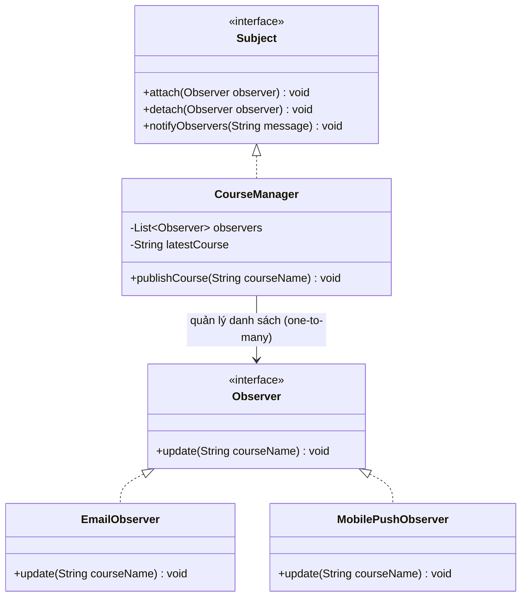

# Observer Pattern (Mẫu Thiết Kế Người Quan Sát)

## 1. Mục tiêu (Intent)

**Observer** (hay còn gọi là Publish-Subscribe) là một mẫu thiết kế thuộc nhóm behavioral (hành vi). Nó định nghĩa một mối quan hệ phụ thuộc một-nhiều (one-to-many) giữa các đối tượng sao cho khi một đối tượng thay đổi trạng thái, tất cả các đối tượng phụ thuộc của nó sẽ nhận được thông báo và tự động cập nhật.

Mục tiêu chính:

- Thiết lập cơ chế truyền thông tin bất đồng bộ hoặc hướng sự kiện (event-driven).
- Giảm thiểu sự liên kết cứng (coupling) giữa chủ thể phát sự kiện (Subject/Publisher) và các bên tiêu thụ sự kiện (Observer/Subscriber).
- Cho phép đăng ký (subscribe) hoặc hủy đăng ký (unsubscribe) các bên quan sát một cách linh hoạt tại runtime.

---

## 2. Bối cảnh đặt ra (Problem Scenario)

Hãy tưởng tượng bạn đang xây dựng một nền tảng học tập trực tuyến. Hệ thống có lớp quản lý thông tin các khóa học là `CourseManager`. Khi một giảng viên xuất bản một **Khóa học mới (New Course)**, hệ thống cần thực hiện nhiều hành động:

1. Gửi email thông báo cho học viên quan tâm (`EmailService`).
2. Gửi thông báo đẩy (push notification) lên điện thoại học viên (`MobilePushService`).
3. Ghi log sự kiện phục vụ thống kê marketing (`AnalyticsService`).

Nếu bạn viết code theo cách thông thường:

```java
class CourseManager {
    private EmailService emailService = new EmailService();
    private MobilePushService pushService = new MobilePushService();
    private AnalyticsService analyticsService = new AnalyticsService();

    public void publishCourse(String courseName) {
        System.out.println("Khóa học mới xuất bản: " + courseName);

        // Gọi trực tiếp các dịch vụ liên quan
        emailService.sendEmail(courseName);
        pushService.sendPushNotification(courseName);
        analyticsService.logPublishEvent(courseName);
    }
}
```

Vấn đề nảy sinh:

- **Kết dính chặt (Tight Coupling)**: `CourseManager` phụ thuộc trực tiếp vào 3 lớp dịch vụ cụ thể kia. Nếu một dịch vụ thay đổi chữ ký phương thức hoặc bạn muốn tạm dừng gửi SMS, bạn buộc phải sửa code của `CourseManager`.
- **Khó mở rộng**: Sau này, nếu muốn thêm một kênh thông báo mới (ví dụ Telegram), bạn lại phải sửa code của `CourseManager`. Điều này vi phạm nghiêm trọng nguyên lý Open/Closed (OCP).
- **Khó kiểm thử**: Rất khó để viết Unit Test cho `CourseManager` một cách độc lập mà không bị dính líu đến logic gửi email hay push notification thực tế.

---

## 3. Giải pháp (Solution)

Mẫu thiết kế **Observer** đề xuất tách biệt nguồn phát sự kiện và các đối tượng quan tâm.

- **Subject (Chủ thể phát sự kiện)**: Giữ một danh sách các bên đăng ký (observers) và cung cấp các hàm để thêm (`attach`), xóa (`detach`) observer khỏi danh sách. Khi trạng thái thay đổi, Subject duyệt qua danh sách và gọi phương thức cập nhật chung trên từng observer.
- **Observer (Bên quan sát)**: Định nghĩa một interface chung có phương thức nhận thông báo (ví dụ `update()`). Các dịch vụ cụ thể như gửi Email, SMS sẽ triển khai interface này.

---

## 4. Cấu trúc thành phần (Structure)

Cấu trúc chuẩn của Observer Pattern bao gồm các thành phần sau:



1. **Subject (Publisher)**: Interface định nghĩa các phương thức đăng ký, hủy đăng ký và thông báo.
2. **Concrete Subject**: Lớp triển khai thực tế của Subject (`CourseManager`). Nó lưu giữ trạng thái và thông báo cho các bên quan sát khi trạng thái thay đổi.
3. **Observer (Subscriber)**: Giao diện chung định nghĩa phương thức cập nhật cho các bên nhận sự kiện (`Observer`).
4. **Concrete Observers**: Các lớp triển khai cụ thể của Observer, định nghĩa hành động thực tế khi nhận được sự kiện (`EmailObserver`, `MobilePushObserver`).

---

## 5. Ví dụ mã nguồn Java hoàn chỉnh (Java Code Example)

Dưới đây là cách triển khai Observer Pattern bằng Java:

```java
import java.util.ArrayList;
import java.util.List;

// 1. Observer Interface (Người quan sát)
interface Observer {
    void update(String courseName);
}

// 2. Subject Interface (Chủ thể phát sự kiện)
interface Subject {
    void attach(Observer observer);
    void detach(Observer observer);
    void notifyObservers(String courseName);
}

// 3. Concrete Subject (Chủ thể cụ thể)
class CourseManager implements Subject {
    private final List<Observer> observers = new ArrayList<>();
    private String latestCourse;

    @Override
    public void attach(Observer observer) {
        if (!observers.contains(observer)) {
            observers.add(observer);
        }
    }

    @Override
    public void detach(Observer observer) {
        observers.remove(observer);
    }

    @Override
    public void notifyObservers(String courseName) {
        for (Observer observer : observers) {
            observer.update(courseName);
        }
    }

    // Phương thức nghiệp vụ thay đổi trạng thái
    public void publishCourse(String courseName) {
        System.out.println("\n[SYSTEM] Xuất bản khóa học mới: \"" + courseName + "\"");
        this.latestCourse = courseName;
        // Thông báo cho tất cả các observer đã đăng ký
        notifyObservers(courseName);
    }
}

// 4. Concrete Observers (Bên quan sát cụ thể)
class EmailObserver implements Observer {
    private final String emailAddress;

    public EmailObserver(String emailAddress) {
        this.emailAddress = emailAddress;
    }

    @Override
    public void update(String courseName) {
        System.out.println("[EMAIL] Gửi thư tới <" + emailAddress + ">: Đã có khóa học mới: \"" + courseName + "\". Đăng ký học ngay!");
    }
}

class MobilePushObserver implements Observer {
    private final String deviceToken;

    public MobilePushObserver(String deviceToken) {
        this.deviceToken = deviceToken;
    }

    @Override
    public void update(String courseName) {
        System.out.println("[MOBILE PUSH] Thiết bị " + deviceToken.substring(0, 8) + "... thông báo: \"" + courseName + "\" vừa ra mắt!");
    }
}

class MarketingObserver implements Observer {
    @Override
    public void update(String courseName) {
        System.out.println("[ANALYTICS] Ghi log: Tăng tương tác quảng bá cho khóa học \"" + courseName + "\"");
    }
}

// Lớp Client chạy ứng dụng
class Main {
    public static void main(String[] args) {
        // Khởi tạo Subject
        CourseManager courseManager = new CourseManager();

        // Tạo các bên quan sát (Observers)
        Observer student1 = new EmailObserver("sinhvien1@gmail.com");
        Observer student2 = new EmailObserver("sinhvien2@gmail.com");
        Observer studentApp = new MobilePushObserver("DEVICE_TOKEN_XYZ_12345");
        Observer marketing = new MarketingObserver();

        // Đăng ký nhận thông báo
        courseManager.attach(student1);
        courseManager.attach(student2);
        courseManager.attach(studentApp);
        courseManager.attach(marketing);

        // Xuất bản khóa học lần 1 (Cả 4 bên đều nhận)
        courseManager.publishCourse("Lập trình Java Core căn bản");

        // Học viên 2 quyết định hủy đăng ký nhận tin email
        courseManager.detach(student2);

        // Xuất bản khóa học lần 2 (Chỉ 3 bên còn lại nhận)
        courseManager.publishCourse("Cấu trúc dữ liệu và Giải thuật");
    }
}
```

---

## 6. Luồng hoạt động (Workflow)

1. Client khởi tạo chủ thể `CourseManager` và đăng ký các đối tượng quan sát bằng cách gọi `.attach()`.
2. Khi sự kiện `publishCourse(courseName)` xảy ra, chủ thể thực hiện thay đổi trạng thái nội bộ.
3. Chủ thể duyệt qua danh sách `observers` và gọi `.update(courseName)` trên từng thực thể.
4. Mỗi Concrete Observer tự động thực thi logic nghiệp vụ của riêng mình (in log, gửi email, bắn push) dựa trên thông tin cập nhật nhận được từ chủ thể.

---

## 7. Đánh giá (Pros & Cons)

### Ưu điểm

- **Giảm kết dính (Loose Coupling)**: Chủ thể phát không cần biết các lớp cụ thể của bên quan sát, chỉ cần làm việc thông qua giao diện `Observer`.
- **Đăng ký động**: Có thể thêm mới hoặc hủy bỏ các bên quan sát tại thời điểm runtime mà không ảnh hưởng đến logic của publisher.
- **Tuân thủ Open/Closed Principle**: Bạn có thể viết thêm các loại Observer mới mà không cần chạm vào mã nguồn của lớp phát sự kiện hay các observer cũ.

### Nhược điểm

- **Thứ tự không đảm bảo**: Không thể kiểm soát thứ tự nhận thông báo của các Observer (trừ khi xây dựng thêm logic sắp xếp phức tạp).
- **Rò rỉ bộ nhớ (Memory Leak)**: Nếu bạn không hủy đăng ký (`detach`) các observer khi chúng không còn sử dụng, chúng sẽ vẫn được lưu trong danh sách của Subject, làm cản trở bộ dọn rác (Garbage Collector) giải phóng bộ nhớ.

---

## 8. So sánh với các mẫu khác (Comparison)

- **Observer vs Mediator**: Observer thiết lập kết nối động theo hướng một-nhiều giữa chủ thể phát sự kiện và người đăng ký. Mediator loại bỏ liên kết chéo giữa nhiều thành phần bằng cách bắt chúng phải giao tiếp gián tiếp qua một đối tượng điều phối trung tâm (Mediator).
- **Observer vs Pub-Sub (Publish-Subscribe)**: Trong Pub-Sub truyền thống, Publisher và Subscriber hoàn toàn không biết nhau, họ giao tiếp qua một kênh trung gian gọi là **Message Broker** hoặc **Event Bus** (như Kafka, RabbitMQ). Còn trong Observer Pattern chuẩn, Subject giữ danh sách tham chiếu trực tiếp đến các Observer.

---

## 9. Ứng dụng thực tế (Real-world Use Cases)

- **Java Core**: Các lớp lắng nghe sự kiện UI như `ActionListener` trong Java Swing/AWT.
- **Spring Boot**: Cơ chế Spring Events thông qua `@EventListener` và `ApplicationEventPublisher` cho phép truyền sự kiện đồng bộ/bất đồng bộ giữa các bean.
- **Reactive Programming**: Thư viện RxJava hoặc Project Reactor (WebFlux) dựa trên Observer Pattern để xử lý luồng dữ liệu bất đồng bộ.
