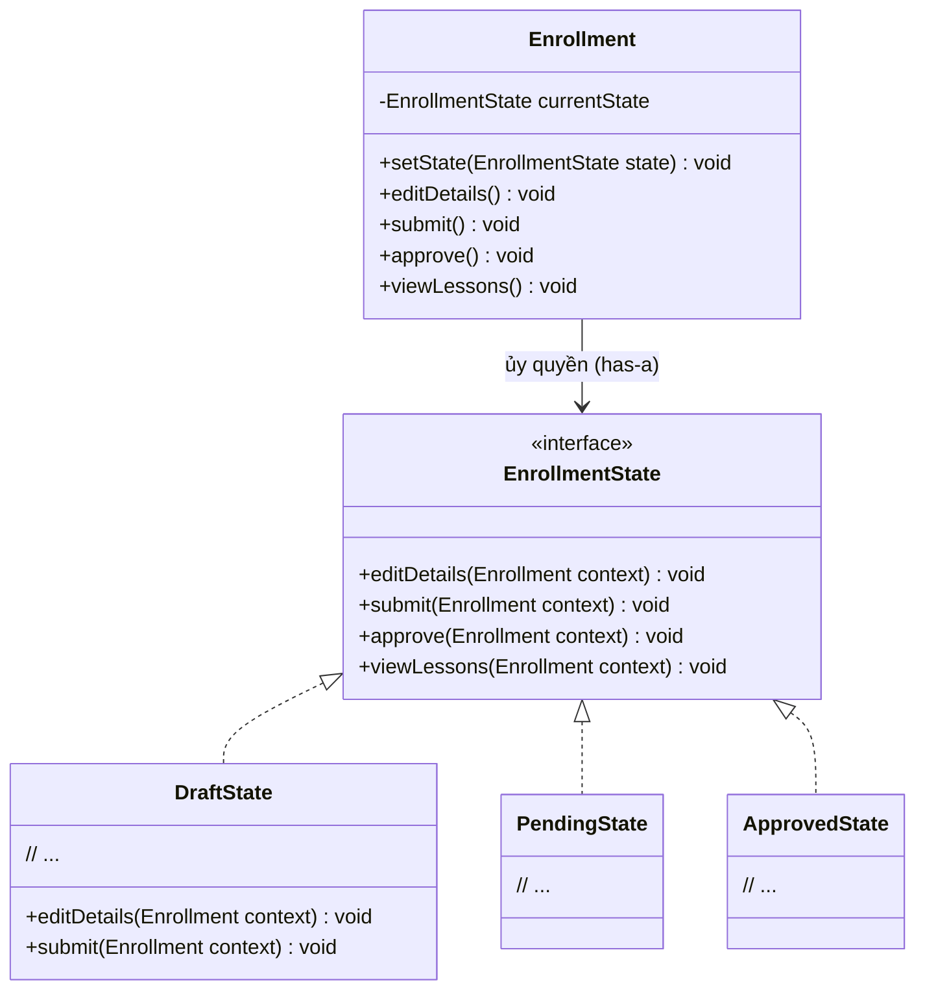

# State Pattern (Mẫu Thiết Kế Trạng Thái)

## 1. Mục tiêu (Intent)

**State** là một mẫu thiết kế thuộc nhóm behavioral (hành vi) cho phép một đối tượng thay đổi hành vi của nó khi trạng thái nội bộ của nó thay đổi. Lúc này, đối tượng sẽ hoạt động giống như một lớp khác.

Mục tiêu chính:

- Đóng gói các trạng thái cụ thể của đối tượng thành các lớp riêng biệt.
- Loại bỏ các câu lệnh rẽ nhánh phức tạp (`if-else` hay `switch-case`) kiểm tra trạng thái hiện tại trước khi thực hiện hành động.
- Đơn giản hóa việc chuyển đổi trạng thái (State Transition) một cách tự động và rõ ràng.

---

## 2. Bối cảnh đặt ra (Problem Scenario)

Hãy tưởng tượng bạn đang phát triển chức năng ghi danh khóa học trực tuyến. Một đơn đăng ký học (`Enrollment`) của học viên có các trạng thái khác nhau:

1. **DRAFT (Nháp)**: Học viên đang chỉnh sửa thông tin. Có thể sửa thông tin, chưa thể xem bài học, chưa thể tải chứng chỉ.
2. **PENDING (Chờ duyệt)**: Học viên đã gửi đơn thanh toán. Thông tin bị khóa (không được sửa), vẫn chưa xem được bài học.
3. **APPROVED (Đã duyệt)**: Thanh toán thành công, đơn được duyệt. Học viên bắt đầu được phép xem bài học, không được sửa thông tin.
4. **COMPLETED (Hoàn thành)**: Học viên đã học hết bài. Được quyền tải chứng chỉ.

Nếu viết code rẽ nhánh thông thường:

```java
class Enrollment {
    private String state = "DRAFT";

    public void editDetails() {
        if (state.equals("DRAFT")) {
            System.out.println("Cho phép chỉnh sửa thông tin.");
        } else if (state.equals("PENDING") || state.equals("APPROVED") || state.equals("COMPLETED")) {
            System.out.println("Lỗi: Không được sửa đơn ở trạng thái này!");
        }
    }

    public void viewLessons() {
        if (state.equals("APPROVED") || state.equals("COMPLETED")) {
            System.out.println("Hiển thị nội dung bài học.");
        } else {
            System.out.println("Lỗi: Bạn chưa đăng ký thành công khóa học!");
        }
    }
    // ... Tương tự cho các hàm payment(), downloadCertificate() ...
}
```

Vấn đề nảy sinh:

1. **Mã nguồn rối rắm**: Các phương thức nghiệp vụ tràn ngập điều kiện `if-else` kiểm tra trạng thái.
2. **Khó thêm trạng thái mới**: Nếu thêm trạng thái `SUSPENDED` (Tạm khóa tài khoản), bạn phải đi tìm từng phương thức (`editDetails`, `viewLessons`, `payment`, ...) để viết thêm nhánh điều kiện. Việc này vô cùng dễ bỏ sót và phát sinh lỗi.
3. **Quy tắc chuyển đổi trạng thái phân tán**: Logic quyết định khi nào chuyển từ `DRAFT` sang `PENDING` bị trộn lẫn trong logic nghiệp vụ.

---

## 3. Giải pháp (Solution)

Mẫu thiết kế **State** đề xuất tạo ra một interface chung đại diện cho trạng thái (`EnrollmentState`).

Sau đó, chúng ta tạo ra các class cụ thể cho từng trạng thái (`DraftState`, `PendingState`, `ApprovedState`, `CompletedState`).
Mỗi class này chịu trách nhiệm định nghĩa hành vi của chính nó cho tất cả các hành động. Đối tượng chính (`Enrollment`) sẽ giữ một thuộc tính tham chiếu đến đối tượng trạng thái hiện tại và ủy quyền xử lý tất cả các hành động cho nó.

---

## 4. Cấu trúc thành phần (Structure)

Cấu trúc của State Pattern:



1. **Context (Bối cảnh)**: Lớp lưu giữ trạng thái hiện tại dưới dạng giao diện trừu tượng (`Enrollment`). Nó cung cấp phương thức để Client gọi hành động.
2. **State (Trạng thái trừu tượng)**: Interface định nghĩa các phương thức hành động chung (`EnrollmentState`). Các phương thức này thường nhận đối tượng Context làm đối số để có thể chuyển đổi trạng thái của nó.
3. **Concrete States (Trạng thái cụ thể)**: Các lớp thực hiện hành vi tương ứng với trạng thái cụ thể của chúng (`DraftState`, `PendingState`, ...).

---

## 5. Ví dụ mã nguồn Java hoàn chỉnh (Java Code Example)

Dưới đây là cách triển khai State Pattern bằng ngôn ngữ Java:

```java
// 1. Định nghĩa Context (Đơn ghi danh khóa học)
class Enrollment {
    private EnrollmentState currentState;

    public Enrollment() {
        // Trạng thái ban đầu mặc định là Draft
        this.currentState = new DraftState();
    }

    public void setState(EnrollmentState state) {
        this.currentState = state;
    }

    // Các hành động ủy quyền cho đối tượng Trạng thái xử lý
    public void editDetails() {
        currentState.editDetails(this);
    }

    public void submit() {
        currentState.submit(this);
    }

    public void approve() {
        currentState.approve(this);
    }

    public void viewLessons() {
        currentState.viewLessons(this);
    }
}

// 2. Giao diện Trạng thái chung (State Interface)
interface EnrollmentState {
    void editDetails(Enrollment context);
    void submit(Enrollment context);
    void approve(Enrollment context);
    void viewLessons(Enrollment context);
}

// 3. Các lớp Trạng thái cụ thể (Concrete States)

// A. Trạng thái bản Nháp
class DraftState implements EnrollmentState {
    @Override
    public void editDetails(Enrollment context) {
        System.out.println("[DRAFT] Cho phép chỉnh sửa thông tin học viên.");
    }

    @Override
    public void submit(Enrollment context) {
        System.out.println("[DRAFT] Đã nộp đơn thanh toán thành công. Chuyển trạng thái sang Chờ duyệt.");
        context.setState(new PendingState()); // Chuyển trạng thái
    }

    @Override
    public void approve(Enrollment context) {
        System.out.println("[DRAFT] Lỗi: Đơn nháp chưa nộp thanh toán, không thể duyệt!");
    }

    @Override
    public void viewLessons(Enrollment context) {
        System.out.println("[DRAFT] Lỗi: Bạn chưa thanh toán khóa học này!");
    }
}

// B. Trạng thái Chờ duyệt
class PendingState implements EnrollmentState {
    @Override
    public void editDetails(Enrollment context) {
        System.out.println("[PENDING] Lỗi: Thông tin đã bị khóa để chờ duyệt thanh toán!");
    }

    @Override
    public void submit(Enrollment context) {
        System.out.println("[PENDING] Lỗi: Đơn đã nộp rồi, đang chờ duyệt!");
    }

    @Override
    public void approve(Enrollment context) {
        System.out.println("[PENDING] Đã xác nhận thanh toán. Kích hoạt khóa học!");
        context.setState(new ApprovedState()); // Chuyển trạng thái sang Đã duyệt
    }

    @Override
    public void viewLessons(Enrollment context) {
        System.out.println("[PENDING] Lỗi: Vui lòng chờ quản trị viên duyệt thanh toán.");
    }
}

// C. Trạng thái Đã duyệt / Đang học
class ApprovedState implements EnrollmentState {
    @Override
    public void editDetails(Enrollment context) {
        System.out.println("[APPROVED] Lỗi: Khóa học đã kích hoạt, không thể sửa thông tin ghi danh!");
    }

    @Override
    public void submit(Enrollment context) {
        System.out.println("[APPROVED] Lỗi: Đơn đã hoàn tất!");
    }

    @Override
    public void approve(Enrollment context) {
        System.out.println("[APPROVED] Lỗi: Đơn này đã được duyệt từ trước.");
    }

    @Override
    public void viewLessons(Enrollment context) {
        System.out.println("[APPROVED] Đang hiển thị danh sách video bài học... Học tập vui vẻ!");
    }
}

// Lớp Client chạy ứng dụng
class Main {
    public static void main(String[] args) {
        Enrollment enrollment = new Enrollment();

        System.out.println("--- 1. GIAI ĐOẠN ĐƠN NHÁP ---");
        enrollment.editDetails();
        enrollment.viewLessons(); // Lỗi

        System.out.println("\n--- 2. GIAI ĐOẠN NỘP ĐƠN ---");
        enrollment.submit(); // Chuyển sang Pending
        enrollment.editDetails(); // Lỗi

        System.out.println("\n--- 3. GIAI ĐOẠN DUYỆT ĐƠN ---");
        enrollment.approve(); // Chuyển sang Approved
        enrollment.viewLessons(); // Thành công!
    }
}
```

---

## 6. Luồng hoạt động (Workflow)

1. Client khởi tạo đối tượng `Enrollment` (mặc định trạng thái ban đầu là `DraftState`).
2. Client gọi hành động `enrollment.submit()`. Lớp `Enrollment` chuyển tiếp cuộc gọi tới `currentState.submit(this)`.
3. Bên trong `DraftState.submit()`, chương trình thực hiện nghiệp vụ và cập nhật trạng thái mới của đối tượng bằng cách gọi `context.setState(new PendingState())`.
4. Lần tiếp theo Client gọi `enrollment.editDetails()`, do trạng thái hiện tại đã là `PendingState`, JVM sẽ gọi hàm tương ứng trong lớp `PendingState` và đưa ra thông báo từ chối truy cập.

---

## 7. Đánh giá (Pros & Cons)

### Ưu điểm

- **Nguyên tắc đơn nhiệm (Single Responsibility)**: Gom toàn bộ code logic của một trạng thái cụ thể vào một lớp duy nhất, giúp code sạch và dễ quản lý.
- **Nguyên lý Open/Closed**: Bạn dễ dàng thêm trạng thái mới mà không làm ảnh hưởng đến các lớp trạng thái cũ hoặc logic của Context.
- **Bỏ rẽ nhánh phức tạp**: Code của Context trở nên gọn gàng khi loại bỏ hoàn toàn các cấu trúc rẽ nhánh rườm rà.

### Nhược điểm

- **Tăng số lượng lớp**: Nếu một đối tượng có quá nhiều trạng thái nhỏ lẻ, số lượng class cần tạo ra sẽ rất lớn.
- **Độ phức tạp tăng nhẹ**: Đòi hỏi lập trình viên phải hiểu rõ luồng luân chuyển trạng thái giữa các class con.

---

## 8. So sánh với các mẫu khác (Comparison)

- **State vs Strategy**: Về mặt cấu trúc, cả hai đều lưu giữ tham chiếu đối tượng qua Composition. Tuy nhiên, trong **Strategy**, các chiến lược độc lập nhau, Client tự lựa chọn chiến lược để thực hiện và Context ít khi tự thay đổi chiến lược. Trong **State**, các trạng thái liên kết chặt chẽ với nhau theo luồng vòng đời, các lớp trạng thái cụ thể thường tự ý thức và thực hiện việc chuyển đổi trạng thái của Context.
- **State vs Singleton**: Các lớp trạng thái cụ thể (như `DraftState`) nếu không chứa thuộc tính dữ liệu thay đổi (stateless) thì thường được triển khai dưới dạng Singleton để tránh việc khởi tạo đối tượng liên tục khi chuyển đổi trạng thái.

---

## 9. Ứng dụng thực tế (Real-world Use Cases)

- **E-commerce Order Processing**: Quản lý trạng thái đơn hàng (Mới tạo -> Đã thanh toán -> Đang giao -> Đã nhận -> Hủy hàng).
- **Spring State Machine**: Một thư viện mạnh mẽ của hệ sinh thái Spring chuyên dùng để quản lý các quy trình trạng thái (Workflow) phức tạp của doanh nghiệp.
