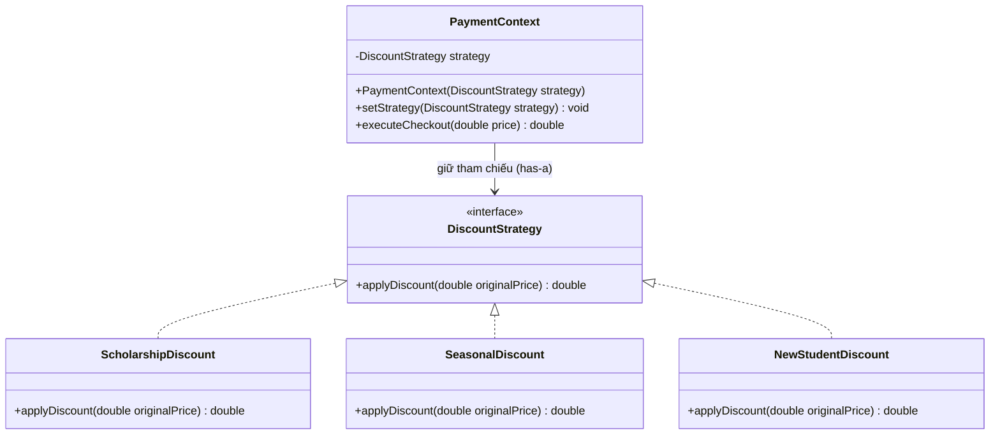

# Strategy Pattern (Mẫu Thiết Kế Chiến Lược)

## 1. Mục tiêu (Intent)

**Strategy** là một mẫu thiết kế thuộc nhóm behavioral (hành vi) cho phép bạn định nghĩa một tập hợp các thuật toán, đóng gói từng thuật toán đó lại thành các lớp riêng biệt, và giúp chúng có thể hoán đổi cho nhau một cách linh hoạt tại runtime (khi chương trình đang chạy).

Mục tiêu chính:

- Cô lập các thuật toán và logic nghiệp vụ xử lý phức tạp ra khỏi đối tượng ngữ cảnh sử dụng (Context).
- Loại bỏ các câu lệnh điều kiện rẽ nhánh phức tạp (`if-else` hoặc `switch-case` lồng nhau) khi chọn lựa hành vi.
- Tuân thủ nguyên tắc "Composition over Inheritance" để thay đổi hành vi của đối tượng.

---

## 2. Bối cảnh đặt ra (Problem Scenario)

Hãy tưởng tượng bạn đang xây dựng tính năng thanh toán hóa đơn mua khóa học cho một trang web e-learning. Hệ thống có nhiều chương trình khuyến mãi/giảm giá khác nhau:

1. Giảm giá cho học viên nhận học bổng (`ScholarshipDiscount`): Giảm 70% giá trị khóa học.
2. Giảm giá theo mùa lễ hội (`SeasonalDiscount`): Giảm 20% giá trị khóa học.
3. Khuyến mãi cho học viên mới đăng ký lần đầu (`NewStudentDiscount`): Giảm trực tiếp 10 USD (nếu giá trị lớn hơn 10 USD).

Nếu bạn viết code theo cách tiếp cận thông thường sử dụng rẽ nhánh:

```java
class PaymentService {
    public double calculateTotal(double originalPrice, String discountType) {
        double finalPrice = originalPrice;

        if (discountType.equalsIgnoreCase("SCHOLARSHIP")) {
            finalPrice = originalPrice * 0.3; // Giảm 70%
        } else if (discountType.equalsIgnoreCase("SEASONAL")) {
            finalPrice = originalPrice * 0.8; // Giảm 20%
        } else if (discountType.equalsIgnoreCase("NEW_STUDENT")) {
            finalPrice = originalPrice - 10.0; // Giảm 10 USD
        } else {
            // Không giảm giá
        }

        return finalPrice;
    }
}
```

Vấn đề nảy sinh:

- **Khó bảo trì**: Khi số lượng loại giảm giá tăng lên (ví dụ: Black Friday, mã giảm giá của KOL, giảm giá nhóm), danh sách `if-else` trong lớp `PaymentService` sẽ phình to ra và cực kỳ khó kiểm soát.
- **Vi phạm nguyên lý Open/Closed (OCP)**: Mỗi khi thêm mới hoặc sửa đổi một thuật toán tính giá, bạn đều phải chỉnh sửa trực tiếp vào lớp `PaymentService`. Việc này có thể vô tình làm hỏng logic tính toán của các loại giảm giá cũ.
- **Khó kiểm thử độc lập**: Bạn không thể viết Unit Test cho riêng thuật toán tính giảm giá học bổng mà không kéo theo logic của cả lớp `PaymentService`.

---

## 3. Giải pháp (Solution)

Mẫu thiết kế **Strategy** đề xuất tách biệt các thuật toán tính giảm giá này ra khỏi lớp `PaymentService`.

1. Định nghĩa một interface chung gọi là `DiscountStrategy` chứa phương thức `applyDiscount(double price)`.
2. Tạo ra các lớp triển khai cụ thể cho từng thuật toán giảm giá (các Concrete Strategies).
3. Lớp ngữ cảnh (`PaymentContext` hoặc `PaymentService`) sẽ giữ một thuộc tính tham chiếu đến giao diện `DiscountStrategy`. Client sẽ cấu hình hoặc truyền chiến lược cụ thể vào Context lúc runtime.

---

## 4. Cấu trúc thành phần (Structure)

Cấu trúc chuẩn của Strategy bao gồm các thành phần sau:



1. **Strategy (Chiến lược)**: Interface chung khai báo phương thức áp dụng thuật toán (`DiscountStrategy`).
2. **Concrete Strategies (Chiến lược cụ thể)**: Các lớp triển khai thực tế thuật toán (`ScholarshipDiscount`, `SeasonalDiscount`).
3. **Context (Ngữ cảnh)**: Lớp duy trì tham chiếu đến đối tượng Strategy, cung cấp phương thức thay thế chiến lược và ủy quyền xử lý thuật toán cho đối tượng Strategy hiện tại.

---

## 5. Ví dụ mã nguồn Java hoàn chỉnh (Java Code Example)

Dưới đây là cách cài đặt Strategy Pattern bằng ngôn ngữ Java:

```java
// 1. Strategy Interface
interface DiscountStrategy {
    double applyDiscount(double originalPrice);
}

// 2. Concrete Strategy A: Giảm giá học bổng (70%)
class ScholarshipDiscount implements DiscountStrategy {
    @Override
    public double applyDiscount(double originalPrice) {
        System.out.println("[SCHOLARSHIP] Áp dụng giảm giá học bổng: Giảm 70%.");
        return originalPrice * 0.3;
    }
}

// 3. Concrete Strategy B: Giảm giá mùa lễ hội (20%)
class SeasonalDiscount implements DiscountStrategy {
    @Override
    public double applyDiscount(double originalPrice) {
        System.out.println("[SEASONAL] Áp dụng giảm giá mùa lễ hội: Giảm 20%.");
        return originalPrice * 0.8;
    }
}

// 4. Concrete Strategy C: Giảm giá học viên mới (Giảm trực tiếp 10$)
class NewStudentDiscount implements DiscountStrategy {
    @Override
    public double applyDiscount(double originalPrice) {
        System.out.println("[NEW STUDENT] Áp dụng giảm giá học viên mới: Giảm trực tiếp 10$.");
        if (originalPrice > 10.0) {
            return originalPrice - 10.0;
        }
        return originalPrice;
    }
}

// Lớp chiến lược mặc định (Không giảm giá)
class NoDiscount implements DiscountStrategy {
    @Override
    public double applyDiscount(double originalPrice) {
        System.out.println("[DEFAULT] Không áp dụng giảm giá.");
        return originalPrice;
    }
}

// 5. Context Class (Ngữ cảnh thanh toán)
class PaymentContext {
    private DiscountStrategy strategy; // Giữ tham chiếu chiến lược

    // Constructor nhận chiến lược mặc định
    public PaymentContext(DiscountStrategy strategy) {
        this.strategy = strategy;
    }

    // Cho phép hoán đổi chiến lược linh hoạt tại runtime
    public void setStrategy(DiscountStrategy strategy) {
        this.strategy = strategy;
    }

    public double executeCheckout(double originalPrice) {
        // Ủy quyền tính giá cho chiến lược hiện tại
        return strategy.applyDiscount(originalPrice);
    }
}

// Lớp Client chạy ứng dụng
class Main {
    public static void main(String[] args) {
        double originalPrice = 100.0; // Giá trị khóa học gốc là 100$

        System.out.println("Giá gốc khóa học: " + originalPrice + "$");
        System.out.println("----------------------------------------");

        // Khởi tạo ngữ cảnh với chiến lược không giảm giá ban đầu
        PaymentContext payment = new PaymentContext(new NoDiscount());
        double finalPrice = payment.executeCheckout(originalPrice);
        System.out.println("Thành tiền: " + finalPrice + "$");

        System.out.println("\n--- TÌNH HUỐNG 1: HỌC VIÊN CÓ HỌC BỔNG ---");
        payment.setStrategy(new ScholarshipDiscount());
        finalPrice = payment.executeCheckout(originalPrice);
        System.out.println("Thành tiền: " + finalPrice + "$");

        System.out.println("\n--- TÌNH HUỐNG 2: MÙA GIÁNG SINH ---");
        payment.setStrategy(new SeasonalDiscount());
        finalPrice = payment.executeCheckout(originalPrice);
        System.out.println("Thành tiền: " + finalPrice + "$");

        System.out.println("\n--- TÌNH HUỐNG 3: ĐĂNG KÝ MỚI ---");
        payment.setStrategy(new NewStudentDiscount());
        finalPrice = payment.executeCheckout(originalPrice);
        System.out.println("Thành tiền: " + finalPrice + "$");
    }
}
```

---

## 6. Luồng hoạt động (Workflow)

1. Client khởi tạo một đối tượng Context (`PaymentContext`) và thiết lập chiến lược ban đầu.
2. Khi Client thực hiện thanh toán bằng cách gọi `.executeCheckout(originalPrice)`, Context sẽ chuyển tiếp lời gọi này tới phương thức `.applyDiscount(originalPrice)` của đối tượng chiến lược hiện đang được liên kết.
3. Khi cần thay đổi chính sách tính giá, Client gọi `.setStrategy(new NewStrategy())` để cấu hình lại Context.
4. Lần tính tiền tiếp theo sẽ tự động áp dụng thuật toán của chiến lược mới mà không cần chỉnh sửa mã nguồn của Context.

---

## 7. Đánh giá (Pros & Cons)

### Ưu điểm

- **Ngăn chặn lạm dụng rẽ nhánh**: Thay thế các chuỗi câu lệnh `if-else` phức tạp bằng sự liên kết đa hình linh hoạt.
- **Open/Closed Principle**: Bạn dễ dàng viết thêm các chính sách giảm giá mới mà không cần sửa đổi lớp Context.
- **Cô lập mã nguồn**: Logic thuật toán được tách riêng khỏi nghiệp vụ thanh toán chung, giúp dễ quản lý và viết Unit Test cho từng chiến lược.

### Nhược điểm

- **Tăng số lượng lớp**: Việc tạo ra mỗi thuật toán một class làm gia tăng số lượng file trong project.
- **Client phải biết về các chiến lược**: Client phải tự chọn và gán chiến lược phù hợp cho Context, điều đó có nghĩa là Client phải hiểu rõ sự khác nhau giữa các chiến lược.

---

## 8. So sánh với các mẫu khác (Comparison)

- **Strategy vs State**: Cả hai đều thay đổi hành vi của đối tượng dựa trên cấu trúc Composition. Nhưng trong **Strategy**, các chiến lược hoàn toàn độc lập và Client thường tự lựa chọn gán chiến lược. Trong **State**, các trạng thái có thể tự động chuyển đổi qua lại lẫn nhau dựa trên các hành động xảy ra trong Context mà Client không cần can thiệp.
- **Strategy vs Template Method**: Strategy thay đổi hành vi thông qua **Composition** ở runtime. Template Method thay đổi hành vi thông qua **Kế thừa (Inheritance)** ở compile-time (lớp con ghi đè các bước cụ thể của thuật toán khung ở lớp cha).

---

## 9. Ứng dụng thực tế (Real-world Use Cases)

- **Java Core**: Bộ so sánh `java.util.Comparator` là một ví dụ kinh điển của Strategy Pattern. Phương thức `Collections.sort(List, Comparator)` nhận chiến lược sắp xếp khác nhau thông qua đối tượng `Comparator`.
- **Spring Boot Security**: Cơ chế mã hóa mật khẩu `PasswordEncoder` (ví dụ `BCryptPasswordEncoder`, `NoOpPasswordEncoder`) được áp dụng linh hoạt dựa trên cấu hình bảo mật của ứng dụng.
