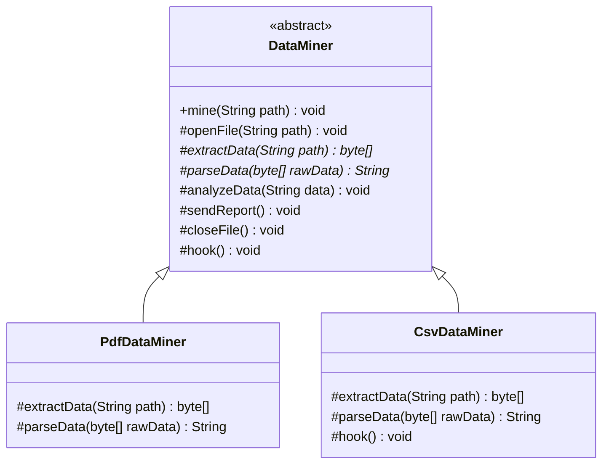

# Template Method Pattern (Mẫu Phương Thức Khuôn Mẫu)

## 1. Mục tiêu (Intent)

**Template Method** là một mẫu thiết kế behavioral (hành vi) định nghĩa bộ khung (skeleton) của một thuật toán trong một phương thức của lớp cha, đồng thời ủy quyền việc triển khai một số bước cụ thể cho các lớp con.

Mục tiêu chính:

- Tái sử dụng mã nguồn bằng cách gom các phần logic chung của thuật toán vào lớp cha và chỉ để các bước khác biệt cho các lớp con triển khai.
- Cho phép các lớp con tùy biến hoặc mở rộng một số bước nhất định của một thuật toán mà không làm thay đổi cấu trúc hoặc trật tự thực thi các bước của thuật toán đó.
- Cung cấp các điểm móc nối (Hooks) để lớp con có thể can thiệp vào quy trình của thuật toán khi cần thiết.

---

## 2. Bối cảnh đặt ra (Problem Scenario)

Hãy tưởng tượng bạn đang phát triển một ứng dụng phân tích tài liệu và xuất báo cáo dữ liệu (`Data Miner`). Ứng dụng cần hỗ trợ đọc dữ liệu từ nhiều định dạng tệp khác nhau như `PDF` và `CSV`.

Quy trình phân tích dữ liệu nhìn chung bao gồm các bước cố định sau:

1. Mở tệp tin (Open file).
2. Trích xuất dữ liệu thô (Extract raw data).
3. Phân tích cú pháp dữ liệu (Parse data).
4. Phân tích nghiệp vụ (Analyze data).
5. Gửi báo cáo kết quả (Send report).
6. Đóng tệp tin (Close file).

Nếu bạn viết các lớp độc lập `PdfDataMiner` và `CsvDataMiner`:

```java
public class PdfDataMiner {
    public void mine(String path) {
        // Mở tệp PDF (Giống hệt CSV)
        // Trích xuất PDF (Khác biệt)
        // Phân tích cú pháp PDF (Khác biệt)
        // Phân tích nghiệp vụ (Giống hệt CSV)
        // Gửi báo cáo (Giống hệt CSV)
        // Đóng tệp PDF (Giống hệt CSV)
    }
}
```

Vấn đề nảy sinh:

1. **Lặp lại mã nguồn (Code Duplication)**: Các bước mở tệp, phân tích nghiệp vụ, gửi báo cáo và đóng tệp hoàn toàn giống nhau giữa các định dạng nhưng phải viết lại ở mọi lớp con.
2. **Khó bảo trì**: Nếu bạn muốn đổi cách gửi báo cáo (ví dụ: chuyển từ gửi email sang lưu cơ sở dữ liệu), bạn phải sửa đổi thủ công ở tất cả các lớp con.

---

## 3. Giải pháp (Solution)

Mẫu thiết kế **Template Method** giải quyết vấn đề bằng cách:

1. Tạo một lớp cha trừu tượng (ví dụ: `DataMiner`).
2. Định nghĩa một phương thức đại diện cho thuật toán chính (ví dụ: `mine()`). Phương thức này được đánh dấu là `final` trong Java để ngăn không cho các lớp con ghi đè cấu trúc của nó.
3. Trong phương thức `mine()`, chúng ta gọi tuần tự các bước của thuật toán.
    - Các bước chung sẽ được triển khai trực tiếp tại lớp cha (`openFile`, `analyzeData`, `sendReport`, `closeFile`).
    - Các bước khác biệt sẽ được khai báo là phương thức trừu tượng (`abstract`) để buộc các lớp con phải tự triển khai (`extractData`, `parseData`).

---

## 4. Cấu trúc thành phần (Structure)

Cấu trúc chuẩn của Template Method bao gồm:



1. **Abstract Class (DataMiner)**: Định nghĩa phương thức khuôn mẫu `mine()` chứa khung thuật toán, đồng thời triển khai các bước chung và khai báo các bước trừu tượng.
2. **Concrete Classes (PdfDataMiner, CsvDataMiner)**: Triển khai các phương thức trừu tượng để hoàn thiện các bước đặc thù của thuật toán, và ghi đè các hook nếu cần.

---

## 5. Ví dụ mã nguồn Java hoàn chỉnh (Java Code Example)

Dưới đây là mã nguồn Java mô phỏng quy trình phân tích tệp dữ liệu:

```java
// 1. Lớp cha trừu tượng định nghĩa Khuôn mẫu
abstract class DataMiner {

    // Phương thức khuôn mẫu (Template Method) - Đánh dấu final để cố định cấu trúc thuật toán
    public final void mine(String path) {
        openFile(path);
        byte[] rawData = extractData(path);
        String parsedData = parseData(rawData);
        analyzeData(parsedData);
        sendReport();
        closeFile();
        hook(); // Gọi hook (tùy chọn)
    }

    // Các bước chung đã được triển khai sẵn ở lớp cha
    protected void openFile(String path) {
        System.out.println("[COMMON] Mở tệp tin tại đường dẫn: " + path);
    }

    protected void analyzeData(String data) {
        System.out.println("[COMMON] Đang phân tích thống kê dữ liệu: " + data);
    }

    protected void sendReport() {
        System.out.println("[COMMON] Gửi báo cáo kết quả qua Email cho quản trị viên.");
    }

    protected void closeFile() {
        System.out.println("[COMMON] Đóng tệp tin giải phóng tài nguyên.\n");
    }

    // Các bước trừu tượng buộc các lớp con phải tự triển khai
    protected abstract byte[] extractData(String path);
    protected abstract String parseData(byte[] rawData);

    // Một phương thức Hook (móc nối) trống. Lớp con có thể ghi đè hoặc không
    protected void hook() {
        // Mặc định không làm gì
    }
}

// 2. Lớp con cụ thể xử lý tệp PDF
class PdfDataMiner extends DataMiner {
    @Override
    protected byte[] extractData(String path) {
        System.out.println("[PDF] Đọc dữ liệu nhị phân từ định dạng PDF...");
        return new byte[]{80, 68, 70}; // Giả lập dữ liệu byte PDF
    }

    @Override
    protected String parseData(byte[] rawData) {
        System.out.println("[PDF] Sử dụng thư viện PDFBox để trích xuất văn bản...");
        return "Nội dung văn bản từ PDF";
    }
}

// 3. Lớp con cụ thể xử lý tệp CSV
class CsvDataMiner extends DataMiner {
    @Override
    protected byte[] extractData(String path) {
        System.out.println("[CSV] Đọc các dòng văn bản ngăn cách bởi dấu phẩy...");
        return new byte[]{67, 83, 86}; // Giả lập dữ liệu byte CSV
    }

    @Override
    protected String parseData(byte[] rawData) {
        System.out.println("[CSV] Phân tích cú pháp các dòng và cột dữ liệu...");
        return "Bảng dữ liệu dòng/cột từ CSV";
    }

    // Ghi đè phương thức hook để thực hiện hành động bổ sung sau khi kết thúc thuật toán
    @Override
    protected void hook() {
        System.out.println("[CSV HOOK] Đã hoàn thành xử lý CSV. Tiến hành dọn dẹp các tệp tạm thời...");
    }
}

// Lớp Client chạy ứng dụng
class Main {
    public static void main(String[] args) {
        System.out.println("--- Bắt đầu phân tích tài liệu PDF ---");
        DataMiner pdfMiner = new PdfDataMiner();
        pdfMiner.mine("report.pdf");

        System.out.println("--- Bắt đầu phân tích tài liệu CSV ---");
        DataMiner csvMiner = new CsvDataMiner();
        csvMiner.mine("data.csv");
    }
}
```

---

## 6. Luồng hoạt động (Workflow)

1. Client khởi tạo một đối tượng lớp con cụ thể (`PdfDataMiner`) và gọi phương thức khuôn mẫu `mine("report.pdf")`.
2. Phương thức `mine()` được thực thi tuần tự theo đúng trật tự định sẵn:
    - Đầu tiên, nó gọi `openFile()` của lớp cha.
    - Tiếp theo, nó gọi `extractData()`. Lúc này, do cơ chế đa hình, phương thức `extractData()` cụ thể của `PdfDataMiner` sẽ được gọi để trích xuất dữ liệu.
    - Quá trình tương tự diễn ra cho bước `parseData()`.
    - Các bước `analyzeData()`, `sendReport()`, và `closeFile()` của lớp cha được thực thi tiếp.
    - Cuối cùng, phương thức `hook()` được gọi. Ở lớp `PdfDataMiner` nó sẽ không làm gì, nhưng ở lớp `CsvDataMiner` nó sẽ chạy logic dọn dẹp tệp tạm.

---

## 7. Đánh giá (Pros & Cons)

### Ưu điểm

- **Tái sử dụng mã nguồn tối đa**: Loại bỏ hoàn toàn sự trùng lặp code bằng cách kéo các phần logic chung lên lớp cha.
- **Dễ dàng bảo trì**: Thay đổi logic của các bước chung chỉ cần thực hiện tại một nơi duy nhất ở lớp cha.
- **Kiểm soát quy trình**: Lớp cha kiểm soát chặt chẽ quy trình thực thi của thuật toán, ngăn các lớp con tùy tiện thay đổi trật tự thực hiện gây lỗi logic.

### Nhược điểm

- **Giới hạn sự linh hoạt**: Lớp con bị ràng buộc bởi cấu trúc thuật toán của lớp cha. Nếu một thuật toán mới cần bỏ qua một số bước hoặc thay đổi trật tự, việc cấu trúc lại lớp cha sẽ rất khó khăn.
- **Vi phạm Liskov Substitution Principle (nếu thiết kế kém)**: Nếu lớp con cố tình vô hiệu hóa một bước quan trọng của lớp cha (bằng cách ghi đè phương thức rỗng), nó có thể làm hỏng logic hệ thống.
- **Khó theo dõi**: Khi số lượng bước quá nhiều, việc nhảy qua nhảy lại giữa lớp cha và lớp con trong quá trình debug sẽ rất phức tạp.

---

## 8. So sánh với các mẫu khác (Comparison)

- **Template Method vs Strategy**:
    - **Template Method** dựa trên sự **kế thừa (inheritance)**: Bạn thay đổi các phần của thuật toán bằng cách tạo lớp con ghi đè các phương thức. Nó hoạt động ở mức độ lớp (Class-level) và mang tính tĩnh (Static).
    - **Strategy** dựa trên sự **kết hợp (composition)**: Bạn định nghĩa toàn bộ thuật toán trong một đối tượng độc lập và truyền nó vào Client. Nó hoạt động ở mức độ đối tượng (Object-level) và cho phép hoán đổi thuật toán linh hoạt tại runtime (Dynamic).

---

## 9. Ứng dụng thực tế (Real-world Use Cases)

- **Java Core**: Các lớp IO như `java.io.InputStream` có phương thức `read(byte b[], int off, int len)` hoạt động như một Template Method, nó gọi tới phương thức trừu tượng `read()` mà các lớp con phải tự triển khai.
- **Web Frameworks (Spring Boot / Servlet)**: Phương thức `HttpServlet.service()` là một Template Method. Nó phân tích HTTP request và gọi tới các phương thức `doGet()`, `doPost()`, `doPut()` tương ứng mà lập trình viên ghi đè để xử lý API.
- **Testing Frameworks (JUnit)**: Quá trình chạy test bao gồm: khởi tạo (`@BeforeEach`), chạy test (`@Test`), giải phóng tài nguyên (`@AfterEach`) tuân thủ chính xác mô hình Template Method.
