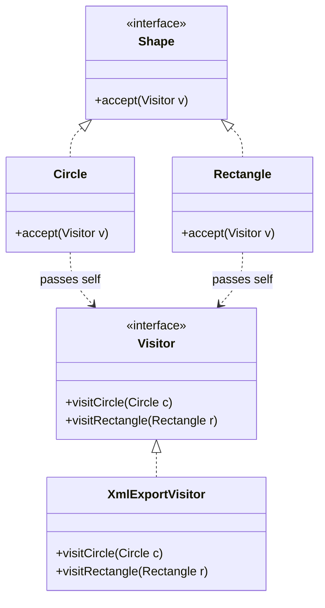

# Visitor Pattern (Mẫu Khách / Đối Tượng Khách)

## 1. Mục tiêu (Intent)

**Visitor** là một mẫu thiết kế behavioral (hành vi) cho phép bạn định nghĩa các hoạt động nghiệp vụ mới trên một tập hợp các đối tượng có cấu trúc phức tạp mà không cần sửa đổi mã nguồn của các lớp đối tượng đó.

Mục tiêu chính:

- Tách biệt logic xử lý nghiệp vụ ra khỏi cấu trúc dữ liệu của đối tượng (đảm bảo tính đóng gói và Single Responsibility).
- Hỗ trợ cơ chế định tuyến kép (**Double Dispatch**) để gọi đúng phương thức xử lý tương ứng với kiểu đối tượng cụ thể tại runtime.
- Cho phép dễ dàng thêm các hành vi xử lý mới trên toàn bộ cấu trúc đối tượng hiện có mà không làm ảnh hưởng tới các lớp hiện tại (tuân thủ Open/Closed Principle).

---

## 2. Bối cảnh đặt ra (Problem Scenario)

Hãy tưởng tượng bạn đang phát triển một ứng dụng thiết kế đồ họa vector. Bạn có một cây cấu trúc chứa các đối tượng hình học như `Circle` (hình tròn), `Rectangle` (hình chữ nhật), và `Dot` (điểm chấm).

Hiện tại, bạn cần thêm chức năng xuất (export) toàn bộ bản vẽ này sang định dạng **XML**.

Nếu viết theo cách thông thường:

- Bạn sẽ thêm phương thức `exportToXml()` trực tiếp vào từng lớp: `Circle.exportToXml()`, `Rectangle.exportToXml()`.

Vấn đề nảy sinh:

1. **Vi phạm Single Responsibility**: Các lớp hình học vốn chỉ nên chịu trách nhiệm quản lý tọa độ và vẽ hình, nay lại phải ôm đồm thêm logic định dạng chuỗi XML phức tạp.
2. **Vi phạm Open/Closed**: Nếu tuần tới khách hàng yêu cầu thêm tính năng xuất bản vẽ sang **JSON** hoặc xuất sang **PDF**, bạn lại phải mở tất cả các lớp hình học ra để bổ sung phương thức `exportToJson()` hoặc `exportToPdf()`. Điều này cực kỳ rủi ro vì có thể làm hỏng logic vẽ hình hiện có của ứng dụng.

---

## 3. Giải pháp (Solution)

Mẫu thiết kế **Visitor** khuyên bạn: Hãy chuyển toàn bộ logic xử lý nghiệp vụ mới (như export XML, JSON) vào một lớp riêng biệt gọi là **Visitor** (ví dụ: `XmlExportVisitor`).

1. Định nghĩa một interface `Visitor` khai báo các phương thức duyệt qua từng loại đối tượng cụ thể: `visitCircle(Circle c)`, `visitRectangle(Rectangle r)`.
2. Định nghĩa một phương thức chung là `accept(Visitor v)` trong interface của các lớp hình học (`Shape`).
3. Trong mỗi lớp cụ thể, ví dụ `Circle`, phương thức `accept` sẽ được triển khai cực kỳ ngắn gọn:
    ```java
    public void accept(Visitor v) {
        v.visitCircle(this); // Truyền chính nó vào Visitor
    }
    ```
4. Khi cần chạy tính năng, Client duyệt qua các hình, gọi `shape.accept(visitor)`. Lớp hình học sẽ tự chọn đúng phương thức `visit` tương ứng trên Visitor để thực thi. Cơ chế này gọi là **Double Dispatch**.

---

## 4. Cấu trúc thành phần (Structure)

Cấu trúc chuẩn của Visitor bao gồm:



1. **Visitor (Interface)**: Khai báo tập hợp các phương thức truy cập ứng với từng Concrete Element.
2. **Concrete Visitor (XmlExportVisitor)**: Triển khai logic nghiệp vụ cụ thể cho từng loại đối tượng.
3. **Element (Shape)**: Interface khai báo phương thức `accept(visitor)`.
4. **Concrete Elements (Circle, Rectangle)**: Triển khai `accept()`, ủy quyền xử lý cho Visitor bằng cách gọi đúng hàm ứng với kiểu dữ liệu của mình.

---

## 5. Ví dụ mã nguồn Java hoàn chỉnh (Java Code Example)

Dưới đây là mã nguồn Java mô phỏng tính năng xuất dữ liệu hình học sang XML bằng Visitor:

```java
import java.util.ArrayList;
import java.util.List;

// 1. Interface Visitor định nghĩa các phương thức ghé thăm (visit)
interface Visitor {
    void visitCircle(Circle circle);
    void visitRectangle(Rectangle rectangle);
}

// 2. Interface Element định nghĩa phương thức chấp nhận (accept)
interface Shape {
    void accept(Visitor visitor);
}

// 3. Concrete Element: Hình tròn (Circle)
class Circle implements Shape {
    private final int id;
    private final int x;
    private final int y;
    private final int radius;

    public Circle(int id, int x, int y, int radius) {
        this.id = id;
        this.x = x;
        this.y = y;
        this.radius = radius;
    }

    @Override
    public void accept(Visitor visitor) {
        // Double Dispatch: Gọi đúng phương thức dành cho Circle
        visitor.visitCircle(this);
    }

    // Getters
    public int getId() { return id; }
    public int getX() { return x; }
    public int getY() { return y; }
    public int getRadius() { return radius; }
}

// 4. Concrete Element: Hình chữ nhật (Rectangle)
class Rectangle implements Shape {
    private final int id;
    private final int x;
    private final int y;
    private final int width;
    private final int height;

    public Rectangle(int id, int x, int y, int width, int height) {
        this.id = id;
        this.x = x;
        this.y = y;
        this.width = width;
        this.height = height;
    }

    @Override
    public void accept(Visitor visitor) {
        visitor.visitRectangle(this);
    }

    // Getters
    public int getId() { return id; }
    public int getX() { return x; }
    public int getY() { return y; }
    public int getWidth() { return width; }
    public int getHeight() { return height; }
}

// 5. Concrete Visitor: Xuất cấu trúc hình học sang XML
class XmlExportVisitor implements Visitor {
    @Override
    public void visitCircle(Circle circle) {
        System.out.println("  <circle>");
        System.out.println("    <id>" + circle.getId() + "</id>");
        System.out.println("    <x>" + circle.getX() + "</x>");
        System.out.println("    <y>" + circle.getY() + "</y>");
        System.out.println("    <radius>" + circle.getRadius() + "</radius>");
        System.out.println("  </circle>");
    }

    @Override
    public void visitRectangle(Rectangle rectangle) {
        System.out.println("  <rectangle>");
        System.out.println("    <id>" + rectangle.getId() + "</id>");
        System.out.println("    <x>" + rectangle.getX() + "</x>");
        System.out.println("    <y>" + rectangle.getY() + "</y>");
        System.out.println("    <width>" + rectangle.getWidth() + "</width>");
        System.out.println("    <height>" + rectangle.getHeight() + "</height>");
        System.out.println("  </rectangle>");
    }
}

// Lớp Client chạy ứng dụng
class Main {
    public static void main(String[] args) {
        System.out.println("--- Tạo danh sách các hình vẽ ---");
        List<Shape> shapes = new ArrayList<>();
        shapes.add(new Circle(1, 10, 20, 15));
        shapes.add(new Rectangle(2, 5, 5, 30, 40));

        // Khởi tạo Visitor xuất bản vẽ XML
        Visitor xmlVisitor = new XmlExportVisitor();

        System.out.println("\n--- Tiến hành xuất định dạng XML qua Visitor ---");
        System.out.println("<export>");
        for (Shape shape : shapes) {
            shape.accept(xmlVisitor); // Đa hình và Double Dispatch hoạt động ở đây
        }
        System.out.println("</export>");
    }
}
```

---

## 6. Luồng hoạt động (Workflow)

1. Client tạo ra danh sách các đối tượng hình vẽ cụ thể (`Circle`, `Rectangle`) và một đối tượng `XmlExportVisitor`.
2. Client duyệt qua danh sách, gọi phương thức `shape.accept(xmlVisitor)`.
3. Khi chạy trên đối tượng `Circle`:
    - Hàm `accept` của `Circle` được gọi.
    - Bên trong `Circle.accept`, nó gọi tới `visitor.visitCircle(this)`. Ở đây `this` có kiểu dữ liệu tường minh là `Circle` tại thời điểm biên dịch.
4. Điều này giúp Java bỏ qua kiểm tra kiểu bằng `instanceof` và nhảy thẳng tới phương thức `visitCircle(Circle circle)` của `XmlExportVisitor` để in ra thẻ `<circle>`.
5. Quá trình tương tự diễn ra cho lớp `Rectangle`.

---

## 7. Đánh giá (Pros & Cons)

### Ưu điểm

- **Tuân thủ Open/Closed Principle**: Bạn có thể viết thêm một Visitor mới (ví dụ: `JsonExportVisitor`) để xuất dữ liệu sang JSON mà không cần đụng chạm gì tới code của các lớp hình học.
- **Tập trung nghiệp vụ (Single Responsibility)**: Gom toàn bộ logic định dạng và xử lý dữ liệu phức tạp về một nơi duy nhất (Visitor), giữ cho các lớp Element luôn thuần khiết và ngắn gọn.
- **Tích lũy trạng thái**: Visitor có thể tích lũy kết quả trung gian trong quá trình duyệt qua cấu trúc dữ liệu phức tạp (ví dụ: đếm tổng diện tích của toàn bộ bản vẽ).

### Nhược điểm

- **Khó thêm Element mới**: Nếu bạn thêm một lớp hình học mới (ví dụ: `Triangle`), bạn bắt buộc phải bổ sung phương thức `visitTriangle(Triangle t)` trong interface `Visitor` và sửa đổi toàn bộ các lớp Concrete Visitor hiện có.
- **Có thể vi phạm tính đóng gói**: Để thực hiện công việc, Visitor cần truy cập vào các thuộc tính của Element. Nếu các thuộc tính này bị khóa kín (`private`), bạn buộc phải mở các phương thức getter công khai, vô tình làm lộ chi tiết thiết kế của Element.

---

## 8. So sánh với các mẫu khác (Comparison)

- **Visitor vs Iterator**:
    - **Iterator** chỉ dùng để duyệt tuần tự qua các phần tử của một Collection có cấu trúc dữ liệu đồng nhất.
    - **Visitor** có thể duyệt và thực thi các nghiệp vụ khác nhau trên các đối tượng có kiểu dữ liệu khác hẳn nhau nằm trong một cấu trúc cây phức tạp.
- **Visitor vs Strategy**:
    - **Strategy** hoán đổi các thuật toán khác nhau cho cùng một nhiệm vụ trên một đối tượng cụ thể.
    - **Visitor** áp dụng cùng một thuật toán nghiệp vụ lên nhiều đối tượng thuộc nhiều lớp khác nhau trong một hệ thống.

---

## 9. Ứng dụng thực tế (Real-world Use Cases)

- **Trình biên dịch (Compilers)**: Quá trình phân tích cú pháp mã nguồn tạo ra một Cây cú pháp trừu tượng (Abstract Syntax Tree - AST). Trình biên dịch sử dụng Visitor để duyệt qua cây này nhằm kiểm tra kiểu dữ liệu (Type checking), tối ưu hóa mã nguồn, hoặc sinh mã máy (Code generation).
- **Hệ thống tệp tin**: Một Visitor có thể duyệt qua cấu trúc thư mục (Composite) để thực hiện các nghiệp vụ như: Tìm kiếm tệp theo tên, Tính dung lượng thư mục, Nén dữ liệu.
