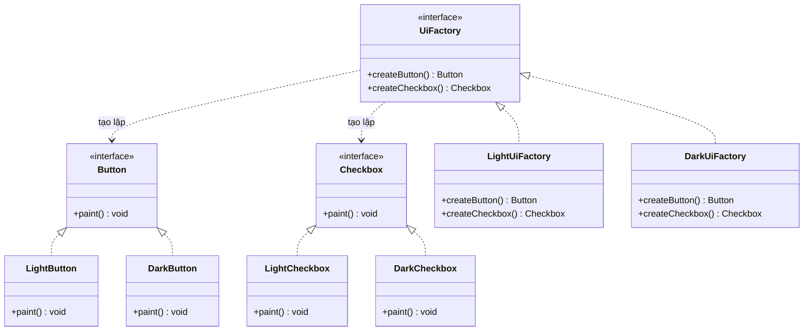

# Abstract Factory Pattern (Mẫu Thiết Kế Nhà Máy Trừu Tượng)

## 1. Mục tiêu (Intent)

**Abstract Factory** là một mẫu thiết kế creational (khởi tạo) cung cấp một giao diện (interface) để tạo ra các họ đối tượng có liên quan hoặc phụ thuộc lẫn nhau mà không cần chỉ định các lớp triển khai cụ thể của chúng.

Mục tiêu chính:

- Đảm bảo tính nhất quán giữa các sản phẩm cùng nhóm (họ sản phẩm).
- Tránh sự phụ thuộc cứng nhắc giữa Client và các biến thể sản phẩm cụ thể.
- Cách ly logic khởi tạo của một nhóm sản phẩm vào một nơi tập trung duy nhất.

---

## 2. Bối cảnh đặt ra (Problem Scenario)

Hãy tưởng tượng bạn đang phát triển một hệ thống giao diện người dùng (UI Library) đa nền tảng cho ứng dụng học tập trực tuyến. Hệ thống cần hỗ trợ hiển thị giao diện theo các chủ đề (Themes) khác nhau: **Light Theme** (Giao diện sáng) và **Dark Theme** (Giao diện tối).

Các thành phần giao diện gồm có: `Button` (Nút bấm) và `Checkbox` (Hộp kiểm).

Nếu bạn tự khởi tạo các thành phần giao diện một cách phân tán:

```java
Button button = new DarkButton();
Checkbox checkbox = new LightCheckbox(); // OOPS! Trộn lẫn hai chủ đề khác nhau
```

Vấn đề nảy sinh:

1. **Thiếu đồng bộ**: Rất dễ xảy ra tình trạng trộn lẫn các thành phần của Light Theme và Dark Theme trong cùng một màn hình giao diện, gây lỗi thẩm mỹ nghiêm trọng.
2. **Khó bảo trì và mở rộng**: Khi muốn thêm một chủ đề mới (ví dụ Neon Theme hoặc Retro Theme), bạn phải đi tìm tất cả các đoạn mã khởi tạo nút bấm và hộp kiểm để viết thêm nhánh điều kiện `if-else`.

---

## 3. Giải pháp (Solution)

Mẫu thiết kế **Abstract Factory** đề xuất:

1. Định nghĩa các interface riêng biệt cho từng sản phẩm trong họ sản phẩm (ví dụ `Button` và `Checkbox`).
2. Định nghĩa một interface Nhà máy trừu tượng (`UiFactory`) khai báo các phương thức tạo lập cho từng sản phẩm trừu tượng (như `createButton()` và `createCheckbox()`).
3. Tạo ra các lớp Nhà máy cụ thể cho từng biến thể chủ đề (như `LightUiFactory` và `DarkUiFactory`).
4. Client chỉ giao tiếp với nhà máy thông qua interface `UiFactory` và sử dụng các sản phẩm thông qua giao diện trừu tượng (`Button`, `Checkbox`).

---

## 4. Cấu trúc thành phần (Structure)

Cấu trúc chuẩn của Abstract Factory Pattern:



1. **Abstract Products**: Giao diện cho các sản phẩm đơn lẻ thuộc một họ (`Button`, `Checkbox`).
2. **Concrete Products**: Triển khai cụ thể của sản phẩm cho từng biến thể chủ đề (`LightButton`, `DarkButton`, ...).
3. **Abstract Factory**: Khai báo tập hợp các phương thức tạo lập các sản phẩm trừu tượng (`UiFactory`).
4. **Concrete Factories**: Triển khai các phương thức của Abstract Factory để tạo ra sản phẩm cụ thể tương ứng (`LightUiFactory`, `DarkUiFactory`).

---

## 5. Ví dụ mã nguồn Java hoàn chỉnh (Java Code Example)

Dưới đây là cách triển khai Abstract Factory Pattern bằng ngôn ngữ Java:

```java
// === 1. ĐỊNH NGHĨA CÁC SẢN PHẨM TRỪU TƯỢNG (Abstract Products) ===
interface Button {
    void paint();
}

interface Checkbox {
    void paint();
}

// === 2. CÁC BIẾN THỂ SẢN PHẨM CỤ THỂ (Concrete Products) ===
// Biến thể Light Theme
class LightButton implements Button {
    @Override
    public void paint() {
        System.out.println("Vẽ nút bấm màu xám nhạt (Light Button).");
    }
}

class LightCheckbox implements Checkbox {
    @Override
    public void paint() {
        System.out.println("Vẽ hộp kiểm viền xanh nhạt (Light Checkbox).");
    }
}

// Biến thể Dark Theme
class DarkButton implements Button {
    @Override
    public void paint() {
        System.out.println("Vẽ nút bấm màu đen xám (Dark Button).");
    }
}

class DarkCheckbox implements Checkbox {
    @Override
    public void paint() {
        System.out.println("Vẽ hộp kiểm viền neon sáng (Dark Checkbox).");
    }
}

// === 3. NHÀ MÁY TRỪU TƯỢNG (Abstract Factory) ===
interface UiFactory {
    Button createButton();
    Checkbox createCheckbox();
}

// === 4. CÁC NHÀ MÁY CỤ THỂ (Concrete Factories) ===
class LightUiFactory implements UiFactory {
    @Override
    public Button createButton() {
        return new LightButton();
    }

    @Override
    public Checkbox createCheckbox() {
        return new LightCheckbox();
    }
}

class DarkUiFactory implements UiFactory {
    @Override
    public Button createButton() {
        return new DarkButton();
    }

    @Override
    public Checkbox createCheckbox() {
        return new DarkCheckbox();
    }
}

// === 5. LỚP CLIENT SỬ DỤNG ===
class Application {
    private final Button button;
    private final Checkbox checkbox;

    // Client nhận nhà máy thông qua Dependency Injection
    public Application(UiFactory factory) {
        // Khởi tạo các sản phẩm hoàn toàn qua nhà máy trừu tượng
        this.button = factory.createButton();
        this.checkbox = factory.createCheckbox();
    }

    public void render() {
        button.paint();
        checkbox.paint();
    }
}

// Lớp Main chạy ứng dụng
class Main {
    public static void main(String[] args) {
        // Giả lập cấu hình hệ thống yêu cầu Dark Theme
        String configTheme = "DARK";
        UiFactory factory;

        if (configTheme.equalsIgnoreCase("DARK")) {
            factory = new DarkUiFactory();
        } else {
            factory = new LightUiFactory();
        }

        // Khởi tạo ứng dụng với nhà máy tương ứng
        Application app = new Application(factory);
        System.out.println("--- BẮT ĐẦU HIỂN THỊ GIAO DIỆN ---");
        app.render();
    }
}
```

---

## 6. Luồng hoạt động (Workflow)

1. Khi ứng dụng khởi chạy, hệ thống đọc cấu hình môi trường/chủ đề và khởi tạo một đối tượng nhà máy cụ thể (`DarkUiFactory`).
2. Đối tượng nhà máy cụ thể này được truyền vào constructor của lớp `Application` dưới dạng giao diện trừu tượng `UiFactory`.
3. Bên trong constructor của `Application`, code gọi `factory.createButton()` và `factory.createCheckbox()`. Do đa hình, JVM tự động tạo ra cặp sản phẩm tương thích là `DarkButton` và `DarkCheckbox`.
4. Ứng dụng hiển thị giao diện đồng bộ chủ đề thành công mà không cần quan tâm đến các lớp cụ thể được sinh ra.

---

## 7. Đánh giá (Pros & Cons)

### Ưu điểm

- **Đảm bảo tính đồng bộ**: Cam kết chắc chắn các sản phẩm bạn nhận được từ một nhà máy sẽ luôn tương thích và đồng bộ với nhau (tránh tình trạng trộn lệch theme).
- **Tránh kết dính chặt**: Giảm thiểu sự liên kết giữa Client và các sản phẩm cụ thể.
- **Nguyên lý Open/Closed**: Dễ dàng bổ sung thêm các họ sản phẩm mới (ví dụ: `NeonUiFactory` và các linh kiện Neon) mà không ảnh hưởng tới mã nguồn chính.

### Nhược điểm

- **Mã nguồn phức tạp**: Đòi hỏi tạo ra rất nhiều interface và class mới cho từng biến thể và từng nhà máy con.
- **Khó phát triển thêm dòng sản phẩm**: Nếu sau này họ giao diện cần bổ sung thêm một sản phẩm mới như `RadioButton`, bạn bắt buộc phải sửa interface `UiFactory` và sửa tất cả các lớp nhà máy cụ thể để implement phương thức mới này.

---

## 8. So sánh với các mẫu khác (Comparison)

- **Factory Method vs Abstract Factory**: Factory Method dựa trên kế thừa lớp để tạo ra **một sản phẩm đơn lẻ** thông qua ghi đè phương thức. Abstract Factory sử dụng nguyên lý Composition để ủy quyền tạo ra **cả một họ sản phẩm liên quan** thông qua một interface nhà máy chứa nhiều phương thức tạo lập.
- **Builder vs Abstract Factory**: Abstract Factory tập trung vào việc tạo lập tức thì các đối tượng đồng bộ trong họ sản phẩm. Builder tập trung tạo dựng một đối tượng phức tạp duy nhất theo từng bước cấu hình chi tiết.

---

## 9. Ứng dụng thực tế (Real-world Use Cases)

- **Java Core**: Lớp `javax.xml.parsers.DocumentBuilderFactory` dùng để tạo trình phân tích cú pháp XML tùy thuộc vào môi trường runtime.
- **Database Driver**: Các kết nối cơ sở dữ liệu trừu tượng tạo ra các câu lệnh (`Statement`, `Connection`, `ResultSet`) tương thích với từng cơ sở dữ liệu cụ thể (MySQL, Oracle).
