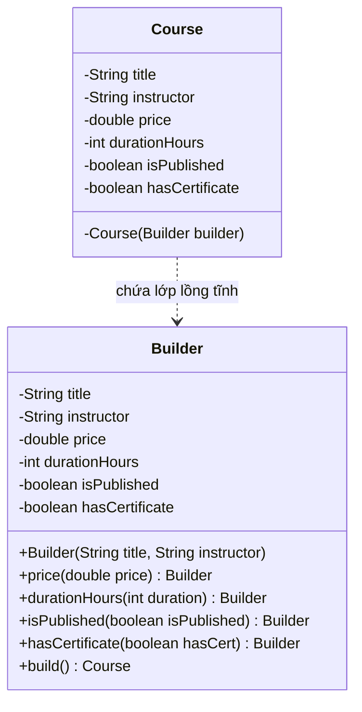

# Builder Pattern (Mẫu Thiết Kế Người Xây Dựng)

## 1. Mục tiêu (Intent)

**Builder** là một mẫu thiết kế creational (khởi tạo) cho phép bạn xây dựng các đối tượng phức tạp theo từng bước (step-by-step). Mẫu này cho phép bạn tạo ra các kiểu dáng và đại diện khác nhau của cùng một đối tượng bằng cách sử dụng cùng một mã khởi tạo.

Mục tiêu chính:

- Chuẩn hóa quá trình tạo đối tượng có nhiều thuộc tính (đặc biệt là thuộc tính tùy chọn).
- Tránh hiện tượng "Telescoping Constructor" (constructor bị quá tải với quá nhiều tham số khác nhau).
- Tách biệt logic xây dựng đối tượng ra khỏi lớp biểu diễn chính của đối tượng đó.

---

## 2. Bối cảnh đặt ra (Problem Scenario)

Hãy tưởng tượng bạn đang phát triển một hệ thống quản lý học tập trực tuyến (LMS). Hệ thống cần tạo đối tượng `Course` (Khóa học). Một khóa học có thể có rất nhiều thông tin:

- Các thuộc tính bắt buộc: `title` (tiêu đề), `instructor` (giảng viên).
- Các thuộc tính tùy chọn: `durationHours` (thời lượng), `price` (giá), `isPublished` (trạng thái xuất bản), `hasCertificate` (có chứng chỉ hay không), `lessonsCount` (số lượng bài học).

Nếu bạn sử dụng constructor thông thường, bạn sẽ gặp các vấn đề sau:

1. **Telescoping Constructor**: Bạn phải viết rất nhiều constructor để bao quát hết tất cả các tổ hợp thuộc tính tùy chọn:
    ```java
    public Course(String title, String instructor) { ... }
    public Course(String title, String instructor, double price) { ... }
    public Course(String title, String instructor, double price, int durationHours) { ... }
    // ... dài vô tận ...
    ```
2. **Khó đọc và dễ nhầm lẫn**: Khi khởi tạo đối tượng, việc truyền liên tiếp 5-10 đối số (đặc biệt là các kiểu dữ liệu giống nhau như `double`, `int`, `boolean`) rất dễ dẫn đến lỗi truyền sai thứ tự tham số.
    ```java
    // Nhìn vào đây khó biết giá trị true/false tương ứng với thuộc tính nào
    Course course = new Course("Java Core", "Alex", 199.0, 40, true, false);
    ```

---

## 3. Giải pháp (Solution)

Mẫu thiết kế **Builder** đề xuất tách logic khởi tạo của đối tượng ra khỏi lớp của nó và chuyển nó vào các đối tượng riêng biệt gọi là _builders_.

Thay vì gọi trực tiếp constructor của `Course`, bạn gọi đến các phương thức thiết lập tương ứng của đối tượng `Builder` theo cách nối chuỗi (fluent interface/method chaining) và cuối cùng gọi phương thức `build()` để nhận về đối tượng hoàn chỉnh.

---

## 4. Cấu trúc thành phần (Structure)

Cấu trúc chuẩn của Builder bao gồm các thành phần sau:



1. **Product (Sản phẩm)**: Đối tượng phức tạp cần được tạo dựng (ở đây là lớp `Course`). Thường có constructor là `private` để bắt buộc client phải thông qua Builder.
2. **Builder (Người xây dựng)**: Lớp lồng tĩnh (Static Nested Class) bên trong Product hoặc một lớp riêng biệt, chứa các phương thức thiết lập từng thuộc tính và trả về chính nó (`return this`).
3. **Director (Giám đốc - Tùy chọn)**: Định nghĩa thứ tự gọi các bước xây dựng. Thường dùng khi có nhiều cấu hình sản phẩm giống nhau lặp đi lặp lại.

---

## 5. Ví dụ mã nguồn Java hoàn chỉnh (Java Code Example)

Dưới đây là cách triển khai Builder Pattern chuẩn theo phong cách lập trình Java hiện đại (thường thấy trong các framework lớn như Spring Boot hay các thư viện như Lombok):

```java
// Lớp Product (Khóa học)
public class Course {
    // Các thuộc tính của khóa học (bất biến sau khi được build)
    private final String title;
    private final String instructor;
    private final double price;
    private final int durationHours;
    private final boolean isPublished;
    private final boolean hasCertificate;

    // Constructor private nhận vào đối tượng Builder
    private Course(Builder builder) {
        this.title = builder.title;
        this.instructor = builder.instructor;
        this.price = builder.price;
        this.durationHours = builder.durationHours;
        this.isPublished = builder.isPublished;
        this.hasCertificate = builder.hasCertificate;
    }

    // Các hàm getter
    public String getTitle() { return title; }
    public String getInstructor() { return instructor; }
    public double getPrice() { return price; }
    public int getDurationHours() { return durationHours; }
    public boolean isPublished() { return isPublished; }
    public boolean isHasCertificate() { return hasCertificate; }

    @Override
    public String toString() {
        return "Course{" +
                "title='" + title + '\'' +
                ", instructor='" + instructor + '\'' +
                ", price=" + price +
                ", durationHours=" + durationHours +
                ", isPublished=" + isPublished +
                ", hasCertificate=" + hasCertificate +
                '}';
    }

    // Lớp lồng tĩnh Builder
    public static class Builder {
        // Các thuộc tính tương ứng với Course
        private final String title;        // Thuộc tính bắt buộc
        private final String instructor;   // Thuộc tính bắt buộc
        private double price = 0.0;        // Tùy chọn (giá trị mặc định)
        private int durationHours = 0;     // Tùy chọn
        private boolean isPublished = false; // Tùy chọn
        private boolean hasCertificate = false; // Tùy chọn

        // Constructor của Builder yêu cầu các trường bắt buộc
        public Builder(String title, String instructor) {
            if (title == null || instructor == null) {
                throw new IllegalArgumentException("Tiêu đề và Giảng viên không được để trống!");
            }
            this.title = title;
            this.instructor = instructor;
        }

        // Các phương thức thiết lập thuộc tính tùy chọn trả về chính Builder (Method Chaining)
        public Builder price(double price) {
            this.price = price;
            return this;
        }

        public Builder durationHours(int durationHours) {
            this.durationHours = durationHours;
            return this;
        }

        public Builder isPublished(boolean isPublished) {
            this.isPublished = isPublished;
            return this;
        }

        public Builder hasCertificate(boolean hasCertificate) {
            this.hasCertificate = hasCertificate;
            return this;
        }

        // Phương thức build() khởi tạo đối tượng Course hoàn chỉnh
        public Course build() {
            // Có thể thêm bước kiểm tra tính hợp lệ trước khi tạo (Validation)
            if (this.durationHours < 0) {
                throw new IllegalStateException("Thời lượng khóa học không thể âm!");
            }
            return new Course(this);
        }
    }
}

// Lớp Client chạy ứng dụng
class Main {
    public static void main(String[] args) {
        // 1. Tạo một khóa học cơ bản (chỉ có thuộc tính bắt buộc)
        Course basicCourse = new Course.Builder("Java cho người mới bắt đầu", "Alex Nguyễn")
                .build();
        System.out.println("Basic Course: " + basicCourse);

        // 2. Tạo một khóa học nâng cao đầy đủ thuộc tính tùy chọn với Fluent API
        Course premiumCourse = new Course.Builder("Thiết kế hệ thống microservices", "Dr. Sarah")
                .price(499.99)
                .durationHours(60)
                .hasCertificate(true)
                .isPublished(true)
                .build();
        System.out.println("Premium Course: " + premiumCourse);
    }
}
```

---

## 6. Luồng hoạt động (Workflow)

1. Client khởi tạo đối tượng `Course.Builder` bằng cách truyền vào các tham số bắt buộc (`title` và `instructor`).
2. Client gọi các phương thức có giao diện trôi chảy (fluent methods) như `.price(...)`, `.durationHours(...)` để cấu hình các trường tùy chọn. Mỗi lời gọi hàm đều cập nhật trạng thái tạm thời trong Builder và trả lại đối tượng Builder đó.
3. Client gọi `.build()`. Lớp Builder sẽ tiến hành kiểm tra tính hợp lệ (Validation) nếu cần, sau đó chuyển giao chính nó vào constructor `private` của lớp `Course`.
4. Đối tượng `Course` được sinh ra là đối tượng **bất biến** (Immutable Object) - các thuộc tính đều được khai báo là `final` và chỉ có phương thức đọc (getter), giúp tăng độ an toàn trong môi trường đa luồng (Multi-threading).

---

## 7. Đánh giá (Pros & Cons)

### Ưu điểm

- **Tránh Telescoping constructor**: Tránh việc quá tải mã nguồn với hàng tá constructor phức tạp.
- **Tăng tính bất biến (Immutability)**: Bạn có thể tạo các thuộc tính `final` mà không cần cung cấp các hàm `setter` nguy hại, giúp tránh lỗi thay đổi trạng thái không kiểm soát được trong suốt vòng đời đối tượng.
- **Độ dễ đọc cao (Readability)**: Code khởi tạo nhìn rất rõ ràng, tự giải thích được ý nghĩa nhờ tên của từng bước thiết lập.
- **Dễ bảo trì và mở rộng**: Nếu sau này thêm thuộc tính mới cho lớp `Course`, bạn chỉ cần sửa đổi lớp Builder mà không làm hỏng code của các lớp Client đang sử dụng trước đó.

### Nhược điểm

- **Tăng số lượng dòng code**: Bạn phải viết thêm một lớp lồng tĩnh `Builder` tương đối dài dòng (mặc dù điều này có thể giảm bớt nếu sử dụng thư viện Lombok `@Builder`).
- **Chi phí khởi tạo tăng nhẹ**: Cần tạo ra một đối tượng trung gian (đối tượng Builder) trước khi tạo đối tượng thực tế.

---

## 8. So sánh với các mẫu khác (Comparison)

- **Factory Method vs Builder**: Factory Method dùng để khởi tạo một họ các đối tượng con dựa trên đa hình và quyết định tạo lập ở runtime mà không cần cung cấp nhiều bước phức tạp. Builder tập trung vào quy trình tạo lập từng bước một đối tượng phức tạp.
- **Singleton vs Builder**: Singleton đảm bảo chỉ có duy nhất một thực thể duy nhất, trong khi Builder dùng để tạo ra nhiều đối tượng khác nhau nhưng chung quy trình khởi tạo phức tạp.

---

## 9. Ứng dụng thực tế (Real-world Use Cases)

Trong Java, Builder Pattern cực kỳ phổ biến:

- **Java Core**: Lớp `java.lang.StringBuilder` (xây dựng chuỗi hiệu năng cao), `java.util.Calendar.Builder`.
- **Spring Framework**: Lớp `UriComponentsBuilder` (xây dựng URL), các builder cấu hình bảo mật `HttpSecurity` trong Spring Security.
- **Lombok Library**: Annotation `@Builder` tự động sinh mã nguồn Builder cho class khi compile.
