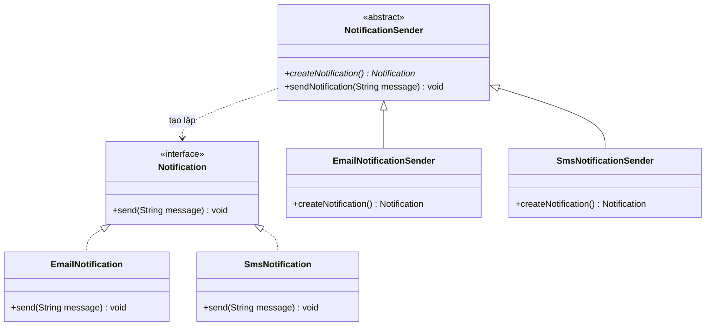

# Factory Method Pattern (Mẫu Thiết Kế Phương Thức Nhà Máy)

## 1. Mục tiêu (Intent)

**Factory Method** là một mẫu thiết kế creational (khởi tạo) định nghĩa một interface (giao diện) để tạo một đối tượng, nhưng để các lớp con quyết định lớp nào sẽ được khởi tạo. Factory Method cho phép một lớp trì hoãn việc khởi tạo cho các lớp con.

Mục tiêu chính:

- Tránh kết dính chặt (tight coupling) giữa bên gọi dịch vụ (Client) và lớp sản phẩm cụ thể.
- Tuân thủ nguyên tắc đóng gói (Encapsulation): che giấu logic chọn lựa đối tượng khởi tạo.
- Hỗ trợ nguyên lý Open/Closed (OCP) bằng cách cho phép dễ dàng thêm các sản phẩm mới mà không làm ảnh hưởng đến mã nguồn hiện tại.

---

## 2. Bối cảnh đặt ra (Problem Scenario)

Hãy tưởng tượng bạn đang xây dựng một ứng dụng quản lý lớp học trực tuyến. Hệ thống cần gửi thông báo (Notifications) tới học viên khi có bài học mới hoặc có bài tập cần nộp.
Ban đầu, hệ thống chỉ hỗ trợ gửi thông báo qua **Email**. Bạn viết code như thế này trong lớp xử lý nghiệp vụ:

```java
public class LearningService {
    public void notifyStudent(String message) {
        EmailNotification email = new EmailNotification();
        email.send(message);
    }
}
```

Mọi thứ hoạt động ổn định cho đến khi hệ thống phát triển rộng hơn. Người dùng yêu cầu thêm tính năng gửi thông báo qua tin nhắn **SMS** và **Push Notification** (thông báo đẩy trên app điện thoại).

Lúc này, bạn bắt đầu phải sửa code nghiệp vụ bằng cách thêm các câu lệnh rẽ nhánh:

```java
public class LearningService {
    public void notifyStudent(String message, String type) {
        if (type.equalsIgnoreCase("email")) {
            EmailNotification email = new EmailNotification();
            email.send(message);
        } else if (type.equalsIgnoreCase("sms")) {
            SmsNotification sms = new SmsNotification();
            sms.send(message);
        } else if (type.equalsIgnoreCase("push")) {
            PushNotification push = new PushNotification();
            push.send(message);
        }
    }
}
```

Vấn đề xuất hiện:

1. **Kết dính chặt (Tight Coupling)**: Lớp nghiệp vụ `LearningService` phụ thuộc trực tiếp vào các lớp cụ thể (`EmailNotification`, `SmsNotification`, `PushNotification`). Nếu một trong các lớp này thay đổi constructor, `LearningService` sẽ bị lỗi biên dịch.
2. **Vi phạm nguyên tắc Open/Closed**: Mỗi lần có thêm kênh thông báo mới (ví dụ Telegram, Zalo), bạn lại phải mở code của lớp nghiệp vụ ra để sửa và thêm nhánh `else if`. Điều này cực kỳ dễ gây lỗi (regression bugs) cho các tính năng hiện tại.

---

## 3. Giải pháp (Solution)

Mẫu thiết kế **Factory Method** đề xuất thay thế các lệnh gọi toán tử `new` trực tiếp bằng việc gọi một phương thức "nhà máy" đặc biệt (factory method).

Thay vì tạo sản phẩm trực tiếp, ta khai báo một lớp cha/giao diện chung của nhà sản xuất (Creator) chứa phương thức trừu tượng tạo sản phẩm. Các nhà sản xuất con cụ thể (Concrete Creators) sẽ ghi đè phương thức này để trả về sản phẩm cụ thể tương ứng.

---

## 4. Cấu trúc thành phần (Structure)

Cấu trúc chuẩn của Factory Method bao gồm các thành phần sau:



1. **Product (Sản phẩm)**: Khai báo giao diện chung cho tất cả các đối tượng mà nhà máy có thể tạo ra (`Notification`).
2. **Concrete Product (Sản phẩm cụ thể)**: Các lớp triển khai thực tế của giao diện sản phẩm (`EmailNotification`, `SmsNotification`).
3. **Creator (Nhà tạo lập)**: Lớp trừu tượng khai báo phương thức factory method trả về một đối tượng kiểu `Product`. Lớp này cũng có thể chứa logic xử lý nghiệp vụ chung dựa trên đối tượng sản phẩm được tạo ra.
4. **Concrete Creator (Nhà tạo lập cụ thể)**: Ghi đè phương thức factory method để trả về một thực thể của `Concrete Product` mong muốn.

---

## 5. Ví dụ mã nguồn Java hoàn chỉnh (Java Code Example)

Dưới đây là cách cài đặt Factory Method Pattern bằng ngôn ngữ Java:

```java
// 1. Giao diện sản phẩm chung (Product Interface)
interface Notification {
    void send(String message);
}

// 2. Các sản phẩm cụ thể (Concrete Products)
class EmailNotification implements Notification {
    @Override
    public void send(String message) {
        System.out.println("[EMAIL] Gửi email nội dung: " + message);
    }
}

class SmsNotification implements Notification {
    @Override
    public void send(String message) {
        System.out.println("[SMS] Gửi tin nhắn SMS nội dung: " + message);
    }
}

class PushNotification implements Notification {
    @Override
    public void send(String message) {
        System.out.println("[PUSH] Hiển thị thông báo đẩy: " + message);
    }
}

// 3. Lớp trừu tượng nhà tạo lập (Creator)
abstract class NotificationSender {
    // Đây chính là Factory Method (trừu tượng để lớp con tự quyết định)
    public abstract Notification createNotification();

    // Luồng nghiệp vụ chung không phụ thuộc vào lớp cụ thể nào
    public void sendNotification(String message) {
        Notification notification = createNotification();
        notification.send(message); // Đa hình quyết định lớp thực thi nào được gọi
    }
}

// 4. Các nhà tạo lập cụ thể (Concrete Creators)
class EmailNotificationSender extends NotificationSender {
    @Override
    public Notification createNotification() {
        return new EmailNotification();
    }
}

class SmsNotificationSender extends NotificationSender {
    @Override
    public Notification createNotification() {
        return new SmsNotification();
    }
}

class PushNotificationSender extends NotificationSender {
    @Override
    public Notification createNotification() {
        return new PushNotification();
    }
}

// Lớp Client chạy ứng dụng
class Main {
    public static void main(String[] args) {
        // Nghiệp vụ cần gửi thông báo qua Email
        NotificationSender emailSender = new EmailNotificationSender();
        emailSender.sendNotification("Chào mừng bạn đến với khóa học Java Core!");

        // Nghiệp vụ cần gửi thông báo qua SMS
        NotificationSender smsSender = new SmsNotificationSender();
        smsSender.sendNotification("Mã OTP kích hoạt tài khoản của bạn là 123456.");

        // Nghiệp vụ cần gửi thông báo đẩy Push
        NotificationSender pushSender = new PushNotificationSender();
        pushSender.sendNotification("Bạn có 1 bài tập mới cần nộp trước ngày mai.");
    }
}
```

---

## 6. Luồng hoạt động (Workflow)

1. Client quyết định sử dụng loại nhà gửi tin nhắn nào bằng cách tạo ra một đối tượng `ConcreteCreator` (ví dụ `EmailNotificationSender`).
2. Client gọi phương thức nghiệp vụ `sendNotification(message)`.
3. Bên trong `sendNotification`, mã nguồn gọi phương thức trừu tượng `createNotification()`. Do tính đa hình của hướng đối tượng, JVM sẽ tìm đến lớp cụ thể (`EmailNotificationSender`) để chạy hàm `createNotification()`, nhận về đối tượng `EmailNotification`.
4. Phương thức tiếp tục gọi `.send(message)` trên đối tượng sản phẩm vừa nhận được để hoàn tất nghiệp vụ. Client hoàn toàn không biết đến sự tồn tại của lớp cụ thể `EmailNotification`.

---

## 7. Đánh giá (Pros & Cons)

### Ưu điểm

- **Tránh kết dính chặt**: Client chỉ làm việc với giao diện sản phẩm (`Notification`) và giao diện nhà máy (`NotificationSender`).
- **Single Responsibility Principle (Nguyên tắc đơn nhiệm)**: Gom toàn bộ code khởi tạo sản phẩm về một nơi duy nhất (ở từng Factory cụ thể), giúp mã nguồn dễ đọc và dễ tìm lỗi.
- **Open/Closed Principle**: Bạn dễ dàng bổ sung loại sản phẩm mới (ví dụ `ZaloNotification`) bằng cách tạo thêm lớp sản phẩm mới và lớp nhà máy mới, mà không cần chỉnh sửa bất kỳ dòng mã hiện tại nào.

### Nhược điểm

- **Phình to mã nguồn**: Mỗi khi thêm sản phẩm mới, bạn phải tạo thêm tối thiểu 2 lớp mới (Sản phẩm mới + Nhà máy mới). Nếu hệ thống có quá nhiều biến thể sản phẩm, số lượng lớp sẽ tăng lên rất nhanh.

---

## 8. So sánh với các mẫu khác (Comparison)

- **Simple Factory vs Factory Method**: Simple Factory không dùng tính kế thừa của OOP, nó chỉ đơn thuần là một class chứa một phương thức tĩnh có `switch-case` hoặc `if-else` để trả về đối tượng. Factory Method sử dụng tính kế thừa và đa hình (lớp cha định nghĩa, lớp con quyết định).
- **Abstract Factory vs Factory Method**: Factory Method tập trung vào việc tạo ra **một sản phẩm**, trong khi Abstract Factory tập trung vào việc tạo ra **một gia đình các sản phẩm liên quan** (family of related products) mà không chỉ định lớp cụ thể của chúng.

---

## 9. Ứng dụng thực tế (Real-world Use Cases)

- **Java SDK**: `java.util.Calendar.getInstance()`, `java.text.NumberFormat.getInstance()`.
- **Spring Boot**: Spring Container sử dụng Factory Method thông qua cơ chế `@Bean` để khởi tạo các Component/Services trong Application Context.
