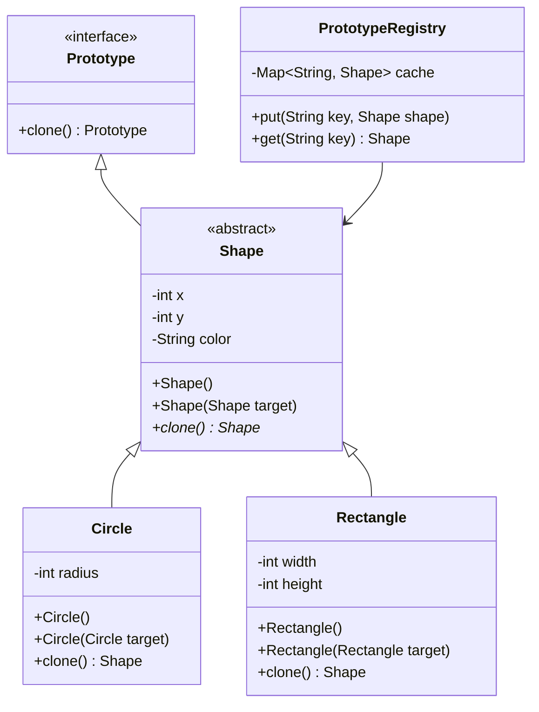

# Prototype Pattern (Mẫu Bản Mẫu)

## 1. Mục tiêu (Intent)

**Prototype** là một mẫu thiết kế creational (khởi tạo) cho phép sao chép (clone) các đối tượng hiện có mà không làm cho mã nguồn của bạn phụ thuộc vào các lớp cụ thể (concrete classes) của chúng.

Mục tiêu chính:

- Tạo ra một bản sao hoàn chỉnh của một đối tượng tại runtime (chạy chương trình) có cùng trạng thái dữ liệu.
- Tránh việc khởi tạo đối tượng mới bằng từ khóa `new` rồi sao chép thủ công từng thuộc tính, đặc biệt hữu ích khi một số thuộc tính bị ẩn (private) hoặc quá trình khởi tạo đối tượng tốn nhiều tài nguyên hệ thống.
- Giảm thiểu số lượng lớp con (subclasses) vốn chỉ khác biệt nhau về cách cấu hình trạng thái ban đầu của đối tượng.

---

## 2. Bối cảnh đặt ra (Problem Scenario)

Hãy tưởng tượng bạn đang xây dựng một engine đồ họa cho trò chơi điện tử. Trong game, người chơi có thể tạo và tùy chỉnh các loại quái vật (Monster). Mỗi quái vật có các thuộc tính: lượng máu (`health`), tốc độ (`speed`), màu sắc (`color`), và danh sách các vật phẩm mang theo (`inventory`).

Nếu muốn nhân bản một quái vật hiện có để tạo ra một đội quân quái vật giống hệt nhau, bạn có thể viết:

```java
Monster original = getMonster();
Monster clone = new Monster();
clone.setHealth(original.getHealth());
clone.setSpeed(original.getSpeed());
clone.setColor(original.getColor());
// Vấn đề: Làm sao sao chép được danh sách inventory nếu nó là private và không có getter công khai?
// Hoặc nếu original thực chất là một lớp con cụ thể như Zombie hay Orc, làm sao client biết để gọi new Zombie() hay new Orc()?
```

Vấn đề nảy sinh:

1. **Phụ thuộc vào các lớp cụ thể**: Client phải biết chính xác lớp cụ thể của đối tượng gốc để gọi `new Zombie()` hoặc `new Orc()`, làm tăng tính liên kết chặt chẽ (tight coupling).
2. **Không thể sao chép thuộc tính ẩn**: Một số thuộc tính quan trọng của đối tượng có thể được khai báo `private` và không có cơ chế truy xuất công khai từ bên ngoài.
3. **Phức tạp và lặp lại**: Quá trình khởi tạo và sao chép thủ công các thuộc tính của đối tượng lớn phức tạp làm mã nguồn dài dòng, dễ xảy ra sai sót.

---

## 3. Giải pháp (Solution)

Mẫu thiết kế **Prototype** giải quyết vấn đề này bằng cách giao trách nhiệm sao chép cho chính đối tượng được sao chép.

Lớp đối tượng gốc sẽ định nghĩa một phương thức `clone()` chung. Phương thức này sẽ tạo ra một thực thể mới của chính nó và sao chép toàn bộ thuộc tính (bao gồm cả private) sang đối tượng mới. Client chỉ cần gọi `original.clone()` mà không cần quan tâm lớp cụ thể là gì hay quá trình sao chép diễn ra như thế nào.

---

## 4. Cấu trúc thành phần (Structure)

Cấu trúc chuẩn của Prototype bao gồm:



1. **Prototype**: Interface hoặc Abstract Class khai báo phương thức `clone()`.
2. **Concrete Prototype (Shape, Circle, Rectangle)**: Lớp cụ thể triển khai phương thức `clone()`. Nó thường có một copy constructor nhận tham số chính là lớp đó để sao chép thuộc tính.
3. **Prototype Registry (Tùy chọn)**: Một kho chứa các mẫu thử đã được khởi tạo sẵn, giúp Client dễ dàng lấy ra một bản sao của đối tượng mẫu thông qua một mã định danh.

---

## 5. Ví dụ mã nguồn Java hoàn chỉnh (Java Code Example)

Dưới đây là ví dụ triển khai Prototype để nhân bản các hình học (`Shape`) trong một ứng dụng đồ họa:

```java
import java.util.HashMap;
import java.util.Map;
import java.util.Objects;

// 1. Lớp Prototype cha (Abstract class)
abstract class Shape {
    private int x;
    private int y;
    private String color;

    // Constructor mặc định
    public Shape() {}

    // Copy Constructor - Dùng để sao chép dữ liệu từ đối tượng gốc
    public Shape(Shape target) {
        if (target != null) {
            this.x = target.x;
            this.y = target.y;
            this.color = target.color;
        }
    }

    // Phương thức clone trừu tượng
    public abstract Shape clone();

    // Getters & Setters
    public void setX(int x) { this.x = x; }
    public void setY(int y) { this.y = y; }
    public void setColor(String color) { this.color = color; }
    public String getColor() { return color; }

    @Override
    public boolean equals(Object object2) {
        if (!(object2 instanceof Shape)) return false;
        Shape shape2 = (Shape) object2;
        return shape2.x == x && shape2.y == y && Objects.equals(shape2.color, color);
    }
}

// 2. Concrete Prototype: Hình tròn (Circle)
class Circle extends Shape {
    private int radius;

    public Circle() {}

    // Copy Constructor của Circle
    public Circle(Circle target) {
        super(target); // Gọi constructor cha để sao chép x, y, color
        if (target != null) {
            this.radius = target.radius;
        }
    }

    @Override
    public Shape clone() {
        return new Circle(this); // Gọi copy constructor và trả về bản sao
    }

    public void setRadius(int radius) { this.radius = radius; }
    public int getRadius() { return radius; }

    @Override
    public boolean equals(Object object2) {
        if (!(object2 instanceof Circle) || !super.equals(object2)) return false;
        Circle shape2 = (Circle) object2;
        return shape2.radius == radius;
    }
}

// 3. Concrete Prototype: Hình chữ nhật (Rectangle)
class Rectangle extends Shape {
    private int width;
    private int height;

    public Rectangle() {}

    // Copy Constructor của Rectangle
    public Rectangle(Rectangle target) {
        super(target);
        if (target != null) {
            this.width = target.width;
            this.height = target.height;
        }
    }

    @Override
    public Shape clone() {
        return new Rectangle(this);
    }

    public void setWidth(int width) { this.width = width; }
    public void setHeight(int height) { this.height = height; }

    @Override
    public boolean equals(Object object2) {
        if (!(object2 instanceof Rectangle) || !super.equals(object2)) return false;
        Rectangle shape2 = (Rectangle) object2;
        return shape2.width == width && shape2.height == height;
    }
}

// 4. Registry quản lý các bản mẫu (Prototype Registry)
class ShapeRegistry {
    private final Map<String, Shape> cache = new HashMap<>();

    public void put(String key, Shape shape) {
        cache.put(key, shape);
    }

    public Shape get(String key) {
        Shape shape = cache.get(key);
        return shape != null ? shape.clone() : null; // Trả về bản sao
    }
}

// Lớp Client chạy ứng dụng
class Main {
    public static void main(String[] args) {
        System.out.println("--- Khởi chạy chương trình Prototype ---");

        // 1. Tạo các đối tượng mẫu ban đầu
        Circle redCircle = new Circle();
        redCircle.setX(10);
        redCircle.setY(20);
        redCircle.setRadius(15);
        redCircle.setColor("Red");

        // Đưa vào Registry để tái sử dụng sau này
        ShapeRegistry registry = new ShapeRegistry();
        registry.put("BigRedCircle", redCircle);

        // 2. Nhân bản đối tượng từ Registry
        Shape shapeClone = registry.get("BigRedCircle");

        if (shapeClone != null && shapeClone instanceof Circle) {
            Circle clonedCircle = (Circle) shapeClone;
            System.out.println("Bản sao lấy từ Registry thành công!");
            System.out.println("Màu sắc bản sao: " + clonedCircle.getColor());
            System.out.println("Bán kính bản sao: " + clonedCircle.getRadius());

            // Thay đổi thuộc tính bản sao
            clonedCircle.setColor("Blue");
            System.out.println("Màu sắc bản sao sau khi sửa: " + clonedCircle.getColor());
            System.out.println("Màu sắc của đối tượng gốc vẫn là: " + redCircle.getColor());

            // So sánh ô nhớ
            if (redCircle != clonedCircle) {
                System.out.println("[SUCCESS] Bản sao và đối tượng gốc là hai thực thể độc lập!");
            }
        }
    }
}
```

---

## 6. Luồng hoạt động (Workflow)

1. **Khởi tạo bản mẫu**: Ứng dụng tạo ra một đối tượng đại diện cho một trạng thái cụ thể và có thể đăng ký nó vào `PrototypeRegistry`.
2. **Yêu cầu nhân bản**: Khi Client cần một đối tượng tương tự, thay vì tự dùng `new`, Client yêu cầu đối tượng gốc tự nhân bản bằng phương thức `clone()`.
3. **Sao chép dữ liệu**: Phương thức `clone()` gọi constructor sao chép (copy constructor), truyền chính đối tượng hiện tại (`this`) vào làm đối số. Đối tượng mới được cấp phát vùng nhớ riêng biệt và sao chép toàn bộ giá trị thuộc tính.
4. **Trả về kết quả**: Đối tượng sao chép được trả về cho Client. Client có thể tùy ý chỉnh sửa trạng thái của đối tượng mới mà không ảnh hưởng gì tới đối tượng gốc.

---

## 7. Đánh giá (Pros & Cons)

### Ưu điểm

- **Độc lập lớp cụ thể**: Có thể nhân bản các đối tượng mà không cần liên kết mã nguồn với các lớp cụ thể của chúng.
- **Tiết kiệm hiệu năng**: Thay vì khởi tạo một đối tượng phức tạp thông qua phân tích cơ sở dữ liệu hoặc nạp file (rất tốn kém), bạn chỉ cần sao chép nhanh một đối tượng đã được lưu trong bộ nhớ.
- **Thay thế kế thừa**: Dễ dàng tạo ra các cấu hình đối tượng phức tạp từ các mẫu có sẵn thay vì phải sinh ra hàng tá lớp con.

### Nhược điểm

- **Khó khăn với tham chiếu vòng (Circular Reference)**: Việc triển khai sao chép sâu (Deep Copy) cho các đối tượng có thuộc tính trỏ chéo lẫn nhau rất phức tạp và dễ gây ra lỗi tràn bộ nhớ (stack overflow).
- **Phụ thuộc vào cơ chế nhân bản của ngôn ngữ**: Trong Java, việc sử dụng interface `Cloneable` mặc định của JDK đôi khi gây tranh cãi và không an toàn (do nó không gọi constructor), do đó việc tự viết Copy Constructor (như ví dụ trên) được khuyên dùng hơn.

---

## 8. So sánh với các mẫu khác (Comparison)

- **Prototype vs Factory Method / Abstract Factory**: Cả ba đều là mẫu khởi tạo. Tuy nhiên, Factory sử dụng kế thừa để quyết định lớp nào được khởi tạo (thông qua lớp con), trong khi Prototype sử dụng cơ chế ủy quyền nhân bản trên các đối tượng hiện có tại runtime.
- **Prototype vs Memento**: Cả hai đều lưu giữ trạng thái đối tượng. Tuy nhiên, Prototype dùng để tạo ra một bản sao mới hoạt động độc lập, còn Memento dùng để lưu ảnh chụp (snapshot) trạng thái tại một thời điểm nhằm phục vụ mục đích khôi phục (Undo) sau này.

---

## 9. Ứng dụng thực tế (Real-world Use Cases)

- **Java Core**: Phương thức `Object.clone()` (mặc dù thiết kế chưa tối ưu nhưng là ví dụ cơ bản) và interface `java.lang.Cloneable`. Lớp `ArrayList.clone()`, `HashMap.clone()`.
- **Game Development**: Sinh quái vật (Spawning monsters), đạn dược (Projectiles), hoặc các chướng ngại vật hàng loạt dựa trên các thông số thiết kế chung của một bản mẫu.
- **UI Frameworks**: Sao chép nhanh một component UI phức tạp (như một bảng biểu với nhiều bộ lọc đã chọn sẵn) sang một màn hình hoặc tab mới.
