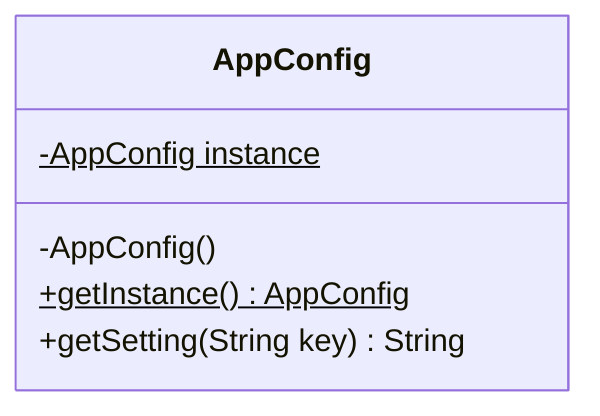

# Singleton Pattern (Mẫu Thiết Kế Đơn Thể)

## 1. Mục tiêu (Intent)

**Singleton** là một mẫu thiết kế creational (khởi tạo) đảm bảo rằng một lớp chỉ có **duy nhất một thực thể (instance)** được tạo ra trong suốt vòng đời của ứng dụng và cung cấp một **điểm truy cập toàn cục (global access point)** đến thực thể đó.

Mục tiêu chính:

- Kiểm soát quyền truy cập vào một tài nguyên chia sẻ duy nhất (như cơ sở dữ liệu, file cấu hình, hàng đợi tác vụ).
- Đảm bảo tính nhất quán của dữ liệu toàn cục.
- Tiết kiệm tài nguyên hệ thống (tránh việc khởi tạo lặp đi lặp lại các đối tượng nặng ký).

---

## 2. Bối cảnh đặt ra (Problem Scenario)

Hãy tưởng tượng bạn đang phát triển một ứng dụng web. Ứng dụng cần đọc các thông số cấu hình hệ thống từ một file `config.properties` duy nhất (như cổng kết nối, môi trường dev/production, dung lượng upload tối đa).

Nếu mỗi module trong mã nguồn tự ý khởi tạo một đối tượng quản lý cấu hình riêng:

```java
public class UserService {
    public void doSomething() {
        AppConfig config = new AppConfig(); // Đọc và nạp file cấu hình từ ổ đĩa
        String dbUrl = config.get("db.url");
        // ...
    }
}
```

Vấn đề nảy sinh:

1. **Lãng phí tài nguyên**: Việc đọc file từ ổ đĩa và phân tích dữ liệu (parsing) rất tốn CPU và RAM. Nếu có 1000 request cùng gọi, hệ thống sẽ nạp file 1000 lần.
2. **Không nhất quán**: Nếu một module thay đổi giá trị cấu hình tại runtime (ví dụ chuyển đổi ngôn ngữ), các module khác sẽ không nhận được sự thay đổi đó vì chúng đang giữ các thực thể `AppConfig` độc lập khác nhau.

---

## 3. Giải pháp (Solution)

Mẫu thiết kế **Singleton** giải quyết vấn đề này bằng cách:

1. **Private Constructor**: Khai báo constructor của lớp là `private` để ngăn chặn các lớp khác khởi tạo đối tượng bằng từ khóa `new`.
2. **Static Instance**: Lưu trữ thực thể duy nhất bên trong một biến `private static` của chính lớp đó.
3. **Public Static Method**: Cung cấp một phương thức truy cập tĩnh công khai (như `getInstance()`) để trả về thực thể duy nhất này. Phương thức này thường áp dụng cơ chế khởi tạo trễ (Lazy Initialization - chỉ tạo đối tượng khi được gọi đến lần đầu).

---

## 4. Cấu trúc thành phần (Structure)

Cấu trúc chuẩn của Singleton trong Java bao gồm:



1. **private static AppConfig instance**: Thuộc tính tĩnh lưu thực thể duy nhất.
2. **private AppConfig()**: Constructor private để chặn khởi tạo tự do.
3. **public static AppConfig getInstance()**: Phương thức static trả về thực thể duy nhất.

---

## 5. Ví dụ mã nguồn Java hoàn chỉnh (Java Code Example)

Có nhiều cách triển khai Singleton trong Java. Dưới đây giới thiệu 2 cách chuẩn và an toàn nhất trong môi trường đa luồng (Multi-threading):

### Cách 1: Double-Checked Locking (Khuyên dùng cho các phiên bản cũ)

```java
import java.util.HashMap;
import java.util.Map;

public class AppConfig {
    // Biến instance tĩnh phải khai báo là "volatile" để tránh lỗi cache luồng và tối ưu hóa của JVM
    private static volatile AppConfig instance;
    private final Map<String, String> settings;

    // 1. Constructor private chặn khởi tạo ngoài
    private AppConfig() {
        System.out.println("[INIT] Đang đọc file cấu hình hệ thống...");
        settings = new HashMap<>();
        settings.put("app.name", "Design Patterns Learning");
        settings.put("app.version", "1.0.0");
        settings.put("db.host", "localhost:3306");
    }

    // 2. Phương thức tĩnh truy cập toàn cục
    public static AppConfig getInstance() {
        // Kiểm tra lần 1 (Không cần đồng bộ hóa nếu instance đã được tạo trước đó)
        if (instance == null) {
            // Đồng bộ hóa cấp độ class
            synchronized (AppConfig.class) {
                // Kiểm tra lần 2 (Đảm bảo chỉ 1 luồng đi qua bước khởi tạo)
                if (instance == null) {
                    instance = new AppConfig();
                }
            }
        }
        return instance;
    }

    public String getSetting(String key) {
        return settings.get(key);
    }
}
```

### Cách 2: Bill Pugh Singleton (Tối ưu nhất cho Java)

Cách này tận dụng cơ chế nạp class của JVM (Class Loader) để đảm bảo thread-safe và lười khởi tạo (Lazy Loading) một cách tự nhiên mà không cần từ khóa `synchronized`.

```java
public class DatabaseConnectionPool {

    // 1. Constructor private Chặn khởi tạo
    private DatabaseConnectionPool() {
        System.out.println("[POOL] Thiết lập kết nối cơ sở dữ liệu ban đầu...");
    }

    // Lớp lồng tĩnh trợ giúp (Helper Class). Chỉ được nạp vào bộ nhớ khi getInstance() được gọi
    private static class Holder {
        private static final DatabaseConnectionPool INSTANCE = new DatabaseConnectionPool();
    }

    // 2. Phương thức tĩnh truy cập
    public static DatabaseConnectionPool getInstance() {
        return Holder.INSTANCE;
    }

    public void executeQuery(String sql) {
        System.out.println("Thực thi câu lệnh SQL: " + sql);
    }
}

// Lớp Client chạy ứng dụng
class Main {
    public static void main(String[] args) {
        System.out.println("--- Khởi chạy chương trình ---");

        // Thử khởi tạo trực tiếp bằng new (Sẽ bị lỗi biên dịch)
        // AppConfig config = new AppConfig();

        // Lấy thực thể ở Module A
        AppConfig configA = AppConfig.getInstance();
        System.out.println("Tên ứng dụng: " + configA.getSetting("app.name"));

        // Lấy thực thể ở Module B
        AppConfig configB = AppConfig.getInstance();
        System.out.println("Phiên bản ứng dụng: " + configB.getSetting("app.version"));

        // Kiểm tra xem hai thực thể có thực sự là một hay không
        if (configA == configB) {
            System.out.println("[SUCCESS] configA và configB trỏ đến cùng một ô nhớ!");
        } else {
            System.out.println("[FAIL] Chúng là hai đối tượng khác nhau!");
        }

        System.out.println("\n--- Thử nghiệm với Database Pool (Bill Pugh) ---");
        DatabaseConnectionPool poolA = DatabaseConnectionPool.getInstance();
        poolA.executeQuery("SELECT * FROM students");

        DatabaseConnectionPool poolB = DatabaseConnectionPool.getInstance();
        if (poolA == poolB) {
            System.out.println("[SUCCESS] Chỉ có duy nhất 1 Connection Pool được hoạt động!");
        }
    }
}
```

---

## 6. Luồng hoạt động (Workflow)

1. Khi chương trình khởi chạy, lớp `AppConfig` được nạp vào máy ảo Java (JVM) nhưng chưa tiến hành tạo đối tượng (do constructor `private` và không tự khởi tạo trực tiếp).
2. Khi bất cứ lớp nào gọi đến `AppConfig.getInstance()`, JVM kiểm tra xem biến `instance` đã được tạo chưa.
3. Nếu chưa, chương trình áp dụng khóa đồng bộ (`synchronized`) đảm bảo tại một thời điểm chỉ có tối đa một luồng thực thi khởi tạo đối tượng thông qua `new AppConfig()`.
4. Các lần gọi tiếp theo sẽ trả về ngay giá trị `instance` đã lưu trữ trong bộ nhớ mà không cần chạy lại constructor hay chờ đợi khóa đồng bộ.

---

## 7. Đánh giá (Pros & Cons)

### Ưu điểm

- **Kiểm soát tuyệt đối**: Đảm bảo chắc chắn chỉ có duy nhất một thực thể của lớp tồn tại.
- **Lazy Initialization**: Đối tượng chỉ được tạo ra khi thực sự cần thiết, tiết kiệm tài nguyên bộ nhớ khởi động.
- **Điểm truy cập chung**: Đơn giản hóa việc gọi tài nguyên từ bất kỳ đâu trong dự án mà không cần truyền tham số lòng vòng qua constructor.

### Nhược điểm

- **Khó kiểm thử (Unit Testing)**: Singleton tạo ra các trạng thái toàn cục ẩn (Global State). Điều này gây khó khăn khi viết test case độc lập do các bài test có thể ảnh hưởng trạng thái lẫn nhau.
- **Vi phạm Single Responsibility Principle**: Lớp Singleton vừa quản lý nghiệp vụ của nó, vừa tự chịu trách nhiệm quản lý vòng đời khởi tạo của chính nó.
- **Đa luồng phức tạp**: Cần cài đặt cẩn thận (Double-checked locking hoặc Bill Pugh) để tránh lỗi tạo nhiều thực thể khi có hàng nghìn thread truy cập đồng thời.

---

## 8. So sánh với các mẫu khác (Comparison)

- **Singleton vs Static Class (Lớp chứa hàm tĩnh)**: Lớp tĩnh (như `java.lang.Math`) không thể khởi tạo đối tượng, không thể kế thừa hoặc triển khai interface (không áp dụng được đa hình). Singleton bản chất vẫn là một đối tượng hướng đối tượng bình thường, có thể truyền vào các phương thức như một tham số, triển khai interface, kế thừa lớp cha và có thể hỗ trợ cơ chế Lazy Loading.
- **Singleton vs Factory Method**: Đa số các lớp Factory thường được triển khai dưới dạng Singleton vì chúng ta chỉ cần một thực thể nhà máy duy nhất để tạo lập các đối tượng khác.

---

## 9. Ứng dụng thực tế (Real-world Use Cases)

- **Java Core**: Lớp `java.lang.Runtime.getRuntime()`, `java.awt.Desktop.getDesktop()`.
- **Spring Boot**: Mặc định, tất cả các Bean được định nghĩa trong Spring Framework (như các lớp `@Service`, `@Repository`, `@Controller`) đều được Spring IoC Container quản lý dưới dạng **Singleton Scope** để tối ưu hóa bộ nhớ và hiệu năng.
- **Logging Framework**: Lớp quản lý ghi log chính (như `LoggerFactory.getLogger()`) thường là Singleton để ghi tập trung log vào một file.
