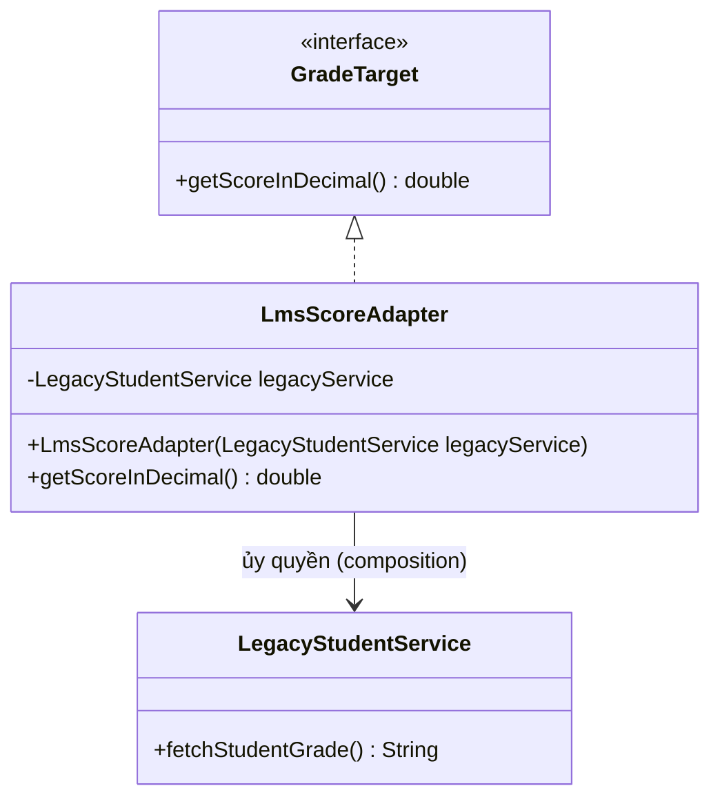

# Adapter Pattern (Mẫu Thiết Kế Bộ Chuyển Đổi)

## 1. Mục tiêu (Intent)

**Adapter** là một mẫu thiết kế structural (cấu trúc) cho phép các đối tượng có giao diện không tương thích có thể cộng tác và làm việc với nhau.

Mục tiêu chính:

- Hoạt động như một cầu nối/bộ chuyển đổi giữa hai giao diện khác nhau.
- Tái sử dụng mã nguồn của các lớp sẵn có (thư viện bên thứ ba, code cũ) mà không cần chỉnh sửa trực tiếp mã nguồn của chúng.
- Cô lập phần logic chuyển đổi dữ liệu phức tạp ra khỏi logic nghiệp vụ chính của hệ thống.

---

## 2. Bối cảnh đặt ra (Problem Scenario)

Hãy tưởng tượng bạn đang phát triển một hệ thống quản lý học tập (LMS). Hệ thống có một module phân tích học tập đòi hỏi điểm số của học sinh phải ở định dạng chuẩn số thực `double` (thang điểm 10.0). Hệ thống giao tiếp qua interface sau:

```java
interface GradeTarget {
    double getScoreInDecimal(); // Trả về điểm dạng số thực từ 0.0 đến 10.0
}
```

Hệ thống hoạt động tốt cho đến khi nhà trường quyết định tích hợp thêm một cơ sở dữ liệu học sinh cũ (Legacy Student System) của bên thứ ba. Hệ thống cũ này lưu trữ điểm số dưới dạng chữ cái học thuật (như `"A"`, `"B"`, `"C"`, `"F"`) hoặc chuỗi phần trăm (`"85%"`). Lớp cũ đó trông như sau:

```java
class LegacyStudentService {
    public String fetchStudentGrade() {
        return "A"; // Trả về điểm chữ cái
    }
}
```

Bây giờ bạn gặp bế tắc:

- Bạn không thể sửa trực tiếp lớp `LegacyStudentService` vì đó là thư viện đóng gói sẵn hoặc hệ thống bên thứ ba không có quyền sửa đổi.
- Bạn không muốn sửa đổi giao diện `GradeTarget` của hệ thống hiện tại, vì việc đó sẽ kéo theo sửa đổi ở hàng chục module phân tích báo cáo đang chạy ổn định.

---

## 3. Giải pháp (Solution)

Mẫu thiết kế **Adapter** giải quyết vấn đề này bằng cách tạo ra một lớp trung gian đóng vai trò làm bộ chuyển đổi (Adapter).

Adapter này sẽ triển khai (implement) giao diện đích (`GradeTarget`) mà hệ thống của bạn đang kỳ vọng, đồng thời giữ một tham chiếu đến đối tượng không tương thích (`LegacyStudentService`). Khi hệ thống của bạn gọi phương thức trên Adapter, nó sẽ xử lý dữ liệu nhận được từ đối tượng cũ và chuyển đổi nó thành định dạng đích trước khi trả về.

---

## 4. Cấu trúc thành phần (Structure)

Có hai cách triển khai Adapter: **Object Adapter** (sử dụng Composition - khuyên dùng) và **Class Adapter** (sử dụng Đa kế thừa/Kế thừa). Dưới đây là cấu trúc Object Adapter tiêu chuẩn:



1. **Client (Khách hàng)**: Lớp chứa logic nghiệp vụ chính của ứng dụng, chỉ làm việc với giao diện `Target`.
2. **Target (Giao diện đích)**: Định nghĩa giao diện mà Client mong muốn sử dụng (`GradeTarget`).
3. **Adaptee (Thành phần cần chuyển đổi)**: Lớp sẵn có nhưng không tương thích với giao diện đích (`LegacyStudentService`).
4. **Adapter (Bộ chuyển đổi)**: Lớp triển khai giao diện `Target` và bọc (wrap) đối tượng `Adaptee` bên trong.

---

## 5. Ví dụ mã nguồn Java hoàn chỉnh (Java Code Example)

Dưới đây là cách triển khai Object Adapter bằng Java:

```java
// 1. Target Interface (Hệ thống hiện tại mong muốn sử dụng)
interface GradeTarget {
    double getScoreInDecimal();
}

// 2. Adaptee Class (Hệ thống cũ không tương thích)
class LegacyStudentService {
    private final String studentName;
    private final String grade; // Giá trị có thể là "A", "B", "C", "F"

    public LegacyStudentService(String studentName, String grade) {
        this.studentName = studentName;
        this.grade = grade;
    }

    public String fetchStudentGrade() {
        return grade;
    }

    public String getStudentName() {
        return studentName;
    }
}

// 3. Adapter Class (Bộ chuyển đổi)
class LmsScoreAdapter implements GradeTarget {
    private final LegacyStudentService legacyService;

    // Sử dụng Composition để giữ đối tượng cần chuyển đổi
    public LmsScoreAdapter(LegacyStudentService legacyService) {
        this.legacyService = legacyService;
    }

    @Override
    public double getScoreInDecimal() {
        // Lấy điểm dạng chữ từ hệ thống cũ
        String legacyGrade = legacyService.fetchStudentGrade();

        // Tiến hành chuyển đổi dữ liệu không tương thích sang thang điểm 10.0
        return convertLetterToDecimal(legacyGrade);
    }

    // Logic chuyển đổi cụ thể
    private double convertLetterToDecimal(String grade) {
        switch (grade.toUpperCase()) {
            case "A": return 9.5;
            case "B": return 8.0;
            case "C": return 6.5;
            case "D": return 5.0;
            case "F": return 2.0;
            default: return 0.0;
        }
    }
}

// Lớp phân tích của hệ thống hiện tại (Client)
class GradeAnalyzer {
    public void printReport(GradeTarget gradeTarget) {
        // Client chỉ cần làm việc với giao diện GradeTarget
        System.out.println("Kết quả học tập quy đổi: " + gradeTarget.getScoreInDecimal() + "/10.0");
    }
}

// Lớp Client chạy ứng dụng
class Main {
    public static void main(String[] args) {
        // 1. Tạo đối tượng từ hệ thống cũ (không tương thích)
        LegacyStudentService legacyStudent = new LegacyStudentService("Hùng Nguyễn", "A");

        // 2. Tạo adapter bọc đối tượng cũ
        GradeTarget adapter = new LmsScoreAdapter(legacyStudent);

        // 3. Hệ thống hiện tại sử dụng adapter bình thường mà không cần sửa code lõi
        System.out.println("Học sinh: " + legacyStudent.getStudentName());
        GradeAnalyzer analyzer = new GradeAnalyzer();
        analyzer.printReport(adapter);
    }
}
```

---

## 6. Luồng hoạt động (Workflow)

1. Client (`GradeAnalyzer`) gọi phương thức xử lý thông tin yêu cầu giao diện `GradeTarget` thông qua hàm `printReport(GradeTarget)`.
2. Client truyền đối tượng `LmsScoreAdapter` vào phương thức.
3. Khi Client gọi `gradeTarget.getScoreInDecimal()`, đối tượng Adapter nhận lệnh và gọi phương thức nội bộ `legacyService.fetchStudentGrade()` để lấy dữ liệu dạng chữ ban đầu.
4. Adapter thực hiện phân tích và quy đổi chữ `"A"` thành số thực `9.5` và trả về kết quả cho Client.
5. Client nhận kết quả dạng `double` và xử lý in báo cáo thành công mà không hề biết có sự xuất hiện của hệ thống cũ.

---

## 7. Đánh giá (Pros & Cons)

### Ưu điểm

- **Tuân thủ Single Responsibility Principle**: Bạn có thể tách biệt mã nguồn chuyển đổi dữ liệu ra khỏi logic nghiệp vụ chính của Client.
- **Tuân thủ Open/Closed Principle**: Dễ dàng tích hợp thêm các dịch vụ cũ hoặc thư viện bên ngoài mới mà không làm hỏng code hiện tại.
- **Tái sử dụng mã nguồn**: Cho phép tái sử dụng các lớp cũ vốn có các phương thức hữu ích nhưng không tương thích giao diện.

### Nhược điểm

- **Tăng độ phức tạp của code**: Bạn phải viết thêm các lớp chuyển đổi trung gian. Đôi khi, việc sửa đổi trực tiếp lớp cũ (nếu có thể) sẽ đơn giản hơn là tạo thêm Adapter.

---

## 8. So sánh với các mẫu khác (Comparison)

- **Adapter vs Facade**: Adapter chuyển đổi giao diện cũ để tương thích với giao diện mới mong muốn. Facade định nghĩa một giao diện hoàn toàn mới và đơn giản hóa việc tương tác với một hệ thống con (subsystem) phức tạp.
- **Adapter vs Decorator**: Adapter thay đổi giao diện của đối tượng gốc để tương thích. Decorator giữ nguyên giao diện của đối tượng gốc và chỉ bổ sung hoặc mở rộng tính năng cho nó.

---

## 9. Ứng dụng thực tế (Real-world Use Cases)

- **Java Core**: Lớp `java.io.InputStreamReader` (chuyển đổi byte-stream sang character-stream), `java.util.Arrays.asList()` (chuyển đổi array sang List).
- **JDBC**: JDBC API hoạt động như một bộ Adapter khổng lồ. Nó định nghĩa các chuẩn giao tiếp chung, các hãng cơ sở dữ liệu (MySQL, Oracle, PostgreSQL) sẽ tự viết JDBC Driver (Adapter) để giúp Java kết nối tương thích với DB của họ.
