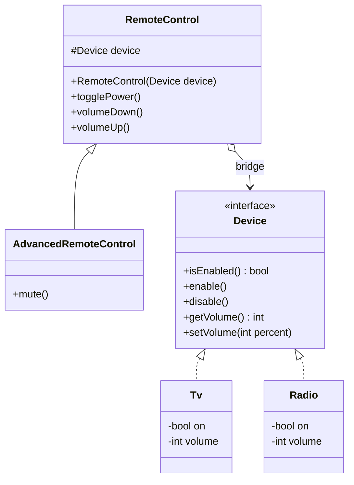

# Bridge Pattern (Mẫu Cầu Nối)

## 1. Mục tiêu (Intent)

**Bridge** là một mẫu thiết kế structural (cấu trúc) cho phép bạn chia một lớp lớn hoặc một tập hợp các lớp liên quan chặt chẽ thành hai phân cấp độc lập: **Trừu tượng (Abstraction)** và **Triển khai (Implementation)**, giúp chúng có thể phát triển độc lập với nhau.

Mục tiêu chính:

- Thay thế mối quan hệ kế thừa (inheritance) đa chiều bằng mối quan hệ chứa đựng/kết hợp (composition) một chiều.
- Tránh sự bùng nổ số lượng lớp (class explosion) khi một lớp có nhiều chiều phát triển độc lập.
- Che giấu chi tiết triển khai cụ thể khỏi Client, cho phép thay thế triển khai tại runtime mà không ảnh hưởng tới Client.

---

## 2. Bối cảnh đặt ra (Problem Scenario)

Giả sử bạn đang xây dựng một ứng dụng quản lý thiết bị điện tử. Bạn có các lớp thiết bị như `TV` và `Radio`. Bạn cần tạo ra các loại điều khiển từ xa để điều khiển chúng: `BasicRemote` (điều khiển cơ bản) và `AdvancedRemote` (điều khiển nâng cao có nút Mute).

Nếu sử dụng kế thừa truyền thống:

- Bạn tạo lớp cha `Remote`.
- Để hỗ trợ TV, bạn tạo `TVBasicRemote` và `TVAdvancedRemote`.
- Để hỗ trợ Radio, bạn tạo `RadioBasicRemote` và `RadioAdvancedRemote`.

```
                    [Remote]
                   /        \
         [BasicRemote]    [AdvancedRemote]
          /        \        /          \
  [TVBasic] [RadioBasic] [TVAdv]    [RadioAdv]
```

Vấn đề nảy sinh:

1. **Bùng nổ số lượng lớp**: Nếu bạn thêm một thiết bị mới (như `Projector`), bạn phải tạo thêm 2 lớp điều khiển mới. Nếu thêm một loại điều khiển mới (như `SmartRemote`), bạn phải tạo thêm 3 lớp điều khiển cho từng thiết bị. Số lượng lớp tăng theo cấp số nhân ($M \times N$).
2. **Khó bảo trì**: Các thay đổi về giao thức điều khiển thiết bị bị trộn lẫn với các tính năng giao diện điều khiển.

---

## 3. Giải pháp (Solution)

Mẫu thiết kế **Bridge** giải quyết vấn đề này bằng cách tách biệt hai chiều phát triển này thành hai phân cấp lớp riêng biệt thông qua một "cây cầu" liên kết (Composition):

1. **Abstraction (Trừu tượng)**: Giao diện điều khiển (Client tương tác trực tiếp với phần này). Ví dụ: `RemoteControl`. Nó giữ một tham chiếu đến một đối tượng thuộc phân cấp Implementation.
2. **Implementation (Triển khai)**: Giao diện thiết bị (nơi chứa các thao tác vật lý cụ thể). Ví dụ: `Device`.

Bằng cách này, `RemoteControl` sẽ ủy quyền các thao tác cho `Device`. Khi thêm thiết bị mới, bạn chỉ cần tạo lớp con của `Device`. Khi thêm điều khiển mới, bạn chỉ cần tạo lớp con của `RemoteControl`. Số lượng lớp chỉ tăng tuyến tính ($M + N$).

---

## 4. Cấu trúc thành phần (Structure)

Cấu trúc chuẩn của Bridge bao gồm:



1. **Abstraction (RemoteControl)**: Lớp trừu tượng định nghĩa các chức năng điều khiển cấp cao và giữ tham chiếu tới `Device`.
2. **Refined Abstraction (AdvancedRemoteControl)**: Mở rộng các tính năng của Abstraction gốc.
3. **Implementation (Device)**: Interface chung định nghĩa các phương thức cơ bản cho tất cả các thiết bị.
4. **Concrete Implementations (Tv, Radio)**: Triển khai chi tiết cách vận hành cụ thể cho từng thiết bị.

---

## 5. Ví dụ mã nguồn Java hoàn chỉnh (Java Code Example)

Dưới đây là mã nguồn Java mô phỏng hệ thống điều khiển từ xa và các thiết bị:

```java
// 1. Interface Implementation định nghĩa hoạt động của Thiết bị
interface Device {
    boolean isEnabled();
    void enable();
    void disable();
    int getVolume();
    void setVolume(int percent);
    String getName();
}

// 2. Concrete Implementation: Tivi (Tv)
class Tv implements Device {
    private boolean on = false;
    private int volume = 30;

    @Override
    public boolean isEnabled() { return on; }

    @Override
    public void enable() { on = true; }

    @Override
    public void disable() { on = false; }

    @Override
    public int getVolume() { return volume; }

    @Override
    public void setVolume(int percent) {
        this.volume = Math.max(0, Math.min(100, percent));
    }

    @Override
    public String getName() { return "Tivi Sony"; }
}

// 3. Concrete Implementation: Radio
class Radio implements Device {
    private boolean on = false;
    private int volume = 10;

    @Override
    public boolean isEnabled() { return on; }

    @Override
    public void enable() { on = true; }

    @Override
    public void disable() { on = false; }

    @Override
    public int getVolume() { return volume; }

    @Override
    public void setVolume(int percent) {
        this.volume = Math.max(0, Math.min(100, percent));
    }

    @Override
    public String getName() { return "Đài Radio Panasonic"; }
}

// 4. Abstraction: Điều khiển cơ bản (RemoteControl)
class RemoteControl {
    // Cầu nối trỏ sang đối tượng thực thi
    protected Device device;

    public RemoteControl(Device device) {
        this.device = device;
    }

    public void togglePower() {
        System.out.println("[REMOTE] Nhấn nút nguồn trên " + device.getName());
        if (device.isEnabled()) {
            device.disable();
            System.out.println("-> Thiết bị đã TẮT.");
        } else {
            device.enable();
            System.out.println("-> Thiết bị đã BẬT.");
        }
    }

    public void volumeDown() {
        System.out.println("[REMOTE] Nhấn Giảm âm lượng");
        device.setVolume(device.getVolume() - 10);
        System.out.println("-> Âm lượng hiện tại: " + device.getVolume() + "%");
    }

    public void volumeUp() {
        System.out.println("[REMOTE] Nhấn Tăng âm lượng");
        device.setVolume(device.getVolume() + 10);
        System.out.println("-> Âm lượng hiện tại: " + device.getVolume() + "%");
    }
}

// 5. Refined Abstraction: Điều khiển nâng cao (AdvancedRemoteControl)
class AdvancedRemoteControl extends RemoteControl {
    private int preMuteVolume = 0;
    private boolean isMuted = false;

    public AdvancedRemoteControl(Device device) {
        super(device);
    }

    public void mute() {
        System.out.println("[ADVANCED REMOTE] Nhấn nút MUTE (Tắt tiếng)");
        if (!isMuted) {
            preMuteVolume = device.getVolume();
            device.setVolume(0);
            isMuted = true;
            System.out.println("-> Đã tắt tiếng thiết bị.");
        } else {
            device.setVolume(preMuteVolume);
            isMuted = false;
            System.out.println("-> Đã khôi phục âm lượng về: " + device.getVolume() + "%");
        }
    }
}

// Lớp Client chạy ứng dụng
class Main {
    public static void main(String[] args) {
        System.out.println("--- Thử nghiệm Bridge Pattern ---");

        // Điều khiển TV bằng Remote cơ bản
        Device tv = new Tv();
        RemoteControl basicRemote = new RemoteControl(tv);
        basicRemote.togglePower();
        basicRemote.volumeUp();

        System.out.println("\n--- Đổi sang thiết bị khác và nâng cấp remote ---");

        // Điều khiển Radio bằng Remote nâng cao
        Device radio = new Radio();
        AdvancedRemoteControl advancedRemote = new AdvancedRemoteControl(radio);
        advancedRemote.togglePower();
        advancedRemote.volumeUp();
        advancedRemote.mute(); // Tính năng độc quyền của Remote nâng cao
        advancedRemote.mute(); // Khôi phục âm thanh
    }
}
```

---

## 6. Luồng hoạt động (Workflow)

1. Client khởi tạo một đối tượng thực thi cụ thể (`Tv` hoặc `Radio`).
2. Client khởi tạo đối tượng trừu tượng điều khiển (`RemoteControl` hoặc `AdvancedRemoteControl`), đồng thời truyền đối tượng thiết bị vào constructor để thiết lập liên kết (Cầu nối).
3. Khi Client gọi các phương thức cấp cao trên điều khiển (ví dụ: `volumeUp()`), điều khiển sẽ xử lý một số logic nghiệp vụ cơ bản, sau đó gọi phương thức cấp thấp tương ứng trên thiết bị (ví dụ: `device.setVolume()`).
4. Nhờ vậy, nếu thiết bị thay đổi chi tiết cấu trúc phần cứng bên trong, Client và lớp điều khiển hoàn toàn không bị ảnh hưởng.

---

## 7. Đánh giá (Pros & Cons)

### Ưu điểm

- **Giảm liên kết chặt chẽ**: Client không cần làm việc trực tiếp với các lớp thiết bị cụ thể.
- **Tuân thủ Open/Closed Principle**: Bạn có thể thêm các lớp Abstraction mới và Implementation mới mà không cần sửa đổi mã nguồn hiện có.
- **Tuân thủ Single Responsibility Principle**: Abstraction tập trung vào logic tương tác người dùng, Implementation tập trung vào logic xử lý thiết bị.
- **Tránh bùng nổ phân cấp lớp**: Giữ cho số lượng file code trong dự án luôn ở mức tối thiểu và dễ quản lý.

### Nhược điểm

- **Tăng độ phức tạp của mã nguồn**: Việc chia tách thành nhiều interface và class trung gian làm tăng độ trừu tượng, khiến người mới đọc code khó hình dung dòng chảy dữ liệu trực quan.

---

## 8. So sánh với các mẫu khác (Comparison)

- **Bridge vs Adapter**:
    - **Bridge** thường được thiết kế **trước** khi ứng dụng được xây dựng, nhằm mục đích tách biệt hai chiều phát triển độc lập một cách chủ động.
    - **Adapter** thường được áp dụng **sau** khi ứng dụng đã hoàn thiện, đóng vai trò như một bộ chuyển đổi để liên kết các class không tương thích (như thư viện bên thứ ba) với mã nguồn hiện tại.
- **Bridge vs State / Strategy**: Về cấu trúc, chúng khá giống nhau khi đều dựa trên Composition để ủy quyền công việc. Tuy nhiên, Bridge giải quyết bài toán phân cấp lớp song song, trong khi Strategy giải quyết bài toán hoán đổi thuật toán, còn State giải quyết bài toán chuyển đổi trạng thái của đối tượng.

---

## 9. Ứng dụng thực tế (Real-world Use Cases)

- **UI Window Toolkits**: Trong Java AWT hay SWT, các thành phần giao diện (Button, Window) hoạt động như các Abstraction, trong khi việc vẽ chúng lên màn hình tùy thuộc vào hệ điều hành cụ thể (Windows, macOS, Linux) hoạt động như các Implementation.
- **Database Drivers**: Giao diện JDBC trong Java là Abstraction. Các driver cụ thể (MySQL Driver, Oracle Driver, PostgreSQL Driver) do bên thứ ba cung cấp là Implementation. Cầu nối này cho phép ứng dụng đổi DB thoải mái mà không cần sửa code.
