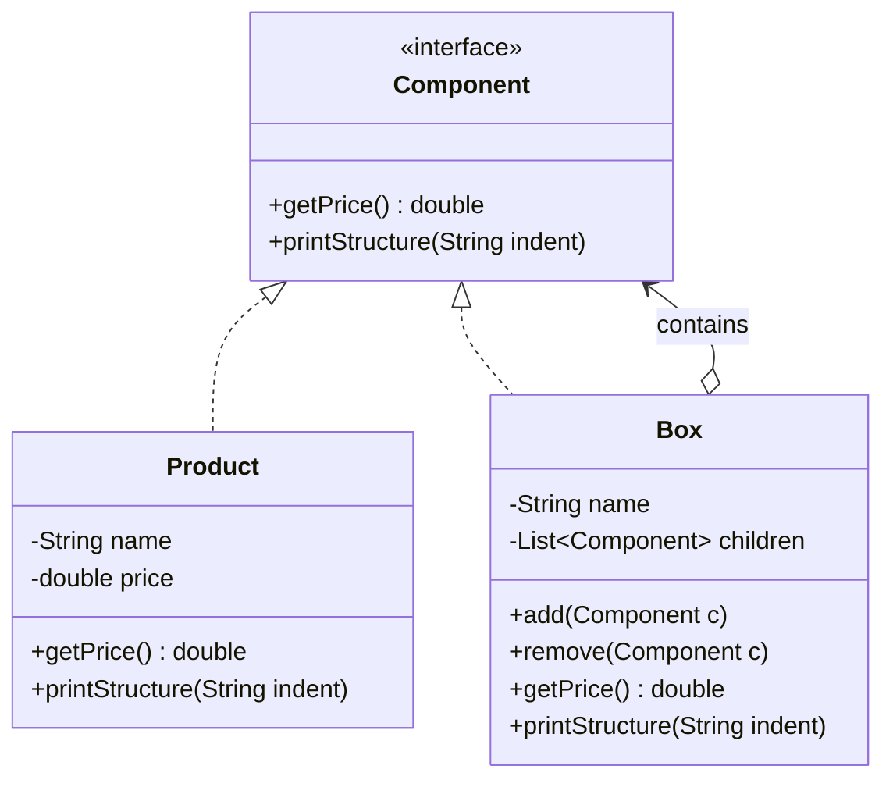

# Composite Pattern (Mẫu Tổ Hợp)

## 1. Mục tiêu (Intent)

**Composite** là một mẫu thiết kế structural (cấu trúc) cho phép bạn nhóm các đối tượng vào một cấu trúc cây để biểu diễn các phân cấp từ bộ phận đến toàn thể (part-whole).

Mục tiêu chính:

- Cho phép Client tương tác đồng nhất (uniformity) với các đối tượng đơn lẻ (Leaf) và các nhóm đối tượng (Composite).
- Đơn giản hóa mã nguồn của Client bằng cách loại bỏ các cấu trúc rẽ nhánh phức tạp (như kiểm tra kiểu dữ liệu `instanceof`) để phân biệt đối tượng đơn lẻ hay tập hợp.
- Dễ dàng thêm các loại thành phần mới vào hệ thống mà không làm thay đổi mã nguồn hiện có của Client.

---

## 2. Bối cảnh đặt ra (Problem Scenario)

Hãy tưởng tượng bạn đang phát triển một hệ thống bán hàng trực tuyến. Hệ thống cần tính tổng giá trị của một đơn hàng đóng gói. Đơn hàng gồm các đối tượng:

- Các sản phẩm đơn lẻ (như `Điện thoại`, `Tai nghe`).
- Các hộp quà (`Box`) đóng gói. Một `Box` có thể chứa một vài sản phẩm đơn lẻ, và cũng có thể chứa các `Box` nhỏ hơn bên trong nó.

Nếu không dùng Composite, để tính tổng tiền của chiếc hộp lớn nhất ngoài cùng, bạn sẽ phải viết logic duyệt qua từng phần tử, kiểm tra xem nó là sản phẩm hay là hộp, nếu là hộp thì lại viết vòng lặp đệ quy để quét các phần tử bên trong:

```java
public double calculateTotalPrice(Object item) {
    if (item instanceof Product) {
        return ((Product) item).getPrice();
    } else if (item instanceof Box) {
        double sum = 0;
        for (Object subItem : ((Box) item).getItems()) {
            sum += calculateTotalPrice(subItem); // Đệ quy phức tạp
        }
        return sum;
    }
    return 0;
}
```

Vấn đề nảy sinh:

1. **Liên kết chặt chẽ và rườm rà**: Mã nguồn Client phải phụ thuộc vào các lớp cụ thể `Product` và `Box`, liên tục kiểm tra kiểu dữ liệu tại runtime.
2. **Khó mở rộng**: Nếu sau này hệ thống thêm một loại đóng gói mới (như túi nylon `Bag` hoặc kệ hàng `Palette`), bạn buộc phải thay đổi toàn bộ logic tính tiền của Client.

---

## 3. Giải pháp (Solution)

Mẫu thiết kế **Composite** giải quyết vấn đề bằng cách định nghĩa một **Interface chung** đại diện cho cả sản phẩm đơn lẻ và hộp chứa (ví dụ: `Component`).

Interface này khai báo phương thức chung là `getPrice()`.

- **Lớp sản phẩm đơn lẻ (Leaf)**: Triển khai `getPrice()` để trả về giá tiền của chính nó.
- **Lớp hộp chứa (Composite)**: Triển khai `getPrice()` bằng cách duyệt qua danh sách các con bên trong nó, gọi `getPrice()` trên từng đứa con (không cần quan tâm con là sản phẩm hay hộp khác) và cộng dồn lại.

Client chỉ cần gọi phương thức `getPrice()` trên đối tượng ngoài cùng là xong.

---

## 4. Cấu trúc thành phần (Structure)

Cấu trúc chuẩn của Composite bao gồm:



1. **Component**: Interface hoặc Abstract Class định nghĩa các hoạt động chung của toàn bộ thành phần (cả lá lẫn cành).
2. **Leaf (Product)**: Thành phần lá đại diện cho các đối tượng cơ bản nhất, không chứa thành phần con nào khác.
3. **Composite (Box)**: Thành phần phức hợp chứa các thành phần con (gồm cả Leaf và Composite khác). Nó thực thi phương thức nghiệp vụ bằng cách ủy quyền cho các con.

---

## 5. Ví dụ mã nguồn Java hoàn chỉnh (Java Code Example)

Dưới đây là mã nguồn Java mô tả hệ thống đóng gói đơn hàng:

```java
import java.util.ArrayList;
import java.util.List;

// 1. Interface chung cho mọi thành phần trong đơn hàng
interface OrderComponent {
    double getPrice();
    void printStructure(String indent);
}

// 2. Lớp Leaf: Sản phẩm đơn lẻ (Product)
class Product implements OrderComponent {
    private final String name;
    private final double price;

    public Product(String name, double price) {
        this.name = name;
        this.price = price;
    }

    @Override
    public double getPrice() {
        return price;
    }

    @Override
    public void printStructure(String indent) {
        System.out.println(indent + "- Sản phẩm: " + name + " (" + price + " USD)");
    }
}

// 3. Lớp Composite: Hộp chứa (Box)
class Box implements OrderComponent {
    private final String name;
    private final List<OrderComponent> children = new ArrayList<>();

    public Box(String name) {
        this.name = name;
    }

    public void add(OrderComponent component) {
        children.add(component);
    }

    public void remove(OrderComponent component) {
        children.remove(component);
    }

    @Override
    public double getPrice() {
        double total = 0;
        for (OrderComponent child : children) {
            total += child.getPrice(); // Đệ quy tự động thông qua tính đa hình
        }
        return total;
    }

    @Override
    public void printStructure(String indent) {
        System.out.println(indent + "[Hộp: " + name + "]");
        for (OrderComponent child : children) {
            child.printStructure(indent + "  "); // In thụt dòng đệ quy
        }
    }
}

// Lớp Client chạy ứng dụng
class Main {
    public static void main(String[] args) {
        System.out.println("--- Tạo các sản phẩm đơn lẻ ---");
        OrderComponent iPhone = new Product("iPhone 15 Pro Max", 1200);
        OrderComponent airPods = new Product("AirPods Pro 2", 250);
        OrderComponent charger = new Product("Sạc Anker 20W", 30);

        System.out.println("\n--- Đóng gói vào hộp phụ ---");
        // Hộp phụ kiện chứa tai nghe và sạc
        Box accessoryBox = new Box("Hộp phụ kiện");
        accessoryBox.add(airPods);
        accessoryBox.add(charger);

        System.out.println("\n--- Đóng gói vào hộp chính ---");
        // Hộp lớn ngoài cùng chứa điện thoại và hộp phụ kiện
        Box masterBox = new Box("Thùng hàng lớn");
        masterBox.add(iPhone);
        masterBox.add(accessoryBox);

        // Client tương tác cực kỳ đơn giản không cần kiểm tra kiểu dữ liệu
        System.out.println("\n--- Cấu trúc chi tiết đơn hàng ---");
        masterBox.printStructure("");

        System.out.println("\n--- Tổng giá trị thanh toán ---");
        double totalPrice = masterBox.getPrice();
        System.out.println("Tổng tiền: " + totalPrice + " USD");
    }
}
```

---

## 6. Luồng hoạt động (Workflow)

1. Client thiết lập cấu trúc cây bằng cách khởi tạo các đối tượng lá và các đối tượng composite, rồi dùng phương thức `add()` để lồng chúng vào nhau tạo thành cấu trúc phân tầng.
2. Khi Client gọi phương thức nghiệp vụ `getPrice()` trên đối tượng composite gốc (`masterBox`).
3. Đối tượng composite gốc sẽ chạy vòng lặp trên các phần tử con của nó:
    - Nếu phần tử con là Leaf (`iPhone`), nó trả về ngay giá tiền `1200`.
    - Nếu phần tử con là một Composite khác (`accessoryBox`), nó tiếp tục gọi `getPrice()` của `accessoryBox` để kích hoạt đệ quy.
4. Tất cả các kết quả được cộng dồn ngược lên trên cây và trả về tổng giá trị cuối cùng cho Client.

---

## 7. Đánh giá (Pros & Cons)

### Ưu điểm

- **Lập trình đa hình mạnh mẽ**: Client tương tác với tất cả đối tượng thông qua interface chung, loại bỏ mã kiểm tra kiểu dữ liệu thủ công.
- **Dễ bảo trì và mở rộng**: Dễ dàng bổ sung các loại Leaf hay Composite mới vào cây mà không cần thay đổi bất cứ dòng code nào của Client.
- **Cấu trúc cây trực quan**: Phù hợp tuyệt đối để mô phỏng các dữ liệu phân cấp ngoài đời thực.

### Nhược điểm

- **Khó giới hạn thành phần của cây**: Do interface chung `Component` ép buộc các phương thức chung, việc ngăn chặn một loại Box không được phép chứa một sản phẩm cụ thể sẽ khó kiểm soát tại thời điểm biên dịch (phải kiểm tra lỗi tại runtime).

---

## 8. So sánh với các mẫu khác (Comparison)

- **Composite vs Decorator**: Cả hai mẫu đều có cấu trúc tương tự nhau khi dựa trên cơ chế đệ quy. Tuy nhiên, Decorator chỉ có duy nhất **một** thành phần con và được sử dụng để bổ sung tính năng mới cho đối tượng. Trong khi đó, Composite có **nhiều** thành phần con và được thiết kế để gom nhóm dữ liệu.
- **Composite vs Visitor**: Bạn có thể sử dụng mẫu **Visitor** để thực thi một hoạt động nghiệp vụ trên toàn bộ cấu trúc cây của Composite thay vì viết logic nghiệp vụ đó trực tiếp bên trong các lớp `Leaf` và `Composite`.

---

## 9. Ứng dụng thực tế (Real-world Use Cases)

- **Giao diện đồ họa (GUI)**: Mọi framework GUI (như Java Swing, React, Flutter) đều hoạt động theo dạng Composite. Ví dụ, một `Container` (Composite) chứa các `Button`, `TextField` (Leaf) hoặc các `Panel` (Composite) con khác. Khi render hoặc thay đổi kích thước, container gọi phương thức vẽ trên toàn bộ cây.
- **Hệ thống tệp tin (File System)**: Hệ điều hành quản lý tập tin bằng cấu trúc thư mục. Trong đó, `File` là Leaf, và `Folder` là Composite chứa các File và Folder con.
- **Trình phân tích cú pháp (XML/JSON/HTML Parser)**: Cấu trúc DOM của trình duyệt web là một Composite Tree khổng lồ, nơi `<html>` là thẻ gốc, chứa các thẻ cành (`<div>`, `<body>`) và thẻ lá (`<p>`, ``, `text`).
