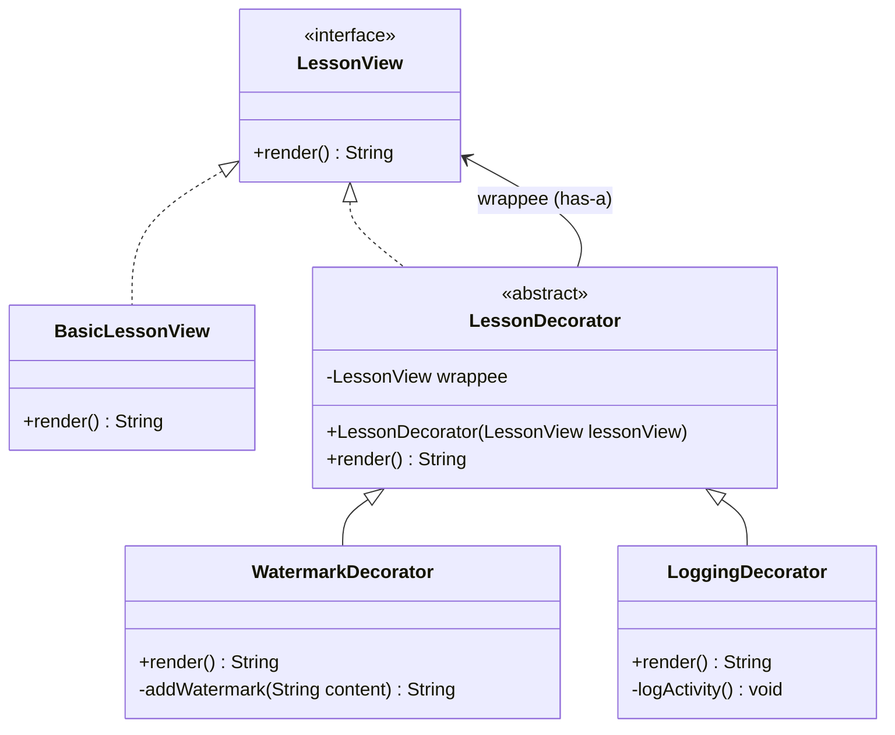

# Decorator Pattern (Mẫu Thiết Kế Trang Trí)

## 1. Mục tiêu (Intent)

**Decorator** là một mẫu thiết kế structural (cấu trúc) cho phép bạn đính kèm thêm các hành vi và trách nhiệm mới vào đối tượng một cách động (ở runtime) bằng cách đặt các đối tượng này bên trong các đối tượng bao bọc (wrapper) đặc biệt.

Mục tiêu chính:

- Mở rộng chức năng của một đối tượng mà không cần thay đổi cấu trúc lớp hay sử dụng kế thừa (subclassing).
- Cung cấp một giải pháp thay thế linh hoạt cho việc kế thừa để mở rộng tính năng.
- Cho phép kết hợp nhiều tính năng trang trí khác nhau cùng lúc trên một đối tượng gốc.

---

## 2. Bối cảnh đặt ra (Problem Scenario)

Hãy tưởng tượng bạn đang xây dựng một nền tảng học trực tuyến (E-learning). Bạn có một lớp hiển thị nội dung bài học là `LessonView` với chức năng cơ bản là hiển thị nội dung bài viết:

```java
interface LessonView {
    String render();
}

class BasicLessonView implements LessonView {
    @Override
    public String render() {
        return "Nội dung bài viết về Java Design Patterns...";
    }
}
```

Bây giờ, yêu cầu nghiệp vụ phát sinh thêm các tính năng:

1. **Chống sao chép bản quyền**: Cần chèn thêm dấu bản quyền (`Watermark`) vào bài viết để ngăn chặn việc copy nội dung trái phép.
2. **Ghi nhận lịch sử (Logging)**: Cần ghi lại nhật ký xem bài học để làm báo cáo thống kê chuyên cần.
3. **Mã hóa nội dung**: Cần mã hóa chuỗi bài học trước khi gửi xuống client để bảo mật đường truyền.

Nếu bạn giải quyết bằng cách **Kế thừa (Inheritance)**, bạn sẽ phải tạo ra các lớp con:

- `WatermarkLessonView`
- `LoggingLessonView`
- `EncryptedLessonView`

Điều gì xảy ra khi bạn cần một bài viết vừa có đóng dấu bản quyền, vừa có ghi nhận lịch sử, vừa được mã hóa? Bạn sẽ phải tạo thêm lớp:

- `WatermarkAndLoggingLessonView`
- `WatermarkAndLoggingAndEncryptedLessonView`

Hiện tượng này gọi là **Class Explosion (Bùng nổ số lượng lớp con)**. Việc kế thừa tĩnh ở thời điểm compile khiến bạn không thể kết hợp linh hoạt các thuộc tính ở runtime, đồng thời dẫn đến trùng lặp mã nguồn nghiêm trọng.

---

## 3. Giải pháp (Solution)

Mẫu thiết kế **Decorator** đề xuất sử dụng cơ chế **Composition (Liên kết thành phần)** thay thế cho **Inheritance (Kế thừa)**.

Bạn tạo ra một lớp trang trí trừu tượng (`LessonDecorator`) cũng triển khai giao diện `LessonView`, và giữ một thuộc tính tham chiếu đến đối tượng `LessonView` gốc. Sau đó, bạn tạo các lớp trang trí cụ thể kế thừa từ `LessonDecorator`. Mỗi lớp trang trí này sẽ bọc đối tượng gốc, thực hiện hành vi riêng trước hoặc sau khi gọi phương thức của đối tượng được bọc.

---

## 4. Cấu trúc thành phần (Structure)

Cấu trúc của Decorator Pattern bao gồm các thành phần sau:



1. **Component (Thành phần giao diện)**: Interface hoặc abstract class định nghĩa các hành vi chung cho cả đối tượng gốc lẫn các bộ trang trí (`LessonView`).
2. **Concrete Component (Thành phần cụ thể)**: Đối tượng gốc chứa logic hành vi cơ bản (`BasicLessonView`).
3. **Base Decorator (Bộ trang trí cơ sở)**: Lớp trừu tượng triển khai giao diện Component và giữ một tham chiếu đến đối tượng Component gốc (`LessonDecorator`).
4. **Concrete Decorators (Bộ trang trí cụ thể)**: Các lớp triển khai thực tế của bộ trang trí, ghi đè các phương thức để bổ sung thêm tính năng trước hoặc sau khi ủy quyền cho đối tượng gốc (`WatermarkDecorator`, `LoggingDecorator`).

---

## 5. Ví dụ mã nguồn Java hoàn chỉnh (Java Code Example)

Dưới đây là cách triển khai Decorator Pattern bằng Java để cấu hình động nội dung bài học:

```java
// 1. Component Interface
interface LessonView {
    String render();
}

// 2. Concrete Component (Đối tượng gốc cơ bản)
class BasicLessonView implements LessonView {
    @Override
    public String render() {
        return "Nội dung bài viết về Java Design Patterns";
    }
}

// 3. Base Decorator
abstract class LessonDecorator implements LessonView {
    protected final LessonView wrappee; // Đối tượng được trang trí

    public LessonDecorator(LessonView wrappee) {
        this.wrappee = wrappee;
    }

    @Override
    public String render() {
        return wrappee.render(); // Mặc định ủy quyền cho đối tượng gốc
    }
}

// 4. Concrete Decorator A: Thêm Watermark đóng dấu bản quyền
class WatermarkDecorator extends LessonDecorator {
    public WatermarkDecorator(LessonView wrappee) {
        super(wrappee);
    }

    @Override
    public String render() {
        // Thực hiện hành vi của đối tượng gốc trước, sau đó bổ sung trang trí bản quyền
        String originalContent = super.render();
        return originalContent + "\n[BẢN QUYỀN THUỘC VỀ KNGUYEN1411B - CẤM SAO CHÉP]";
    }
}

// 5. Concrete Decorator B: Ghi log lịch sử truy cập
class LoggingDecorator extends LessonDecorator {
    public LoggingDecorator(LessonView wrappee) {
        super(wrappee);
    }

    @Override
    public String render() {
        // Ghi log hoạt động trước
        logViewingActivity();
        // Sau đó mới trả về nội dung của đối tượng gốc
        return super.render();
    }

    private void logViewingActivity() {
        System.out.println("[LOG] Nhật ký hệ thống: Học viên vừa truy cập bài học lúc " + new java.util.Date());
    }
}

// Lớp Client chạy ứng dụng
class Main {
    public static void main(String[] args) {
        System.out.println("--- 1. BÀI HỌC CƠ BẢN ---");
        LessonView basicLesson = new BasicLessonView();
        System.out.println(basicLesson.render());

        System.out.println("\n--- 2. BÀI HỌC CÓ ĐÓNG DẤU BẢN QUYỀN ---");
        // Bọc basicLesson bằng WatermarkDecorator
        LessonView watermarkedLesson = new WatermarkDecorator(basicLesson);
        System.out.println(watermarkedLesson.render());

        System.out.println("\n--- 3. BÀI HỌC VỪA GHI LOG VỪA CÓ BẢN QUYỀN ---");
        // Bọc lồng nhau: Logging bọc bên ngoài Watermark bọc bên ngoài Basic
        LessonView premiumLesson = new LoggingDecorator(new WatermarkDecorator(new BasicLessonView()));
        System.out.println(premiumLesson.render());
    }
}
```

---

## 6. Luồng hoạt động (Workflow)

1. Khi Client gọi hàm `premiumLesson.render()`, JVM sẽ gọi hàm render của đối tượng bọc ngoài cùng là `LoggingDecorator`.
2. `LoggingDecorator` thực hiện ghi log hoạt động thông qua hàm `logViewingActivity()`.
3. Sau đó, `LoggingDecorator` gọi `super.render()`, ủy quyền cho đối tượng bên trong nó là `WatermarkDecorator`.
4. `WatermarkDecorator` tiếp tục gọi render của đối tượng bên trong nó là `BasicLessonView` để lấy nội dung bài viết gốc `"Nội dung bài viết về Java Design Patterns"`.
5. `WatermarkDecorator` nhận kết quả gốc, sau đó cộng thêm chuỗi đóng dấu bản quyền rồi trả về cho `LoggingDecorator`.
6. `LoggingDecorator` trả kết quả cuối cùng cho Client để in ra màn hình.

---

## 7. Đánh giá (Pros & Cons)

### Ưu điểm

- **Linh hoạt cao hơn kế thừa**: Bạn có thể thêm hoặc bớt các trách nhiệm của một đối tượng tại runtime thay vì fix cứng lúc biên dịch.
- **Kết hợp đa dạng tính năng**: Có thể lồng nhiều bộ trang trí khác nhau để tạo ra các tổ hợp chức năng mong muốn.
- **Nguyên tắc đơn nhiệm (Single Responsibility)**: Thay vì một lớp lớn chứa tất cả các chức năng phụ trợ, bạn tách chúng ra thành các lớp trang trí nhỏ gọn riêng biệt.

### Nhược điểm

- **Khó debug**: Khi bọc lồng nhau quá nhiều lớp, luồng chạy sẽ đi qua rất nhiều lớp trung gian, khiến việc trace code hoặc debug gặp nhiều khó khăn.
- **Khó khăn khi khởi tạo**: Việc viết code khởi tạo lồng nhau dạng `new A(new B(new C()))` có thể hơi dài dòng (được giải quyết nếu kết hợp với Builder hoặc Factory).

---

## 8. So sánh với các mẫu khác (Comparison)

- **Decorator vs Proxy**: Decorator bọc đối tượng nhằm **mở rộng tính năng** của nó mà không làm thay đổi giao diện. Proxy bọc đối tượng nhằm **kiểm soát quyền truy cập** (access control, lazy loading, caching) đối với đối tượng đó và thường tự quản lý vòng đời của đối tượng gốc thay vì nhận nó từ Client.
- **Decorator vs Strategy**: Decorator thay đổi bề ngoài của đối tượng bằng cách bọc nó từ bên ngoài. Strategy thay đổi "ruột" của đối tượng bằng cách cung cấp các thuật toán/hành vi khác nhau từ bên trong.

---

## 9. Ứng dụng thực tế (Real-world Use Cases)

- **Java I/O System**: Đây là ví dụ kinh điển nhất về Decorator Pattern trong Java JDK.
    ```java
    // FileInputStream đọc file (Basic Component)
    // BufferedInputStream bọc ngoài để thêm bộ đệm tối ưu hiệu năng (Decorator)
    // DataInputStream bọc ngoài cùng để đọc các kiểu dữ liệu nguyên thủy (Decorator)
    DataInputStream dis = new DataInputStream(new BufferedInputStream(new FileInputStream("data.txt")));
    ```
- **Spring Security**: Bọc `HttpServletRequest` bằng các lớp decorator như `HttpServletRequestWrapper` để lọc và bảo mật các dữ liệu trong request đầu vào.
