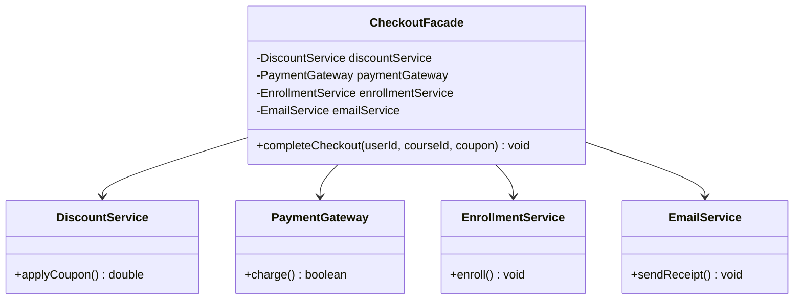

# Facade Pattern (Mẫu Thiết Kế Mặt Tiền)

## 1. Mục tiêu (Intent)

**Facade** là một mẫu thiết kế structural (cấu trúc) cung cấp một giao diện (interface) đơn giản hóa cho một hệ thống con (subsystem) phức tạp bao gồm nhiều lớp, thư viện, hoặc framework.

Mục tiêu chính:

- Giúp hệ thống con phức tạp trở nên dễ sử dụng hơn đối với Client.
- Giảm sự phụ thuộc chéo giữa Client và các module bên trong của hệ thống con (giảm coupling).
- Tổ chức mã nguồn thành các lớp rõ rệt, cung cấp một "cửa ngõ" duy nhất để tương tác với hệ thống phức tạp.

---

## 2. Bối cảnh đặt ra (Problem Scenario)

Hãy tưởng tượng bạn đang xây dựng tính năng mua khóa học trực tuyến. Khi học viên nhấn nút "Mua ngay", hệ thống cần thực hiện một chuỗi các thao tác phức tạp liên quan đến nhiều module/hệ thống con khác nhau:

1. **Kiểm tra & áp dụng giảm giá**: Tính toán lại giá thông qua `DiscountService`.
2. **Xử lý giao dịch**: Kết nối tới cổng thanh toán ngân hàng thông qua `PaymentGateway`.
3. **Mở khóa tài liệu**: Cập nhật quyền truy cập khóa học cho học viên trong `EnrollmentService`.
4. **Gửi hóa đơn**: Gửi email xác nhận kèm hóa đơn thông qua `EmailService`.

Nếu Client (chẳng hạn như Controller xử lý request từ giao diện Web) phải trực tiếp điều phối tất cả các dịch vụ này:

```java
public class CheckoutController {
    public void handleCheckout(String userId, String courseId, String coupon) {
        // Tự gọi DiscountService...
        // Tự gọi PaymentGateway...
        // Tự gọi EnrollmentService...
        // Tự gọi EmailService...
    }
}
```

Vấn đề nảy sinh:

1. **Trùng lặp code**: Nếu ứng dụng có thêm giao diện App Mobile hay ứng dụng Desktop, bạn lại phải viết lại toàn bộ chuỗi logic phức tạp này trong các controller tương ứng.
2. **Khó bảo trì**: Mỗi khi một trong các dịch vụ con thay đổi cách thức hoạt động (ví dụ: cổng thanh toán yêu cầu thêm tham số token bảo mật), bạn phải đi tìm và sửa đổi ở tất cả những nơi gọi trực tiếp nó.
3. **Quá nhiều sự phụ thuộc**: Lớp Client phải import và biết quá nhiều lớp con bên trong hệ thống.

---

## 3. Giải pháp (Solution)

Mẫu thiết kế **Facade** đề xuất tạo ra một lớp duy nhất đóng vai trò là "mặt tiền" (`CheckoutFacade`).

Lớp này sẽ bọc và phối hợp hoạt động của tất cả các hệ thống con phức tạp nói trên. Nó cung cấp một phương thức đơn giản, rõ nghĩa (như `completeCheckout(...)`) cho Client gọi. Client giờ đây chỉ cần giao tiếp với một lớp Facade duy nhất.

---

## 4. Cấu trúc thành phần (Structure)

Cấu trúc của Facade Pattern:



1. **Facade**: Lớp cung cấp giao diện đơn giản, phối hợp hành động của các lớp con (`CheckoutFacade`).
2. **Subsystems (Hệ thống con)**: Các module, thư viện chịu trách nhiệm xử lý các tác vụ chuyên biệt. Chúng hoạt động độc lập và không cần biết đến sự tồn tại của Facade.
3. **Client**: Sử dụng Facade thay vì gọi trực tiếp các lớp trong hệ thống con.

---

## 5. Ví dụ mã nguồn Java hoàn chỉnh (Java Code Example)

Dưới đây là cách triển khai Facade Pattern trong Java:

```java
// === 1. CÁC LỚP HỆ THỐNG CON PHỨC TẠP (Subsystems) ===
class DiscountService {
    public double calculatePrice(double originalPrice, String coupon) {
        if ("XINCHAO".equalsIgnoreCase(coupon)) {
            System.out.println("[DISCOUNT] Áp dụng mã giảm giá XINCHAO: Giảm 10%.");
            return originalPrice * 0.9;
        }
        return originalPrice;
    }
}

class PaymentGateway {
    public boolean processPayment(String userId, double amount) {
        System.out.println("[PAYMENT] Đang trừ số tiền " + amount + "$ từ tài khoản của User: " + userId);
        return true; // Giả lập thanh toán thành công
    }
}

class EnrollmentService {
    public void enrollUserInCourse(String userId, String courseId) {
        System.out.println("[ENROLL] Đã cấp quyền truy cập khóa học " + courseId + " cho User " + userId);
    }
}

class EmailService {
    public void sendConfirmationEmail(String userId, String courseId, double amount) {
        System.out.println("[EMAIL] Gửi hóa đơn thành công khóa học " + courseId + " trị giá " + amount + "$ tới User " + userId);
    }
}

// === 2. LỚP FACADE (Mặt tiền đơn giản hóa) ===
class CheckoutFacade {
    private final DiscountService discountService;
    private final PaymentGateway paymentGateway;
    private final EnrollmentService enrollmentService;
    private final EmailService emailService;

    // Khởi tạo các hệ thống con bên trong Facade
    public CheckoutFacade() {
        this.discountService = new DiscountService();
        this.paymentGateway = new PaymentGateway();
        this.enrollmentService = new EnrollmentService();
        this.emailService = new EmailService();
    }

    // Giao diện đơn giản hóa cho Client sử dụng
    public void completeCheckout(String userId, String courseId, double originalPrice, String coupon) {
        System.out.println("--- BẮT ĐẦU XỬ LÝ THANH TOÁN (FACADE) ---");

        // 1. Tính giá
        double finalPrice = discountService.calculatePrice(originalPrice, coupon);

        // 2. Trừ tiền
        boolean paymentSuccess = paymentGateway.processPayment(userId, finalPrice);

        if (paymentSuccess) {
            // 3. Mở khóa khóa học
            enrollmentService.enrollUserInCourse(userId, courseId);

            // 4. Gửi email xác nhận
            emailService.sendConfirmationEmail(userId, courseId, finalPrice);
            System.out.println("--- GIAO DỊCH HOÀN TẤT THÀNH CÔNG ---");
        } else {
            System.out.println("--- GIAO DỊCH THẤT BẠI ---");
        }
    }
}

// Lớp Client chạy ứng dụng
class Main {
    public static void main(String[] args) {
        // Client chỉ cần biết đến Facade
        CheckoutFacade checkoutFacade = new CheckoutFacade();

        // Thực hiện mua khóa học thông qua giao diện Facade đơn giản
        checkoutFacade.completeCheckout("user_102", "course_java_gof", 150.0, "XINCHAO");
    }
}
```

---

## 6. Luồng hoạt động (Workflow)

1. Client (`Main`) khởi tạo đối tượng `CheckoutFacade`.
2. Client gọi phương thức đơn giản `completeCheckout(...)` của Facade, truyền các tham số cơ bản như mã học viên, mã khóa học, giá gốc và mã giảm giá.
3. Bên trong Facade, luồng công việc được điều phối: tính giá thông qua `DiscountService` -> thanh toán qua `PaymentGateway` -> cấp quyền qua `EnrollmentService` -> gửi email qua `EmailService`.
4. Client chỉ cần ngồi đợi nhận kết quả hoàn tất mà không cần biết các bước phức tạp diễn ra bên trong.

---

## 7. Đánh giá (Pros & Cons)

### Ưu điểm

- **Dễ sử dụng**: Client bớt mệt mỏi khi không cần quản lý vòng đời và phương thức của hàng tá class con.
- **Loose Coupling**: Cô lập mã nguồn Client khỏi các chi tiết cấu tạo phức tạp của các thành phần con.
- **Dễ bảo trì**: Nếu hệ thống con thay đổi cách thức hoạt động, bạn chỉ cần cập nhật tại lớp Facade, các Client gọi Facade hoàn toàn không bị ảnh hưởng.

### Nhược điểm

- **Nguy cơ trở thành God Object**: Lớp Facade có thể phình to và chứa quá nhiều trách nhiệm nếu bạn nhồi nhét tất cả logic nghiệp vụ hệ thống vào nó.

---

## 8. So sánh với các mẫu khác (Comparison)

- **Facade vs Adapter**: Facade định nghĩa một giao diện **mới** đơn giản hơn để làm việc với các lớp con hiện có. Adapter cố gắng thay đổi giao diện **hiện tại** để phù hợp với định dạng mà Client đang kỳ vọng.
- **Facade vs Abstract Factory**: Facade cung cấp một mặt tiền nghiệp vụ chung, còn Abstract Factory chỉ tập trung vào việc tạo ra các họ đối tượng đồng bộ. Facade có thể sử dụng Abstract Factory bên trong để tạo lập các đối tượng con.

---

## 9. Ứng dụng thực tế (Real-world Use Cases)

- **Java Core**: Lớp `java.net.URL` cung cấp giao diện Facade đơn giản (như `openStream()`) che giấu các kết nối TCP/IP phức tạp bên dưới.
- **Spring Framework**: Lớp `JdbcTemplate` trong Spring JDBC hoạt động như một Facade che giấu các tác vụ lặp đi lặp lại như: mở connection, tạo statement, quản lý transaction, xử lý SQLException và đóng connection.
- **SLF4J**: Thư viện ghi log hoạt động như một Facade chung cho các hệ thống ghi log cụ thể bên dưới (Logback, Log4j2, java.util.logging).
