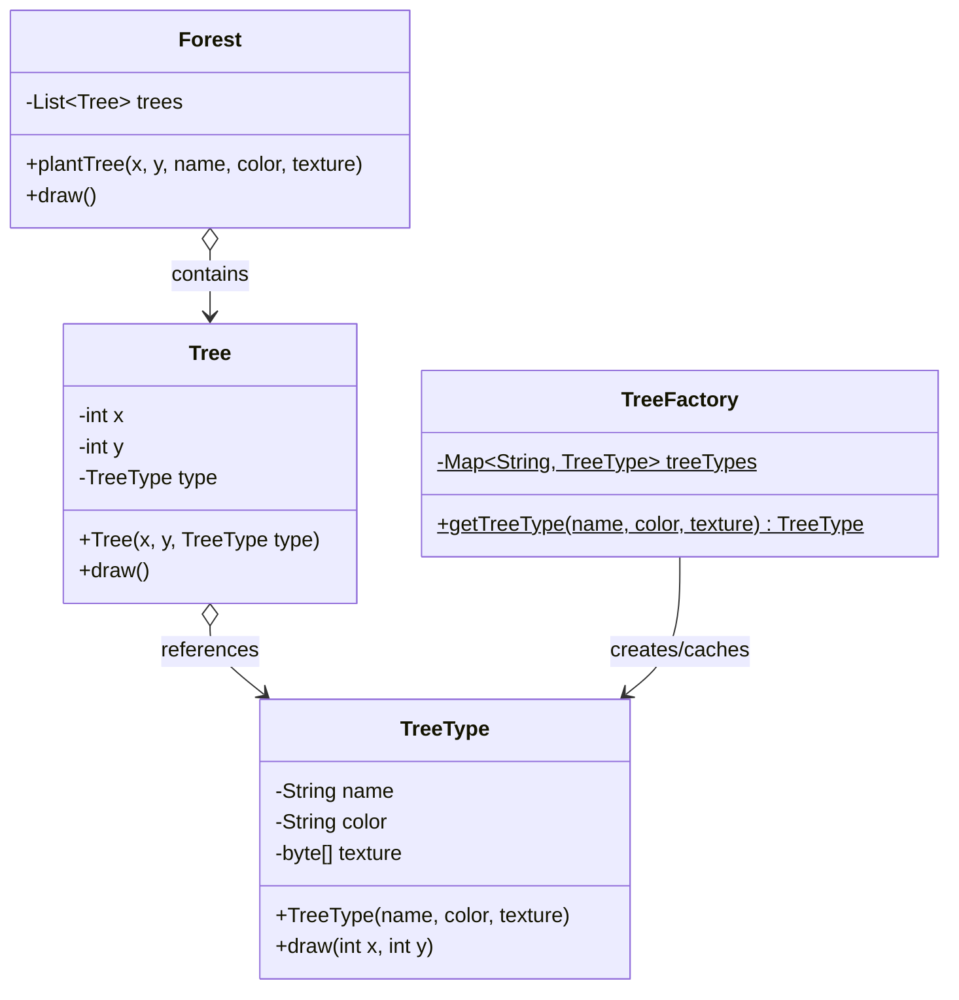

# Flyweight Pattern (Mẫu Chia Sẻ Thực Thể)

## 1. Mục tiêu (Intent)

**Flyweight** là một mẫu thiết kế structural (cấu trúc) giúp tối ưu hóa bộ nhớ bằng cách chia sẻ các phần trạng thái chung giữa nhiều đối tượng thay vì lưu trữ toàn bộ dữ liệu trong mỗi đối tượng riêng lẻ.

Mục tiêu chính:

- Hỗ trợ số lượng cực lớn đối tượng (hàng vạn, hàng triệu) chạy mượt mà trong giới hạn bộ nhớ RAM vật lý.
- Tách biệt trạng thái đối tượng thành hai phần: **Trạng thái nội tại (Intrinsic State)** - có thể chia sẻ được, và **Trạng thái ngoại tại (Extrinsic State)** - phụ thuộc vào ngữ cảnh và không thể chia sẻ.

---

## 2. Bối cảnh đặt ra (Problem Scenario)

Hãy tưởng tượng bạn đang viết một trò chơi điện tử mô phỏng rừng cây ("Rừng Taiga hoang dã"). Trên bản đồ game cần vẽ ra **1.000.000 cây xanh** để tạo cảnh quan chân thực.

Mỗi đối tượng cây (`Tree`) có các thuộc tính:

- Vị trí: `x`, `y` (tọa độ khác nhau cho từng cây).
- Thông tin chung về loài cây: `name` (Cây Thông), `color` (Xanh lá đậm), và dữ liệu hình ảnh 3D/Texture `sprite` (tệp dung lượng lớn tầm 10MB).

Nếu khởi tạo 1.000.000 đối tượng `Tree` theo cách thông thường:

```java
public class Tree {
    private int x;
    private int y;
    private String name;
    private String color;
    private byte[] sprite; // 10MB dữ liệu hình ảnh cho mỗi đối tượng!
}
```

Vấn đề nảy sinh:

1. **Tràn bộ nhớ (OutOfMemoryError)**: 1.000.000 cây nhân với 10MB sprite sẽ tiêu tốn khoảng **10 Terabytes** RAM. Ứng dụng chắc chắn sẽ bị sập ngay lập tức khi vừa tải bản đồ.
2. **Lãng phí dữ liệu**: Mặc dù vị trí $x, y$ của mỗi cây là duy nhất, nhưng dữ liệu loài cây, màu sắc, và hình ảnh hiển thị của loài thông là hoàn toàn giống nhau giữa các cây.

---

## 3. Giải pháp (Solution)

Mẫu thiết kế **Flyweight** giải quyết vấn đề này bằng cách chia thuộc tính của đối tượng thành hai loại:

1. **Trạng thái nội tại (Intrinsic State)**: Dữ liệu bất biến, giống hệt nhau ở mọi đối tượng và không phụ thuộc vị trí địa lý. Ví dụ: Tên loài cây, màu sắc, hình ảnh sprite. Phần này được tách ra thành một lớp riêng gọi là **Flyweight** (ví dụ: `TreeType`).
2. **Trạng thái ngoại tại (Extrinsic State)**: Dữ liệu thay đổi liên tục theo ngữ cảnh và duy nhất cho từng đối tượng. Ví dụ: Tọa độ $x, y$. Phần này được giữ lại ở lớp ngữ cảnh (`Tree`).

Chúng ta sử dụng một Factory (`TreeFactory`) để quản lý và cache các đối tượng Flyweight (`TreeType`). Nếu loại cây đó đã tồn tại, Factory sẽ trả về thực thể có sẵn trong cache thay vì khởi tạo lại. Khi vẽ cây, đối tượng `Tree` sẽ truyền trạng thái ngoại tại ($x, y$) vào phương thức vẽ của `TreeType`.

---

## 4. Cấu trúc thành phần (Structure)

Cấu trúc chuẩn của Flyweight bao gồm:



1. **Flyweight (TreeType)**: Chứa trạng thái nội tại có thể chia sẻ (bất biến).
2. **Flyweight Factory (TreeFactory)**: Quản lý việc tạo và tái sử dụng các đối tượng Flyweight.
3. **Context (Tree)**: Chứa các trạng thái ngoại tại độc lập và một tham chiếu đến Flyweight tương ứng.
4. **Client (Forest)**: Tạo lập và cấu hình các trạng thái ngoại tại cho các Context.

---

## 5. Ví dụ mã nguồn Java hoàn chỉnh (Java Code Example)

Dưới đây là mã nguồn Java hoàn chỉnh minh họa việc tối ưu hóa bộ nhớ khi vẽ rừng cây:

```java
import java.util.ArrayList;
import java.util.HashMap;
import java.util.List;
import java.util.Map;

// 1. Lớp Flyweight: Lưu trạng thái nội tại (bất biến và nặng ký)
class TreeType {
    private final String name;
    private final String color;
    private final byte[] texture; // Giả lập dữ liệu hình ảnh nặng ký

    public TreeType(String name, String color, byte[] texture) {
        this.name = name;
        this.color = color;
        this.texture = texture;
    }

    // Nhận trạng thái ngoại tại (x, y) từ bên ngoài truyền vào để xử lý
    public void draw(int x, int y) {
        System.out.println("Vẽ cây " + name + " [" + color + "] tại tọa độ (" + x + ", " + y + ")");
    }
}

// 2. Flyweight Factory: Đảm bảo tái sử dụng đối tượng TreeType
class TreeFactory {
    private static final Map<String, TreeType> treeTypes = new HashMap<>();

    public static TreeType getTreeType(String name, String color) {
        String key = name + "_" + color;
        TreeType result = treeTypes.get(key);

        if (result == null) {
            // Giả lập việc nạp hình ảnh nặng từ ổ đĩa
            System.out.println("[NẠP HÌNH] Đang tải ảnh texture cho loại cây: " + name);
            byte[] heavyTexture = new byte[1000]; // 1000 bytes giả lập
            result = new TreeType(name, color, heavyTexture);
            treeTypes.put(key, result);
        }
        return result;
    }

    public static int getCacheSize() {
        return treeTypes.size();
    }
}

// 3. Lớp Context: Chỉ lưu trạng thái ngoại tại (độc lập) và tham chiếu Flyweight
class Tree {
    private final int x;
    private final int y;
    private final TreeType type; // Tham chiếu đến Flyweight dùng chung

    public Tree(int x, int y, TreeType type) {
        this.x = x;
        this.y = y;
        this.type = type;
    }

    public void draw() {
        type.draw(x, y); // Ủy quyền vẽ cho đối tượng Flyweight
    }
}

// 4. Lớp Client quản lý toàn bộ rừng cây
class Forest {
    private final List<Tree> trees = new ArrayList<>();

    public void plantTree(int x, int y, String name, String color) {
        // Lấy loại cây từ Factory (Nếu có trong cache sẽ trả về ngay)
        TreeType type = TreeFactory.getTreeType(name, color);
        Tree tree = new Tree(x, y, type);
        trees.add(tree);
    }

    public void draw() {
        for (Tree tree : trees) {
            tree.draw();
        }
    }
}

// Lớp Client chạy ứng dụng
class Main {
    public static void main(String[] args) {
        System.out.println("--- Bắt đầu trồng rừng ---");
        Forest forest = new Forest();

        // Trồng 5 cây thông (Pine) và 5 cây sồi (Oak) tại các tọa độ khác nhau
        forest.plantTree(1, 2, "Cây Thông", "Xanh Thẫm");
        forest.plantTree(5, 8, "Cây Thông", "Xanh Thẫm");
        forest.plantTree(10, 12, "Cây Thông", "Xanh Thẫm");

        forest.plantTree(20, 30, "Cây Sồi", "Xanh Lá Cây");
        forest.plantTree(15, 25, "Cây Sồi", "Xanh Lá Cây");

        System.out.println("\n--- Tiến hành vẽ bản đồ rừng ---");
        forest.draw();

        System.out.println("\n--- Thống kê tài nguyên hệ thống ---");
        System.out.println("Tổng số cây đã trồng trên bản đồ: 5");
        System.out.println("Tổng số đối tượng TreeType (Flyweight) thực sự tạo ra trong bộ nhớ: "
                           + TreeFactory.getCacheSize());
        System.out.println("[SUCCESS] Đã tiết kiệm thành công tài nguyên bộ nhớ!");
    }
}
```

---

## 6. Luồng hoạt động (Workflow)

1. Client (`Forest`) thực hiện trồng cây mới bằng cách cung cấp thông tin loại cây (`name`, `color`) và vị trí ($x, y$).
2. Hệ thống gọi tới `TreeFactory.getTreeType()` để yêu cầu lấy đối tượng lưu trữ trạng thái nội tại:
    - Nếu trong `treeTypes` map đã tồn tại loại cây này, trả về ngay đối tượng `TreeType` có sẵn.
    - Nếu chưa có, tiến hành khởi tạo mới `TreeType` (tải ảnh nặng, chiếm bộ nhớ), lưu vào map rồi mới trả về.
3. Client tạo đối tượng `Tree` siêu nhẹ, chỉ chứa tọa độ $x, y$ và liên kết tới đối tượng `TreeType` vừa lấy được.
4. Khi vẽ bản đồ, vòng lặp duyệt qua danh sách các cây, gọi `tree.draw()`, phương thức này truyền tọa độ động $x, y$ vào hàm `type.draw(x, y)` để hiển thị chính xác vị trí cây trên màn hình.

---

## 7. Đánh giá (Pros & Cons)

### Ưu điểm

- **Tối ưu hóa RAM vượt trội**: Tiết kiệm hàng GB RAM khi xử lý số lượng đối tượng khổng lồ.
- **Tập trung hóa dữ liệu**: Tránh việc trùng lặp các hằng số hoặc cấu hình tĩnh khắp nơi trong mã nguồn.

### Nhược điểm

- **Tăng độ phức tạp của mã**: Chia nhỏ đối tượng gốc thành nhiều lớp làm luồng đi của chương trình khó theo dõi hơn.
- **Đánh đổi CPU**: Khi vẽ hoặc tính toán, hệ thống phải liên tục truy vấn và truyền dữ liệu ngoại tại từ bên ngoài vào Flyweight, có thể gây tốn thêm một ít chu kỳ CPU.

---

## 8. So sánh với các mẫu khác (Comparison)

- **Flyweight vs Singleton**:
    - **Singleton** chỉ cho phép tồn tại duy nhất **một** thực thể của một lớp trong toàn bộ ứng dụng, và nó có thể thay đổi trạng thái.
    - **Flyweight** có thể chứa **nhiều** thực thể khác nhau (ví dụ: các loại cây thông, cây sồi, cây đào), các thuộc tính bên trong nó là bất biến (immutable) và mục tiêu là chia sẻ dữ liệu.
- **Flyweight vs Composite**: Thường được kết hợp với nhau. Các nút lá (Leaf) của cây Composite có thể được triển khai dưới dạng Flyweight để tiết kiệm dung lượng khi cây quá lớn.

---

## 9. Ứng dụng thực tế (Real-world Use Cases)

- **Java Core**: Cơ chế lưu trữ hằng số String (String Pool) trong Java. Khi viết `String s1 = "hello"; String s2 = "hello";`, cả hai biến đều trỏ tới một ô nhớ duy nhất trong String Pool. Các lớp bao bọc số nguyên `Integer.valueOf(int)` cache các số từ `-128` đến `127`.
- **Text Editors**: Trong các trình soạn thảo văn bản như MS Word, mỗi ký tự gõ ra (a, b, c...) là một đối tượng. Thay vì lưu font chữ, kích thước của từng ký tự trong hàng triệu ký tự, trình soạn thảo dùng Flyweight để chia sẻ thông số định dạng ký tự chung.
- **Game Engine**: Quản lý hạt (Particle Systems), hiển thị các vụ nổ, các giọt mưa, tuyết rơi hoặc hàng vạn quân lính trong các tựa game chiến thuật thời gian thực (RTS).
