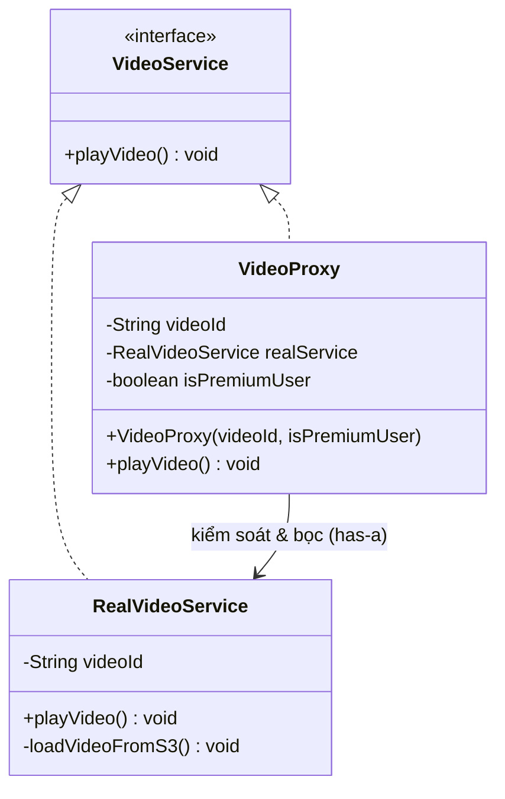

# Proxy Pattern (Mẫu Thiết Kế Đại Diện)

## 1. Mục tiêu (Intent)

**Proxy** là một mẫu thiết kế structural (cấu trúc) cho phép bạn cung cấp một đối tượng thay thế hoặc đại diện cho một đối tượng khác. Đối tượng đại diện này sẽ **kiểm soát quyền truy cập** đến đối tượng gốc, cho phép thực hiện các thao tác bổ sung trước hoặc sau khi yêu cầu được truyền tới đối tượng gốc.

Mục tiêu chính:

- **Lazy Loading (Khởi tạo lười)**: Trì hoãn việc tạo một đối tượng nặng cho tới khi nó thực sự được sử dụng.
- **Access Control (Kiểm soát quyền truy cập)**: Xác thực quyền hạn của Client trước khi cho phép gọi đối tượng gốc.
- **Caching (Bộ đệm)**: Lưu trữ kết quả của các thao tác tốn kém để tái sử dụng mà không cần gọi lại đối tượng gốc.
- **Logging / Monitoring**: Theo dõi lịch sử gọi hàm và đo lường hiệu năng.

---

## 2. Bối cảnh đặt ra (Problem Scenario)

Hãy tưởng tượng bạn đang phát triển chức năng xem bài học video trực tuyến. Hệ thống có lớp `RealVideoDownloader` chịu trách nhiệm kết nối mạng và tải video dung lượng lớn từ một máy chủ lưu trữ đám mây từ xa (AWS S3) về máy người dùng:

```java
interface VideoService {
    void playVideo();
}

class RealVideoService implements VideoService {
    private String videoId;

    public RealVideoService(String videoId) {
        this.videoId = videoId;
        loadVideoFromS3(); // Hàm rất nặng, tốn băng thông và RAM
    }

    private void loadVideoFromS3() {
        System.out.println("Đang tải video " + videoId + " từ đám mây (100MB)...");
    }

    @Override
    public void playVideo() {
        System.out.println("Đang phát video: " + videoId);
    }
}
```

Vấn đề nảy sinh:

1. **Lãng phí tài nguyên**: Khi render danh sách khóa học, nếu bạn khởi tạo đối tượng `RealVideoService` cho tất cả các video, ứng dụng sẽ tải hàng GB dữ liệu từ server về ngay cả khi học viên chưa bấm vào xem video đó.
2. **Thiếu kiểm soát bảo mật**: Bất kỳ Client nào có tham chiếu đến `RealVideoService` đều có thể gọi phát video mà không được kiểm tra xem đã mua khóa học đó hay chưa.

---

## 3. Giải pháp (Solution)

Mẫu thiết kế **Proxy** đề xuất tạo ra một lớp đại diện mới (`VideoProxy`) triển khai cùng interface với đối tượng gốc (`VideoService`).

`VideoProxy` sẽ chứa một thuộc tính tham chiếu đến đối tượng `RealVideoService` gốc (nhưng chưa khởi tạo nó ngay).

- Khi Client gọi `.playVideo()`, Proxy sẽ kiểm tra xem học viên có quyền truy cập hay không (Access Control).
- Nếu có quyền, Proxy mới kiểm tra xem đối tượng `RealVideoService` đã được tạo chưa. Nếu chưa, nó tiến hành khởi tạo (Lazy Loading) và lưu lại kết quả (Caching) để các lần xem tiếp theo không phải tải lại.

---

## 4. Cấu trúc thành phần (Structure)

Cấu trúc của Proxy Pattern:



1. **ServiceInterface (Giao diện chung)**: Khai báo các hành vi chung cho Real Subject và Proxy (`VideoService`). Client giao tiếp với hệ thống thông qua interface này.
2. **Real Subject (Đối tượng thực)**: Lớp thực hiện logic chính và chứa các tác vụ tốn kém tài nguyên (`RealVideoService`).
3. **Proxy (Đối tượng đại diện)**: Giữ tham chiếu đến Real Subject, triển khai cùng giao diện, chịu trách nhiệm kiểm soát truy cập và quản lý vòng đời của Real Subject (`VideoProxy`).

---

## 5. Ví dụ mã nguồn Java hoàn chỉnh (Java Code Example)

Dưới đây là cách triển khai Proxy Pattern bằng ngôn ngữ Java:

```java
// 1. Service Interface
interface VideoService {
    void playVideo();
}

// 2. Real Subject (Đối tượng thực tế rất nặng)
class RealVideoService implements VideoService {
    private final String videoId;

    public RealVideoService(String videoId) {
        this.videoId = videoId;
        loadVideoFromCloud(); // Hàm tốn tài nguyên chạy ngay khi khởi tạo
    }

    private void loadVideoFromCloud() {
        System.out.println("[DOWNLOAD] Đang tải video \"" + videoId + "\" từ AWS S3 (dung lượng 200MB)...");
    }

    @Override
    public void playVideo() {
        System.out.println("[PLAY] Phát video: \"" + videoId + "\"");
    }
}

// 3. Proxy (Đối tượng đại diện kiểm soát)
class VideoProxy implements VideoService {
    private final String videoId;
    private final boolean isPremiumUser; // Trạng thái tài khoản người dùng
    private RealVideoService realVideoService; // Chỉ khởi tạo khi thực sự cần

    public VideoProxy(String videoId, boolean isPremiumUser) {
        this.videoId = videoId;
        this.isPremiumUser = isPremiumUser;
    }

    @Override
    public void playVideo() {
        // A. Kiểm soát quyền truy cập (Access Control)
        if (!isPremiumUser) {
            System.out.println("[SECURITY] Từ chối truy cập: Video \"" + videoId + "\" yêu cầu tài khoản Premium!");
            return;
        }

        // B. Khởi tạo lười (Lazy Loading) & Bộ đệm (Caching)
        if (realVideoService == null) {
            System.out.println("[PROXY] Video chưa được tải. Tiến hành nạp dữ liệu lần đầu...");
            realVideoService = new RealVideoService(videoId);
        } else {
            System.out.println("[PROXY] Video đã được tải sẵn trong bộ nhớ cache.");
        }

        // C. Chuyển tiếp yêu cầu tới đối tượng thực
        realVideoService.playVideo();
    }
}

// Lớp Client chạy ứng dụng
class Main {
    public static void main(String[] args) {
        System.out.println("--- THỬ NGHIỆM 1: TÀI KHOẢN FREE TRUY CẬP VIDEO ---");
        VideoService freeUserVideo = new VideoProxy("Huong-Dan-Design-Patterns", false);
        // Không tải gì cả cho đến khi playVideo được gọi
        freeUserVideo.playVideo();

        System.out.println("\n--- THỬ NGHIỆM 2: TÀI KHOẢN PREMIUM TRUY CẬP VIDEO ---");
        VideoService premiumUserVideo = new VideoProxy("Bi-Kip-Code-Java-Clean", true);

        // Gọi xem lần 1 (Sẽ kích hoạt download)
        System.out.println("-> Người dùng bấm xem lần 1:");
        premiumUserVideo.playVideo();

        // Gọi xem lần 2 (Không download lại, dùng cache)
        System.out.println("\n-> Người dùng bấm xem lần 2:");
        premiumUserVideo.playVideo();
    }
}
```

---

## 6. Luồng hoạt động (Workflow)

1. Client khởi tạo đối tượng đại diện `VideoProxy` bằng cách truyền vào mã video và trạng thái tài khoản. Do đây là Proxy, nó chưa khởi tạo lớp `RealVideoService` thực tế.
2. Khi Client gọi `playVideo()` trên đối tượng Proxy:
    - Proxy kiểm tra điều kiện `isPremiumUser`. Nếu thất bại, chặn đứng xử lý và thoát ra ngoài.
    - Nếu hợp lệ, Proxy kiểm tra biến `realVideoService`. Nếu bằng `null`, nó gọi `new RealVideoService(...)` để tải video về và gán vào biến.
    - Proxy gọi `realVideoService.playVideo()`.
3. Trong các lần gọi tiếp theo, biến `realVideoService` đã khác `null`, Proxy bỏ qua bước tải video và gọi trực tiếp phương thức phát để tối ưu hiệu năng.

---

## 7. Đánh giá (Pros & Cons)

### Ưu điểm

- **Lazy Loading**: Giúp tiết kiệm lượng lớn tài nguyên hệ thống (RAM, băng thông) bằng cách trì hoãn tải các đối tượng cồng kềnh.
- **Bảo vệ đối tượng thực**: Kiểm soát truy cập chặt chẽ mà không cần làm bẩn code nghiệp vụ của lớp thực tế.
- **Quản lý vòng đời**: Dễ dàng thêm logic hủy đối tượng, dọn dẹp bộ nhớ khi không còn sử dụng.

### Nhược điểm

- **Tăng độ trễ phản hồi**: Lần đầu tiên gọi dịch vụ qua Proxy có thể tốn thời gian hơn bình thường vì phải trải qua bước khởi tạo đối tượng thực.
- **Tăng số lượng lớp**: Cần tạo ra các lớp trung gian có giao diện giống hệt lớp gốc.

---

## 8. So sánh với các mẫu khác (Comparison)

- **Proxy vs Decorator**: Về mặt cấu trúc, cả hai đều giữ tham chiếu đến đối tượng gốc thông qua Composition. Nhưng mục tiêu rất khác nhau: Decorator tập trung vào việc **mở rộng tính năng** (như chèn chữ, ghi log), còn Proxy tập trung vào **kiểm soát quyền truy cập, vòng đời hoặc tối ưu hóa** (Lazy Loading, Caching). Proxy thường tự quản lý việc tạo ra đối tượng thực bên trong nó, trong khi Decorator nhận đối tượng thực từ Client truyền vào.
- **Proxy vs Adapter**: Adapter chuyển đổi giao diện của đối tượng sang một giao diện khác. Proxy giữ nguyên giao diện của đối tượng gốc.

---

## 9. Ứng dụng thực tế (Real-world Use Cases)

- **Hibernate Framework**: Khi bạn truy vấn một thực thể có liên kết lazy-loading (ví dụ: `Course` có danh sách `Lessons`), Hibernate không tải danh sách bài học ngay mà nạp vào một đối tượng **HibernateProxy**. Khi bạn gọi `course.getLessons()`, proxy này mới thực sự truy vấn cơ sở dữ liệu để lấy dữ liệu lên.
- **Spring AOP (Aspect-Oriented Programming)**: Spring sử dụng Dynamic Proxy (JDK Proxy hoặc CGLIB) để bọc các Service của bạn, nhằm tự động chèn thêm logic quản lý Transaction (`@Transactional`) hoặc kiểm tra bảo mật (`@PreAuthorize`) trước khi gọi logic thực sự của hàm.
